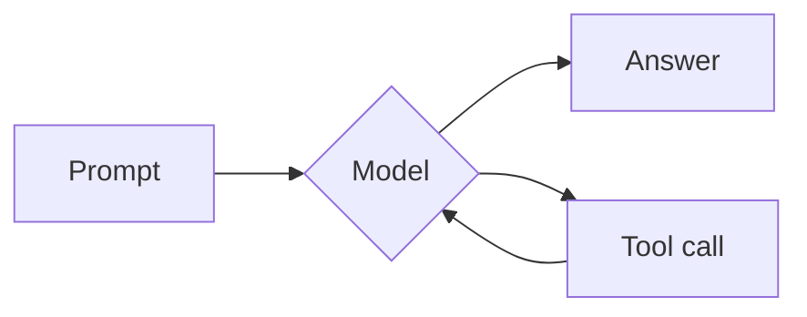

Formatting of text conveys meaning and structure. In everything from web pages to word documents, 
we use formatting like **bold** and *italic* to emphasize text.

## What is Markdown

Markdown is a way to write that formatting in plain characters: a `#` marks a heading, a `-` marks a list item, `**` makes text bold. You write in ordinary text and a converter turns those marks into styled HTML, so the same file reads cleanly before and after it's rendered.

Markdown was created in 2004 by John Gruber, with help from Aaron Swartz, as a way to write formatted text in plain, readable characters and turn it into HTML. It spread quickly, but Gruber's original description left gaps, and different tools filled them differently. GitHub's version — GitHub Flavored Markdown — added tables, strikethrough, task lists, and fenced code blocks, and because so many people wrote on GitHub, it shaped what most people now picture as Markdown. In 2014 a group that included Jeff Atwood and John MacFarlane published CommonMark, a precise specification that settled the ambiguities. Most modern Markdown is CommonMark, usually with a few GitHub extensions on top — and that's what this reference follows.

## A Quick Example

### Source:
```markdown
#### An Example

Here is a _sentence_ with **Markdown Formatting**.
```

### Rendered:
#### An Example

Here is a _sentence_ with **Markdown Formatting**.

## Conveying meaning to an LLM

Markdown is a simple way to convey meaning and structure to an LLM. Often I will use it
in combination with HTML tags to structure content in a way that a model can understand.

Typically I'd use it for "lightly structured" content - this would be something that
doesn't have a defined schema but still requires defined sections to be maximally
effective for the model.

If you've done any prompt engineering before, you may be familiar with adding 
XML/HTML tags to structure content in a way that a model can understand. I go into 
that in more depth in [prompting and evals]({{ "/learn/prompting-and-evals/" | relative_url }}) but for day-to-day use, Markdown is usually sufficient.

> [!TIP]
> If you are **referencing** some content that you want to include, fence it like a code block using triple backticks. I do this with code snippets, logs, markdown pages or html pages that I want to include verbatim and really any content that I want to include as-is.

> [!TIP]
> If you need to bring in tabular data, you can use either GitHub's tables extension or  CSV. **But be careful if you use CSV** - many things have commas in their names, which can cause issues with the CSV format.


## Markdown Reference

The pieces worth knowing when you write for an LLM. This follows CommonMark, plus GitHub's tables and strikethrough.

### Emphasis and links

| You write | You get |
|---|---|
| `**bold**` | **bold** |
| `*italic*` | *italic* |
| `~~strikethrough~~` | ~~strikethrough~~ |
| `[a link](https://commonmark.org)` | [a link](https://commonmark.org) |

### Headings

Structure a document with `#` — one for a title, more for deeper sections:

```markdown
# Title
## Section
### Subsection
```

### Lists

Unordered lists use `-` (or `*`); ordered lists use `1.`, `2.`, and so on. Indent to nest:

```markdown
- first
- second
  - nested

1. step one
2. step two
```

### Code

Inline code goes in single backticks — write `` `print()` `` to get `print()`. Fence a whole block with three backticks and name the language to hint highlighting:

````markdown
```python
print("hello")
```
````

### Blockquote

Start a line with `>`:

```markdown
> A quoted line.
```

### Table

```markdown
| Name | Role |
|------|------|
| Ada  | Lead |
| Alan | Ops  |
```

## Diagrams with Mermaid

Markdown can carry more than prose. [Mermaid](https://mermaid.js.org) is a small language for describing diagrams — flowcharts, sequence diagrams, timelines — as plain text inside a code fence tagged `mermaid`. Tools that support it (GitHub, Obsidian, and many others) turn that text into a rendered picture.

Because a diagram is just text, an LLM can draw one for you: describe what you want and the model writes the Mermaid. You put it in a fenced block tagged `mermaid`:

````markdown

````

and a Mermaid-aware tool renders it as a diagram:


A prompt flows through a model to an answer, with a tool call looping back in — a quick way to sketch a process, a schema, or an architecture without opening a drawing app.

## Tools

A few Markdown editors worth knowing — especially ones that fit an LLM into the loop.

- **[Bear](https://bear.app)** — a focused Markdown notes app (my go-to). It exposes a [command-line interface](https://bear.app/faq/command-line-interface/) and MCP, so an agent can read and write your notes directly.
- **[Lettera](https://lettera.md)** — a Markdown writing app from the makers of Bear.
- **[Obsidian](https://obsidian.md)** — a local-first Markdown knowledge base, popular for its deep plugin ecosystem and its graph view of linked notes.

## Further reading

A short, still-live (2026) reading list. The last one ties Markdown's structure to how a model reads it.

- **[The Markdown Guide](https://www.markdownguide.org/)** — the best all-around beginner reference, with a printable [cheat sheet](https://www.markdownguide.org/cheat-sheet/) to keep by the keyboard.
- **[CommonMark](https://commonmark.org/help/)** — the standardized spec, plus a free [10-minute interactive tutorial](https://commonmark.org/help/tutorial/) that teaches by doing.
- **[GitHub: Basic writing and formatting syntax](https://docs.github.com/en/get-started/writing-on-github/getting-started-with-writing-and-formatting-on-github/basic-writing-and-formatting-syntax)** — the official guide to GitHub Flavored Markdown: tables, task lists, fenced code, and the flavor you'll meet most.
- **[Gruber's original Markdown](https://daringfireball.net/projects/markdown/syntax)** — the 2004 source. Worth it for the core idea: the punctuation is chosen to look like what it means (asterisks around a word look like `*emphasis*`).
- **[OpenAI's GPT-4.1 prompting guide](https://developers.openai.com/cookbook/examples/gpt4-1_prompting_guide)** — _for the LLM angle_: a major lab recommending Markdown as the default way to structure a prompt, headings and all.
