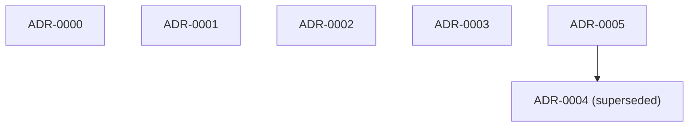

# ADR lineage

> **Regenerated by the `link-adr-graph` skill** (per [[adrs/ADR-0016-add-link-adr-graph-skill]]). Body wholly rewritten on every run; hand-edits are blown away. No timestamps in the body — byte-stable across runs given the same ADR set. See `docs/log.md` (`adr | regenerated lineage`) for when.

## Graph

Solid arrow = supersedes; dashed arrow = amends. Superseded ADRs are marked.

## Lineage table

| id | title | status | supersedes | amends | superseded_by |
|----|-------|--------|------------|--------|---------------|
| ADR-0000 | Record architectural decisions as ADRs | Accepted | — | — | — |
| ADR-0001 | Use Jekyll 4.4 with Ruby pinned to 4.0.5 | Accepted | — | — | — |
| ADR-0002 | Deploy to GitHub Pages via GitHub Actions | Accepted | — | — | — |
| ADR-0003 | Ship a custom presentation layer over Minima | Accepted | — | — | — |
| ADR-0004 | Single-source the manifesto homepage from research | Superseded | — | — | ADR-0005 |
| ADR-0005 | Serve a landing homepage and a five-item top nav | Accepted | ADR-0004 | — | — |

## Topic clusters

ADRs grouped by shared tag (a tag appears below if ≥2 ADRs carry it). Use a cluster to find the current decision on a topic.

- **build** — ADR-0001, ADR-0002
- **information-architecture** — ADR-0004, ADR-0005
- **jekyll** — ADR-0001, ADR-0005
- **navigation** — ADR-0004, ADR-0005
