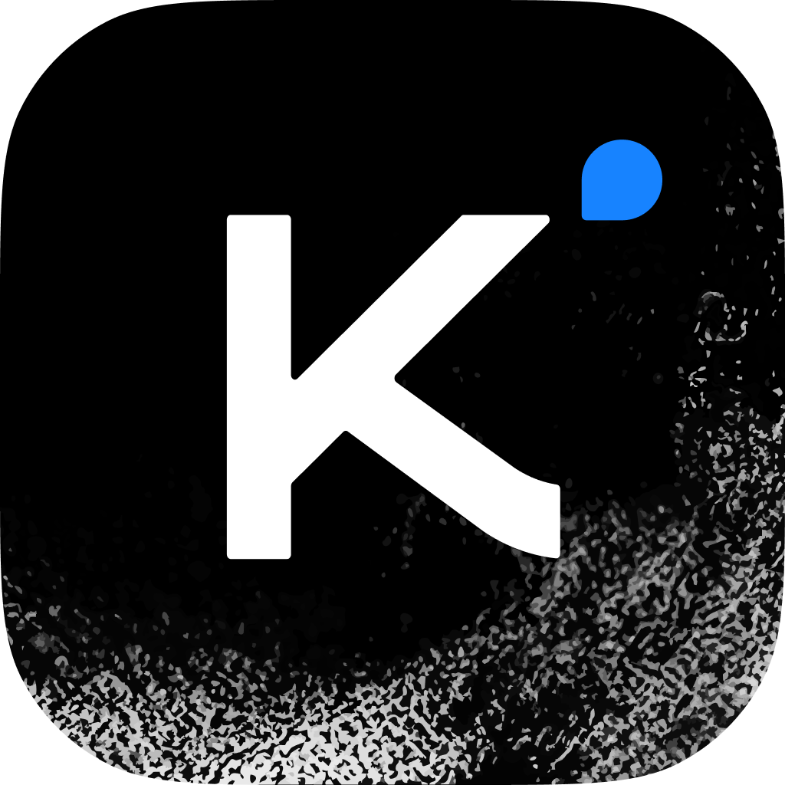

# MoonshotAI: Kimi K3

### [moonshotai](<https://openrouter.ai/moonshotai>)/kimi-k3

[Model weights](<https://huggingface.co/moonshotai/Kimi-K3>)

[Compare](<https://openrouter.ai/compare/moonshotai/kimi-k3>)PlaygroundTry this model

Kimi K3 is a 2.8T parameter open-weight multimodal reasoning model from Moonshot AI. It is suited for complex coding, knowledge work, and long-horizon agentic workflows, and is particularly strong at navigating large repositories, using tools, debugging, and iterating against images, logs, tests, and runtime feedback. Its architecture uses KDA and Attention Residuals for computational efficiency.

Modalities

In / Out Price

$2.55 / $12.75per 1M

Context

1M

Released

Jul 16, 2026

MoonshotAI: Kimi K3

[Compare](<https://openrouter.ai/compare/moonshotai/kimi-k3>)PlaygroundTry this model

Providers

## Providers

Different companies host the same model. OpenRouter routes your request to one of them based on the routing mode you pick — Balanced (price + speed), Nitro (fastest), or Exacto (highest tool-calling accuracy).

## Pricing

The average price customers actually pay for this model, next to the prices providers post. Caching and discounts mean the price actually paid is often well below the listed one.

## Performance

Throughput is how fast the model writes (tokens per second — higher is better). Latency is total round-trip time (lower is better). TTFT is time-to-first-token — how long before you see anything appear (lower is better).

## Uptime

Uptime is the percentage of the past 3 days that at least one provider was responding to requests. Availability is the percentage of time that inference was successfully served. OpenRouter continuously monitors and uses the next-best provider when one returns an error.

## Benchmarks

Scores on standardized evaluations. Higher percentages are better — and rank percentile shows where this model lands among all models on OpenRouter.

## Apps

Public apps that send the most traffic to this model. Good signal for what real production workloads look like — and a hint at which use cases this model is best suited for.

## Activity

Token volume and request traffic to this model over time.

## Quick Start

Drop-in code to call this model. OpenRouter's API is OpenAI-compatible — most SDKs work by just swapping the base URL. The only thing that changes between models is the model slug below.

## Explore more models

[AI Models with Vision: Multimodal LLMs for Image UnderstandingCollection](<https://openrouter.ai/collections/vision-models>)[AI Model RankingsRanking](<https://openrouter.ai/rankings>)

Standard

Latency / throughputP50

Provider| Input /M| Output /M| Cache read /M| Latency| Throughput| Uptime  
---|---|---|---|---|---|---  
Sail Research| $2.60| $13.00| $0.29| 2.07s| 36 tps| 99.54%  
Morph| $2.80| $14.00| $0.29| 7.65s| 8 tps| 97.30%  
DeepInfra| $2.85| $14.25| $0.285| 18.03s| 4 tps| 96.97%  
DigitalOcean| $2.85| $14.25| $0.285| 1.70s| 29 tps| 99.94%  
Parasail| $3.00| $15.00| $0.30| 1.33s| 44 tps| 96.19%  
Baseten| $3.00| $15.00| $0.30| 2.31s| 42 tps| 95.22%  
Together| $3.00| $15.00| $0.30| 1.52s| 49 tps| 99.82%  
Moonshot AI| $3.00| $15.00| $0.30| 4.51s| 23 tps| 99.69%  
Phala| $3.00| $15.00| $0.30| 3.19s| 23 tps| 98.29%  
Fireworks| $3.00| $15.00| $0.30| 2.14s| 34 tps| 99.92%  
Modal| $3.00| $15.00| $0.30| 1.32s| 63 tps| 99.98%  
Chutes| $3.00| $15.00| $0.30| 2.01s| 18 tps| 99.07%  
Fireworks (US)| $3.30| $16.50| $0.33| 1.80s| 48 tps| 99.90%  
Alibaba Cloud Int.| $3.45| $17.25| $0.345| 1.98s| 29 tps| 98.56%  
Fireworks Fast| $4.50| $22.50| $0.45| 1.27s| 46 tps| 98.57%  
Morph Fast| $6.00| $22.50| $0.60| 3.03s| 9 tps| 97.54%  
Makora| $2.55| $12.75| $0.256| 3.24s| 24 tps| 96.34%  
  
Filter quantization

Throughput

63tok/s

P50, best across providers

Latency

1.27s

P50, best provider

All locations

Latency / throughputP501 week

AutoExacto Benchmarks

GPQA DiamondTAU-Bench

Fireworks Fast

92.3%\--

Wafer Fast

92.2%\--

Makora

91.1%\--

Chutes

90.0%\--

Baseten

91.9%77.9%

Fireworks (US)

93.5%71.1%

Fireworks

93.1%69.1%

Wafer

67.3%78.0%

+11 more providers

Uptime (3d)

100.00%

Availability (3d)

99.52%

### Availability over the last 3 days

Last 72 hours

Availability 99.52%

3 Days Ago2 Days AgoYesterdayNow

### Availability over the last 24 hours

OpenRouter Availability

99.55%

Without Routing

92.06%

When an error occurs in an upstream provider, we can recover by routing to another healthy provider, if your request filters allow it. You can access per-provider uptime data programmatically through the [Endpoints API](<https://openrouter.ai/docs/api/api-reference/endpoints/list-endpoints>). [Learn more](<https://openrouter.ai/docs/provider-routing>) about our load balancing and customization options.

1.

[Hermes Agent ](<https://openrouter.ai/apps/hermes-agent>)

Hermes Agent is an open-source, self-improving AI agent by Nous Research that runs persistently with memory across sessions, and builds reusable skills from experience. It comes with 40+ built-in tools, including web search, browser automation, and vision, plus scheduled automations and subagents.

601Btokens

2.

[Claude Code ](<https://openrouter.ai/apps/claude-code>)

Claude Code is Anthropic's agentic coding tool that reads your entire codebase, plans and executes changes across files, runs tests, and iterates on failures, all from natural language prompts.

323Btokens

3.

[pi ](<https://openrouter.ai/apps/pi>)

There are many coding agents, but this one is yours.

260Btokens

4.

[OpenHands ](<https://openrouter.ai/apps/openhands>)

AI coding agent that can run commands, browse the web, call APIs

141Btokens

5.

[Cline ](<https://openrouter.ai/apps/cline>)

Cline is an open-source AI coding agent that lives inside your IDE, autonomously exploring your codebase, editing files, running terminal commands, and using browser automation.

120Btokens

## Frequently asked questions

### What is Kimi K3?

Kimi K3 is a 2.8T parameter open-weight multimodal reasoning model from Moonshot AI. It is suited for complex coding, knowledge work, and long-horizon agentic workflows, and is particularly strong at navigating large repositories, using tools, debugging, and iterating against images, logs, tests, and runtime feedback. Its architecture uses KDA and Attention Residuals for computational efficiency.

### How much does Kimi K3 cost?

Kimi K3 costs $2.55/M input tokens and $12.75/M output tokens, with separate rates for Cache Read at $0.256/M tokens.

### What is the context length of Kimi K3?

Kimi K3 has a 1,048,576 token context window. It supports up to 1,048,576 completion tokens.

### Does Kimi K3 support tool calling and structured outputs?

Yes. Kimi K3 accepts `tools` and `tool_choice` for function calling. It also supports structured outputs via a JSON schema in `response_format`.

### What inputs and outputs does Kimi K3 support?

Kimi K3 accepts text, images and video as input and returns text.

### Which providers serve Kimi K3?

Kimi K3 is served by 14 providers on OpenRouter: Makora, Sail Research, Morph Fast, DeepInfra, DigitalOcean, Parasail, Baseten, Together and 6 more. Requests are routed to the best available provider, with automatic failover to the others, and you can pin or exclude providers with [provider routing](<https://openrouter.ai/docs/features/provider-routing>).

### When was Kimi K3 released?

Kimi K3 was released on July 16, 2026.
