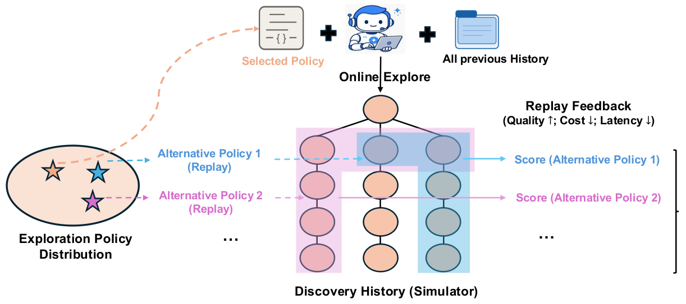

\uselogo

# Dream-RSI: Recursive Self-Improvement through Evolving Worlds

Tong Zheng  Affiliation: \thepa Affiliation: University of Maryland, College Park  Xidong Wu  Affiliation: \thepa Zheng Zhang  Affiliation: \thepa Zhankui He  Affiliation: Google Deepmind  Chaoyi Zhang  Affiliation: \thepa Benjamin Coleman  Affiliation: Google Deepmind  Ruoqiao Wei  Affiliation: \thepa Di Bai  Affiliation: Google Deepmind  Haolin Liu  Affiliation: University of Virginia  Rui Liu  Affiliation: University of Maryland, College Park  Xue Wang  Affiliation: \thepa Yue Zhuan  Affiliation: \thepa Wang-Cheng Kang  Affiliation: Google Deepmind  Renkai Xiang  Affiliation: \thepa Heng Huang  Affiliation: University of Maryland, College Park  Xinwu Cheng  Affiliation: \thepa Yunsong Guo  Affiliation: \thepa

###### Abstract

Recursive self-improvement is becoming increasingly vital for autonomous AI agents, where progress hinges on discovering high-value solutions across complex domains. The driver of this process is effective exploration, however, managing and improving exploration strategies remains a major bottleneck. Current systems face a fundamental dilemma: fixed strategies fail to adapt as search spaces scale, while online policy optimization requires navigating vast meta-search spaces under delayed and expensive feedback over long-horizon rollouts. We introduce Dream-RSI, a framework for scalable and recursively self-improving exploration. A lightweight orchestration layer makes exploration explicit and programmable while leaving the underlying coding agent unchanged. Our key insight is that accumulated discovery history can serve as a replay simulator over the realized search space. By performing dreaming in the replay simulator constructed from historical discovery trees, Dream-RSI secures immediate, low-cost off-policy feedback to evaluate and refine exploration policies without invoking repetitive, expensive online evaluations. The improved policy is subsequently redeployed online to drive further discovery, continuously expanding the simulator pool in a self-improving loop. Across algorithm engineering, mathematical optimization, and GPU kernel engineering, Dream-RSI achieves competitive or improved discovery quality while substantially reducing discovery cost in several settings. [ github.com/zhengkid/Dream-RSI](<https://github.com/zhengkid/Dream-RSI>) | [ dream-rsi.com](<https://dream-rsi.com/>)

## 1 Introduction

 Figure 1: Overview of Dream-RSI. The system operates in a recursive self-improvement loop via three core stages: ① Online Explore, where the current exploration policy guides a coding agent to expand a discovery tree and log historical traces; ② Construct Replay Simulator, where the generated discovery tree is converted into a reusable simulator pool; and ③ Dreaming-based Policy Improvement, where the agent "dreams" up a massive pool of alternative policies in its mind. It then feeds these candidate policies into the replay simulator to simulate executions and derive rapid feedback, continuously refining its strategy (detailed in the Zoom-in box). The updated policy then redeploys for the next round of online exploration.

Recursive self-improvement (RSI) has emerged as an ambitious goal for autonomous AI systems ([Liu et al., 2026c](<https://arxiv.org/html/2609.14858v1#bib.bib25>)). A common mechanism underlying RSI is an iterative discovery loop wherein agents generate candidate solutions, evaluate outcomes, incorporate feedback, and refine future iterations. Such discovery loops have driven substantial progress across scientific and algorithmic domains, including algorithm design ([Novikov et al., 2025](<https://arxiv.org/html/2609.14858v1#bib.bib27>); [Romera-Paredes et al., 2024](<https://arxiv.org/html/2609.14858v1#bib.bib33>)), open-ended mathematical optimization ([Georgiev et al., 2025](<https://arxiv.org/html/2609.14858v1#bib.bib7>); [Anthropic, 2026](<https://arxiv.org/html/2609.14858v1#bib.bib1>)), systems design ([Jaber and Jaber, 2026](<https://arxiv.org/html/2609.14858v1#bib.bib18>); [Cao et al., 2026](<https://arxiv.org/html/2609.14858v1#bib.bib3>)), and agent self-improvement ([Zhang et al., 2026b](<https://arxiv.org/html/2609.14858v1#bib.bib48>); [Zhang et al., 2026c](<https://arxiv.org/html/2609.14858v1#bib.bib49>); [Lee et al., 2026](<https://arxiv.org/html/2609.14858v1#bib.bib22>); [Zheng et al., 2026a](<https://arxiv.org/html/2609.14858v1#bib.bib51>)), with these discoveries increasingly feeding into the development of more capable AI systems. As agent capabilities improve and self-improvement targets become challenging, discovery increasingly requires long-horizon exploration over vast search spaces, often spanning thousands of proposal–evaluation cycles ([Ye et al., 2026](<https://arxiv.org/html/2609.14858v1#bib.bib45>); [OpenAI, 2026](<https://arxiv.org/html/2609.14858v1#bib.bib28>)). At this scale, the ability to orchestrate exploration becomes critical ([Zheng et al., 2026b](<https://arxiv.org/html/2609.14858v1#bib.bib52>)). Poor exploration can waste substantial computation and time, severely limiting the efficiency and scalability of RSI.

Existing approaches have largely relied on manually designed exploration strategies that remain largely fixed throughout discovery ([Novikov et al., 2025](<https://arxiv.org/html/2609.14858v1#bib.bib27>); [Yan et al., 2026b](<https://arxiv.org/html/2609.14858v1#bib.bib44>); [Du et al., 2026](<https://arxiv.org/html/2609.14858v1#bib.bib5>); [Jiang et al., 2026](<https://arxiv.org/html/2609.14858v1#bib.bib19>); [Ye et al., 2026](<https://arxiv.org/html/2609.14858v1#bib.bib45>)). Fixed strategies cannot improve from accumulated discovery experience and may repeatedly allocate computation to ineffective search directions. Recent work therefore seeks to optimize exploration policies online during discovery ([Liu et al., 2026a](<https://arxiv.org/html/2609.14858v1#bib.bib23>)), but doing so faces two fundamental bottlenecks. First, feedback is delayed and expensive at the meta level: unlike evaluating an individual candidate, assessing an exploration policy requires observing how it shapes the subsequent discovery process over many proposal–evaluation cycles. Second, the meta-policy space is vast: a newly proposed policy may perform poorly, so many alternatives may need to be tried. Together, these challenges make meta-level improvement particularly costly: each policy may require a long online rollout before receiving useful feedback, making it difficult to efficiently close the self-improvement loop at the exploration layer.

To address these bottlenecks, our key intuition is simple: a fast and inexpensive simulator of discovery would allow many exploration policies to be evaluated before costly online deployment. Surprisingly, completed discovery histories already provide such a simulator. While prior work treats past discovery history merely as static textual context ([Hu et al., 2025](<https://arxiv.org/html/2609.14858v1#bib.bib14>); [Ouyang et al., 2026b](<https://arxiv.org/html/2609.14858v1#bib.bib31>)) or training data for weight fine-tuning ([Yuksekgonul et al., 2026](<https://arxiv.org/html/2609.14858v1#bib.bib46>); [Wang et al., 2025](<https://arxiv.org/html/2609.14858v1#bib.bib37>)), a completed discovery process inherently records a structured tree of past exploration decisions and their realized code-execution outcomes. Drawing an analogy to model-based reinforcement learning and World Models ([Ha and Schmidhuber, 2018](<https://arxiv.org/html/2609.14858v1#bib.bib9>); [Hafner et al., 2023](<https://arxiv.org/html/2609.14858v1#bib.bib12>)) (§[2](<https://arxiv.org/html/2609.14858v1#S2> "2 Motivation: Discovery History as a Replay Simulator ‣ Dream-RSI: Recursive Self-Improvement through Evolving Worlds")), once organized into a discovery tree, this history can serve as a replay simulator 11 1 We use the terms replay simulator and worlds interchangeably.. As illustrated in Figure [2](<https://arxiv.org/html/2609.14858v1#S1.F2> "Figure 2 ‣ 1 Introduction ‣ Dream-RSI: Recursive Self-Improvement through Evolving Worlds"), an alternative exploration strategy can navigate this pre-recorded tree to traverse different subsets of recorded branches, in different orders, with different parallel groupings and stopping decisions. Because all execution outcomes are already saved in the tree, evaluating a new strategy requires only reading past records without rerunning the underlying discovery agent or evaluator. This transforms meta-policy improvement from an expensive online trial-and-error process into a fast, simulation-based “dreaming” procedure.

Building on this insight, we introduce Dream-RSI, a framework for scalable and recursively self-improving meta-exploration in agent-driven discovery. We first make exploration explicit and programmable through a lightweight orchestration layer that controls branching, parallel exploration, and stopping while leaving the underlying coding agent unchanged. Rather than keeping this policy fixed, Dream-RSI establishes a closed-loop self-improvement mechanism across three core stages (Figure [1](<https://arxiv.org/html/2609.14858v1#S1.F1> "Figure 1 ‣ 1 Introduction ‣ Dream-RSI: Recursive Self-Improvement through Evolving Worlds")): (1) Online Exploration, where the current policy guides real-world discovery and logs historical execution traces; (2) Simulator Construction, where recorded discovery trees are converted into a reusable replay simulator pool; and (3) Dreaming-based Policy Improvement, where candidate policies are evaluated via low-cost "dreaming" over the simulator. The updated policy is then redeployed online to generate new discovery experience and expand the simulator pool, closing a RSI loop at the meta-exploration layer.

Empirically, we evaluate Dream-RSI across 8 scientific discovery tasks spanning three distinct domains: algorithm engineering, mathematical optimization, and GPU kernel engineering. In algorithm engineering (Lasso path solver), Dream-RSI outperforms standard libraries like sklearn and strong baselines while reducing agent calls by up to 162×162\times over SimpleTES and 1.7×1.7\times over fixed-exploration baselines. In mathematical optimization (sum-difference, autocorrelation, circle packing), it matches or surpasses strong baselines within 1​k1\text{k} generations, yielding over 50×50\times budget savings compared to SimpleTES. In GPU kernel engineering (KernelBench), it either reaches target execution speeds using 1.79×1.79\times–2.43×2.43\times fewer generations or improves kernel performance by up to 2.09×2.09\times under identical budget constraints.

In summary, our main contributions are as follows: 1) History as Replay Simulator: We conceptualize completed discovery histories as replay simulators. This makes delayed exploration feedback reusable for efficient meta-exploration policy evaluation.; 2) Meta-Layer RSI Loop (Dream-RSI): We introduce Dream-RSI, establishing a recursive self-improvement loop that continuously collects discovery histories through online exploration, constructs replay simulators from history to refine meta-exploration strategies via dreaming, and redeploys the upgraded policy online; 3) Empirical Validation: We conduct experiments to demonstrate that Dream-RSI improves both discovery effectiveness and efficiency in several settings.

 Figure 2: Discovery history as a replay simulator. A deployed policy first explores online to generate a structured discovery tree containing historical execution traces (each node denote an attempt with its full observation). Thousands of candidate policies can then be tested within this simulator—evaluating alternative choices of search branches, exploration orders, concurrency levels, and stopping rules. Since all node outcomes are pre-stored, a single costly online run enables thousands of rapid, zero-execution-cost off-policy evaluations. This enables policy improvement through historical replay: the agent can “dream” over many alternative exploration strategies before redeploying the improved policy online.

## 2 Motivation: Discovery History as a Replay Simulator

Consider an agent navigating toward a goal in an unfamiliar environment. During its first traversal, the agent may follow inefficient routes, encounter dead ends, backtrack, and gradually construct a map of the surrounding space. Once recorded, however, this experience becomes reusable: the resulting map supports planning without requiring the agent to physically revisit every location. A new navigation policy can instead reason over the accumulated map, avoid known dead ends, reconsider earlier decisions, and compare alternative routes before acting ([Gupta et al., 2017](<https://arxiv.org/html/2609.14858v1#bib.bib8>)).

This idea parallels model-based reinforcement learning ([Sutton, 1990](<https://arxiv.org/html/2609.14858v1#bib.bib35>); [M. Moerland et al., 2023](<https://arxiv.org/html/2609.14858v1#bib.bib26>)). A model captures how an environment evolves in response to an agent’s actions, allowing policies to be trained or evaluated through simulated experience rather than repeated interaction with the real environment ([Ha and Schmidhuber, 2018](<https://arxiv.org/html/2609.14858v1#bib.bib9>)). The Dreamer family ([Hafner et al., 2019](<https://arxiv.org/html/2609.14858v1#bib.bib10>); [Hafner et al., 2020](<https://arxiv.org/html/2609.14858v1#bib.bib11>); [Hafner et al., 2023](<https://arxiv.org/html/2609.14858v1#bib.bib12>); [Hafner et al., 2025](<https://arxiv.org/html/2609.14858v1#bib.bib13>)) demonstrates this principle particularly clearly: an agent learns a compact dynamics model from collected experience and improves its policy by imagining trajectories within that model.

Long-horizon discovery admits an analogous structure. An exploration policy decides which directions to pursue, which candidates to refine, which branches to explore in parallel, and when to terminate. Executing the policy online produces a structured discovery history containing the explored branches, decision points, computational costs, and realized outcomes. As illustrated in Figure [2](<https://arxiv.org/html/2609.14858v1#S1.F2> "Figure 2 ‣ 1 Introduction ‣ Dream-RSI: Recursive Self-Improvement through Evolving Worlds"), this history can subsequently be treated as an _empirical replay simulator_ : a grounded model of the portion of the discovery space that has already been observed.

Within this replay simulator, alternative exploration policies induce different trajectories through the recorded discovery tree. A policy may select a different subset of branches, prioritize them in a different order, issue different requests in parallel, or stop at an earlier point. Evaluating such a trajectory requires only revealing the outcomes already stored along the selected branches, rather than rerunning the underlying coding agent and evaluator. Consequently, a single expensive online discovery run can support many inexpensive evaluations of alternative exploration strategies.

## 3 Dream-RSI: Recursive Self-Improvement through Evolving Worlds

As shown in Figure [1](<https://arxiv.org/html/2609.14858v1#S1.F1> "Figure 1 ‣ 1 Introduction ‣ Dream-RSI: Recursive Self-Improvement through Evolving Worlds"), Dream-RSI alternates between online exploration and offline “dreaming” to improve an executable _exploration policy_ that allocates discovery computation. During the online phase, the policy guides a fixed _discovery agent_ , while a fixed _evaluator_ scores the resulting candidates and provides diagnostic feedback. The resulting _discovery tree_ serves as a _replay world_ in which alternative policies can be evaluated using recorded outcomes. A fixed LLM-based _policy-development agent_ uses this feedback to revise the _exploration policy_ code, and the best evaluated version is deployed for the next online rollout. Only the exploration-policy code changes; the underlying models, evaluator, and execution interfaces remain fixed.

#### Discovery trees and the shared decision interface.

A discovery tree is rooted at rr, which represents the initial workspace state. Each non-root node vv has exactly one _primary parent_ , either the root or a previously created node. This parent identifies where the attempt in vv begins: the discovery agent resumes the parent’s saved workspace and uses its accumulated observations as context to produce a new attempt. Node vv preserves this inherited history and records the outcome of the new generation–evaluation attempt, including the resulting filesystem snapshot, generated artifact, evaluation diagnostics, and score svs_{v}. Scores follow a fixed task-scoring protocol, with larger values indicating better quality.

In both online execution and offline replay, the exploration policy observes a tree 𝒯\mathcal{T}, initially containing only the root, and selects the nodes from which to continue exploration. The eligible nodes form the set A⁡(𝒯)={r}∪{v∈𝒯:v​ is a leaf}A(\mathcal{T})=\\{r\\}\cup\\{v\in\mathcal{T}:v\text{ is a leaf}\\}, where leaves are determined from the currently observed tree. Let W≥1W\geq 1 be the number of parallel workers, each of which can execute one generation–evaluation request at a time (e.g. concurrent API calls). The exploration policy’s action is a batch C∈A⁡(𝒯,W)C\in A(\mathcal{T};W), where A⁡(𝒯,W)={C⊆A⁡(𝒯):|C|≤W}A(\mathcal{T};W)=\\{C\subseteq A(\mathcal{T}):|C|\leq W\\} is the feasible batch set. Each selected node specifies the starting point of one attempt, so the batch determines both where exploration continues and how many attempts are scheduled in parallel. Both the online and offline phases use this same decision interface but differ in the transition that follows a selected batch.

#### Online rollout.

Let t=1,2,…t=1,2,\ldots index the outer iterations, starting from an initial policy π1\pi_{1} and an empty history ℋ0=()\mathcal{H}_{0}=(). At iteration tt, policy πt\pi_{t} guides a new online rollout with access to the completed discovery history ℋt−1\mathcal{H}_{t-1}. This history provides context for exploration but remains separate from the new tree being constructed. The policy code stays fixed throughout the rollout.

Let 𝒯tk\mathcal{T}_{t}^{k} denote the new discovery tree after kk completed decision rounds, with 𝒯t0={r}\mathcal{T}_{t}^{0}=\\{r\\}. The rollout allows at most K1K_{1} rounds. At round k≤K1k\leq K_{1}, the _exploration policy_ chooses a node batch Ctk∈A⁡(𝒯tk,W)C_{t}^{k}\in A(\mathcal{T}_{t}^{k};W) and each node v∈Ctkv\in C_{t}^{k} is assigned to a worker. The discovery agent uses vv’s saved workspace and available context to produce a new candidate, and the evaluator assesses the result. These attempts run in parallel, each producing one new child of its selected parent. Attaching the completed children to the current tree yields 𝒯tk+1\mathcal{T}_{t}^{k+1}, while all previously recorded nodes remain unchanged. This transition is stochastic because the discovery agent may generate different outcomes from the same starting workspace. For the next round, the newly created child becomes the selectable leaf of an extended branch, while the root remains selectable for opening further branches. The rollout ends when the policy selects an empty batch or completes K1K_{1} decision rounds. After the rollout terminates, its final tree is recorded as 𝒯t\mathcal{T}_{t} and appended to the history, giving ℋt=ℋt−1∪{𝒯t}\mathcal{H}_{t}=\mathcal{H}_{t-1}\cup\\{\mathcal{T}_{t}\\}. The method then enters the offline phase using this expanded collection of replay worlds.

#### Offline evaluation.

During the offline phase of outer iteration tt, the history ℋt\mathcal{H}_{t} remains fixed while the method constructs and evaluates M≥1M\geq 1 policy versions πt0,…,πtM−1\pi_{t}^{0},\ldots,\pi_{t}^{M-1}, starting with πt0=πt\pi_{t}^{0}=\pi_{t}. Each version is evaluated separately on every historical tree 𝒯i\mathcal{T}_{i}, i=1,…,ti=1,\ldots,t, before the next version is developed from the resulting feedback. We use mm to index policy versions, ii to index replay worlds, and kk to count decision rounds within one policy–world evaluation. The outer index tt is fixed throughout this phase and is suppressed in the notation for replay trajectories and scores.

For each policy–tree pair (m,i)(m,i), replay resets the policy’s per-rollout state and starts from 𝒯im,0={r}\mathcal{T}_{i}^{m,0}=\\{r\\}. Here, 𝒯im,k⊆𝒯i\mathcal{T}_{i}^{m,k}\subseteq\mathcal{T}_{i} denotes the subtree revealed after kk completed rounds. The full recorded tree 𝒯i\mathcal{T}_{i} remains fixed; only the portion observed by the policy evolves. At each decision, πtm\pi_{t}^{m} selects a batch Cim,k∈A⁡(𝒯im,k,W)C_{i}^{m,k}\in A(\mathcal{T}_{i}^{m,k};W) using the revealed observations. Unlike online execution, replay returns recorded children of the selected nodes deterministically rather than generating new candidates. After the _exploration policy_ takes a nonempty batch Cim,kC_{i}^{m,k}, the next observed tree is 𝒯im,k+1=𝒯im,k∪⋃v∈Cim,kChild⁡(v,𝒯i,𝒯im,k)\mathcal{T}_{i}^{m,k+1}=\mathcal{T}_{i}^{m,k}\cup\bigcup_{v\in C_{i}^{m,k}}\operatorname{Child}(v;\mathcal{T}_{i},\mathcal{T}_{i}^{m,k}) where Child⁡(v,𝒯i,𝒯im,k)\operatorname{Child}(v;\mathcal{T}_{i},\mathcal{T}_{i}^{m,k}) denotes the node set containing unobserved children of vv on tree 𝒯i\mathcal{T}_{i} given the current observed tree Tim,kT_{i}^{m,k}. For v≠rv\neq r, Child⁡(v,𝒯i,𝒯im,k)\operatorname{Child}(v;\mathcal{T}_{i},\mathcal{T}_{i}^{m,k}) is vv’s unique recorded child, if one exists. Since vv is a leaf of 𝒯im,k\mathcal{T}_{i}^{m,k}, that child is still unrevealed. For v=rv=r, replay returns the earliest-created child of rr outside 𝒯im,k\mathcal{T}_{i}^{m,k}, opening one previously unrevealed branch. In either case, Child⁡(v,𝒯i,𝒯im,k)=∅\operatorname{Child}(v;\mathcal{T}_{i},\mathcal{T}_{i}^{m,k})=\emptyset when no recorded continuation remains. The newly revealed nodes expose their stored observations before the policy makes its next decision.

Replay allows at most K2K_{2} decision rounds where each nonempty batch counts as one round, and terminates when the policy selects Cim,k=∅C_{i}^{m,k}=\emptyset, the round limit k=K2k=K_{2} is reached, or 𝒯im,k=𝒯i\mathcal{T}_{i}^{m,k}=\mathcal{T}_{i}, meaning that all recorded nodes have been revealed. Let kim,⋆∈{0,…,K2}k_{i}^{m,\star}\in\\{0,\ldots,K_{2}\\} denote the number of completed rounds at termination, yielding the final subtree 𝒯im,kim,⋆⊆𝒯i\mathcal{T}_{i}^{m,k_{i}^{m,\star}}\subseteq\mathcal{T}_{i}.

Thus, replay evaluates how far to pursue each opened branch, how to group attempts into parallel batches, and when to open another branch or stop. These decisions may differ across policies, but each branch is traversed in its recorded parent–child order, and no outcomes beyond 𝒯i\mathcal{T}_{i} are generated.

#### Replay objective.

The replay objective balances discovery quality, execution cost, and parallelism. Let Nim=|𝒯im,kim,⋆|−1N_{i}^{m}=|\mathcal{T}_{i}^{m,k_{i}^{m,\star}}|-1 be the number of revealed non-root nodes. Although replay itself does not execute new discovery attempts, NimN_{i}^{m} counts the generation–evaluation requests represented by its trajectory. For fixed coefficients β1,β2≥0\beta_{1},\beta_{2}\geq 0, the replay score is

| Vim=maxv∈𝒯im,kim,⋆⁡sv⏟discovery quality−β1​Nim⏟execution cost+β2​Nimmax⁡{1,kim,⋆}⏟parallelism bonus.V_{i}^{m}=\underbrace{\max_{v\in\mathcal{T}_{i}^{m,k_{i}^{m,\star}}}s_{v}}_{\text{discovery quality}}-\underbrace{\beta_{1}N_{i}^{m}}_{\text{execution cost}}+\underbrace{\beta_{2}\frac{N_{i}^{m}}{\max\\{1,k_{i}^{m,\star}\\}}}_{\text{parallelism bonus}}. |  | (1)  
---|---|---|---  
  
The first term measures the best solution quality attained during replay. The second penalizes the number of attempted generations. For a nonempty replay, the third rewards the average number of attempts executed per decision round, favoring policies that batch useful continuations rather than execute them sequentially.

#### Policy improvement and selection.

The evaluation score of policy version πtm\pi_{t}^{m} is its average replay score across the fixed history, Vm=1t​∑i=1tVimV^{m}=\frac{1}{t}\sum_{i=1}^{t}V_{i}^{m}. The offline phase begins by evaluating the current policy πt0=πt\pi_{t}^{0}=\pi_{t}. For each m=0,…,M−1m=0,\ldots,M-1, the _policy-development agent_ examines the replay trajectories and scores of πtm\pi_{t}^{m}, together with feedback from earlier revisions, to identify successful decisions and recurring failures. It then revises the executable policy code to produce πtm+1\pi_{t}^{m+1}, which is evaluated on the same tt replay worlds. Replay feedback is available to the development agent between revisions.

After MM revisions, the next online policy is selected from all MM evaluated versions as πt+1=πtm⋆\pi_{t+1}=\pi_{t}^{m^{\star}}, where m⋆∈arg​maxm∈{0,…,M−1}⁡Vmm^{\star}\in\operatorname*{arg\,max}_{m\in\\{0,\ldots,M-1\\}}V^{m}. Because the candidate set includes the current policy, this selection satisfies Vm⋆≥V0V^{m^{\star}}\geq V^{0}. Thus, the selected policy πt+1\pi_{t+1} is no worse than the current policy πt\pi_{t} in average replay score on the fixed history ℋt\mathcal{H}_{t}. The selected policy is then deployed online to collect 𝒯t+1\mathcal{T}_{t+1}, expanding the history available for the next offline improvement phase.

## 4 Experiments

We evaluate Dream-RSI across three scientific discovery domains: algorithm engineering, kernel optimization and math optimization. Our primary controlled baseline is Recursive Fixed Exploration, which uses the same underlying discovery setting and initialization but keeps the exploration policy fixed across recursive discovery rounds. We additionally compare against task-specific domain baselines.

Across all tasks, Dream-RSI and Recursive Fixed Exploration use the same discovery agent, evaluator, initialization, and resource constraints. Both methods start from the same manually designed exploration policy. This exploration policy follows a simple _parallel refining_ strategy: it launches multiple independent exploration workspaces in parallel, with each workspace maintaining its own local discovery trajectory and repeatedly refining its current candidate based on the history accumulated within that workspace. The two methods therefore follow the same exploration policy in the first discovery round. In subsequent rounds, while Recursive Fixed Exploration keeps its exploration policy static, Dream-RSI progressively refines the policy by dreaming over a replay simulator conditioned on accumulated global discovery history, subsequently deploying the updated policy in each new round. The discovery cost is quantified by the total cumulative number of discovery-agent calls.

Specifically, we evaluate Gemini-3.1 Pro and Gemini-3.7-Flash across multiple recursive discovery rounds via the Gemini CLI 22 2 <https://geminicli.com/>. Under Recursive Fixed Exploration, each round for Gemini-3.1 Pro executes 10 parallel workspaces with up to 11 refinement steps (10×11=11010\times 11=110 discovery-agent calls), whereas Gemini-3.7-Flash operates 32 parallel workspaces with up to 20 refinement steps (32×20=64032\times 20=640 calls). Dream-RSI maintains identical per-round budgets, aligning with the baseline in Round 1 while progressively updating its policy in subsequent rounds. Further details on recursive rounds, task setups, resource budgets, and evaluation protocols follow below.

Method | Model | Compute | Non-biological | Biological | Avg.  
---|---|---|---|---|---  
|  |  | Gisette | RCV1 | DNA | Leukemia | Colon | Duke Breast |   
Previous solvers  
sklearn | – | – | 11275.2 | 252881.7 | 93.8 | 227.2 | 229.8 | 374.0 | 44180.3  
glmnet | – | – | 9063.6 | 73072.8 | 351.9 | 45.0 | 24.2 | 47.7 | 13767.5  
SimpleTES | gpt-oss-120b | 51,200 | 3141.9 | 19625.6 | 15.9 | 15.5 | 11.6 | 18.1 | 3804.8  
SimpleTES †\dagger | gpt-oss-120b | 51,200 | 8651.0 | 41143.1 | 37.6 | 28.2 | 19.5 | 31.1 | 8318.4  
Our System  
Recursive Fixed Exploration | Gemini-3.1-Pro | 550 | 1861.8 | 19550.1 | 41.5 | 26.1 | 14.5 | 28.4 | 3587.1  
| Gemini-3.7-Flash | 3200 | 1133.1 | 13873.0 | 29.8 | 24.1 | 15.7 | 24.4 | 2516.7  
Dream-RSI | Gemini-3.1-Pro | 317 | 2841.0 | 14616.0 | 49.9 | 30.2 | 16.4 | 32.5 | 2931.0  
| Gemini-3.7-Flash | 1879 | 1091.9 | 12923.4 | 31.4 | 21.0 | 12.2 | 23.6 | 2350.6  
  
(a) Final performance.

(b) Recursive Discovery Dynamics.

Figure 3:  Lasso regularization-path discovery results. (a) Final wall-clock runtime on six held-out downstream tasks; lower is better. Compute denotes the cumulative number of discovery-agent calls. (b) Recursive discovery dynamics. Average downstream runtime across six held-out tasks versus cumulative discovery compute for Gemini-3.1-Pro and Gemini-3.7-Flash. Numbers next to markers denote recursive rounds (iterations). Lower is better. 

### 4.1 Algorithm Engineering

In this task, we consider Lasso Regularization Path as our algorithm-engineering task, a fundamental computational primitive in high-dimensional statistics that is widely used in model selection and cross-validation across domains such as genomics and finance. We follow the benchmark setting of SimpleTES ([Ye et al., 2026](<https://arxiv.org/html/2609.14858v1#bib.bib45>)), where the goal is to discover efficient implementations of the complete Lasso regularization path while preserving numerical correctness. During discovery, we use the same 17 synthetic instances as SimpleTES, which cover diverse problem regimes in terms of dimensionality, sparsity, feature correlation, and active-set structure. To evaluate whether the discovered algorithms generalize beyond the search distribution, we additionally evaluate them on six held-out downstream datasets spanning both biological and non-biological domains.

#### Baselines and Setup.

We compare against standard Lasso solvers sklearn ([Pedregosa et al., 2011](<https://arxiv.org/html/2609.14858v1#bib.bib32>)) and glmnet ([Friedman et al., 2010](<https://arxiv.org/html/2609.14858v1#bib.bib6>)), as well as SimpleTES ([Ye et al., 2026](<https://arxiv.org/html/2609.14858v1#bib.bib45>)), which uses GPT-OSS-120B with a reported budget of 51,200 generations. We additionally include Recursive Fixed Exploration as our controlled baseline. Specifically, we run both Recursive Fixed Exploration and Dream-RSI for 5 rounds.

#### Main Results.

Figure [3](<https://arxiv.org/html/2609.14858v1#S4.F3> "Figure 3 ‣ 4 Experiments ‣ Dream-RSI: Recursive Self-Improvement through Evolving Worlds")(a) summarizes the Lasso discovery results. Across both discovery-agent backbones, Dream-RSI achieves a better downstream quality–compute trade-off than Recursive Fixed Exploration. With Gemini-3.1 Pro, it reduces the average runtime across the six held-out datasets from 3587.1 ms to 2931.0 ms while using only 317 discovery-agent calls, compared with 550 calls for fixed exploration. With Gemini-3.7-Flash, Dream-RSI further reduces the average runtime from 2516.7 ms to 2350.6 ms using 1879 calls instead of 3200. Despite using substantially less discovery compute, the resulting solvers also outperform the standard sklearn and glmnet implementations on all six held-out datasets. Compared with SimpleTES, which uses 51,200 generations, Dream-RSI achieves lower average downstream runtime with roughly two orders of magnitude fewer discovery-agent calls. Notably, the program discovered by Gemini-3.1-Pro appears particularly well suited to large-scale matrices such as RCV1. In contrast, Gemini-3.7-Flash discovers a more general-purpose program that performs consistently across different problem scales.

#### Recursive Discovery Dynamics.

Figure [3](<https://arxiv.org/html/2609.14858v1#S4.F3> "Figure 3 ‣ 4 Experiments ‣ Dream-RSI: Recursive Self-Improvement through Evolving Worlds")(b) illustrates the trajectory of downstream performance across recursive discovery rounds relative to cumulative discovery compute. By design, both methods share identical search behavior in the initial round. In subsequent rounds, Recursive Fixed Exploration maintains a static exploration policy, whereas Dream-RSI progressively refines and redeploys its policy via dreaming over accumulated discovery history. Consequently, the two trajectories diverge markedly: Dream-RSI consistently achieves superior downstream performance while requiring substantially lower cumulative compute across both Gemini-3.1-Pro and Gemini-3.7-Flash.

#### Discovered Solver Analysis.

We further analyze the discovered solver, with its implementation provided in the Appendix [C](<https://arxiv.org/html/2609.14858v1#A3> "Appendix C Discovered Programs ‣ Dream-RSI: Recursive Self-Improvement through Evolving Worlds"). Unlike SimpleTES, which switches between LARS and coordinate descent according to problem dimensions, the discovered solver introduces adaptivity within the active-set optimization itself. It combines strong-rule screening with Cauchy–Schwarz-based KKT pruning, selectively recomputing exact gradients only when the bound cannot certify a feature and falling back to a full refresh when pruning becomes ineffective. This adaptive verification scheme is further integrated with efficient active-set bookkeeping, lazy Gram-matrix construction, and hardware-aware implementation.

Table 1:  Performance comparison on mathematical discovery tasks. Higher is better for Sum Diff and Circle Packing, while lower is better for Auto Correlation. Best results are shown in bold.  Method | LLM | Sum Diff (↑\uparrow) | Auto Correlation (↓\downarrow) | Circle Packing (↑\uparrow)  
---|---|---|---|---  
AlphaEvolve | Gemini-2.0 Pro + Flash | – | 1.455700 | 2.635862  
AlphaEvolveV2 | Gemini-2.0 Pro + Flash | 1.121936 | – | 2.635983  
OpenEvolve | - | – | 1.460000 | -  
CodeEvolve | - | – | – | 2.635980  
ShinkaEvolve | Mixed | – | 1.457800 | 2.635982  
TTS-Discovery | Qwen3-8B | – | – | 2.635983  
ThetaEvolve | Distilled-Qwen3-8B | – | 1.493000 | 2.635983  
EvoX | Gemini-3.0-Pro | – | 1.458900 | 2.635900  
SimpleTES | GPT-OSS-120B | 1.143975 | 1.453675 | 2.635983  
Our System |  |  |  |   
Recursive Fixed Exploration | Gemini-3.1-Pro | 1.144047 | 1.456001 | 2.635983  
Dream-RSI | Gemini-3.1-Pro | 1.145427 | 1.456375 | 2.635983  
  
### 4.2 Mathematics Optimization

We further evaluate Dream-RSI on three mathematical discovery tasks spanning discrete combinatorial optimization, geometric optimization, and functional optimization: the Sum–Difference Problem, Circle Packing, and Autocorrelation Inequalities. The goal of these problems is to discover high-quality solutions that optimize task-specific mathematical objectives under their respective constraints. Formal definitions of the three tasks are provided in Appendix.

We use Gemini-3.1 Pro via the Gemini CLI as the discovery agent for both Recursive Fixed Exploration and Dream-RSI for 10 rounds. For each task, the agent iteratively proposes and evaluates candidate constructions or optimization procedures according to the task-specific objective. We compare against a broad set of existing automated discovery systems, including AlphaEvolve ([Novikov et al., 2025](<https://arxiv.org/html/2609.14858v1#bib.bib27>)), AlphaEvolveV2 ([Georgiev et al., 2025](<https://arxiv.org/html/2609.14858v1#bib.bib7>)), OpenEvolve ([Sharma, 2025](<https://arxiv.org/html/2609.14858v1#bib.bib34>)), CodeEvolve ([Assumpção et al., 2025](<https://arxiv.org/html/2609.14858v1#bib.bib2>)), ShinkaEvolve ([Lange et al., 2026](<https://arxiv.org/html/2609.14858v1#bib.bib21>)), TTS-Discovery ([Yuksekgonul et al., 2026](<https://arxiv.org/html/2609.14858v1#bib.bib46>)), ThetaEvolve ([Wang et al., 2025](<https://arxiv.org/html/2609.14858v1#bib.bib37>)), EvoX ([Liu et al., 2026a](<https://arxiv.org/html/2609.14858v1#bib.bib23>)), and SimpleTES ([Ye et al., 2026](<https://arxiv.org/html/2609.14858v1#bib.bib45>)).

#### Results.

Table [1](<https://arxiv.org/html/2609.14858v1#S4.T1> "Table 1 ‣ Discovered Solver Analysis. ‣ 4.1 Algorithm Engineering ‣ 4 Experiments ‣ Dream-RSI: Recursive Self-Improvement through Evolving Worlds") summarizes the results across the three mathematical discovery tasks. Dream-RSI achieves a Sum–Difference score of 1.1454271.145427, outperforming SimpleTES and Recursive Fixed Exploration. On Circle Packing, it reaches 2.6359832.635983, matching the strongest reported result among the compared methods. For Autocorrelation, Dream-RSI obtains 1.4563751.456375, remaining competitive with existing discovery systems. Notably, SimpleTES achieves state-of-the-art performance on Autocorrelation Inequalities, but requires 51,200 generations, significantly more than the fewer than 1,000 generations used by our approach. Overall, these results show that our Dream-RSI generalize well on mathematics optimization.

Figure 4:  GPU kernel engineering results. Discovery performance of Dream-RSI and Recursive Fixed Exploration as a function of the number of generations. On VGG16 and LayerNorm, Dream-RSI reaches comparable performance with 2.43×2.43\times and 1.79×1.79\times fewer generations, respectively. On ConvDiv and ConvMax, it achieves 2.09×2.09\times and 1.44×1.44\times higher performance under comparable discovery budgets. Higher is better for all tasks. 

### 4.3 Kernel Engineering

We further evaluate Dream-RSI on GPU kernel engineering, where the goal is to automatically discover high-performance implementations of kernels while preserving numerical correctness. Unlike mathematical discovery, kernel engineering requires reasoning jointly about algorithmic structure, memory access, parallelization, and hardware-specific optimizations, providing a substantially different testbed for evaluating whether our Dream-RSI generalizes across discovery domains.

We consider four representative kernel-engineering tasks from KernelBench ([Ouyang et al., 2025](<https://arxiv.org/html/2609.14858v1#bib.bib29>)): VGG16, LayerNorm, ConvDiv, and ConvMax. Candidate implementations are evaluated by their execution performance, measured as inverse runtime (1/ms1/\mathrm{ms}), subject to correctness checks against the reference implementation. We use Gemini-3.1 Pro as the coding agent and compare Dream-RSI with Recursive Fixed Exploration under the same evaluation protocol and initialization.

#### Results.

Figure [4](<https://arxiv.org/html/2609.14858v1#S4.F4> "Figure 4 ‣ Results. ‣ 4.2 Mathematics Optimization ‣ 4 Experiments ‣ Dream-RSI: Recursive Self-Improvement through Evolving Worlds") shows the discovery trajectories as the number of generations increases. On VGG16 and LayerNorm, Dream-RSI reaches comparable final performance using 2.43×2.43\times and 1.79×1.79\times fewer generations, respectively. On ConvDiv and ConvMax, under comparable discovery budgets, Dream-RSI achieves 2.09×2.09\times and 1.44×1.44\times higher performance, respectively. These results show that adapting the exploration policy across recursive rounds can improve the efficiency and effectiveness of long-horizon discovery.

## 5 Further Analysis

### 5.1 Analysis of Historical Inductive Biases in Long-Horizon Discovery

Figure 5:  Discovery performance on ConvDiv. Using history as an interactive replay simulator outperforms using it only as guidance. 

We further investigate how the nature of the historical inductive bias affects long-horizon discovery. A natural alternative for utilizing history is to abstract prior trajectories into high-level directional insights, which are directly injected into the prompt as explicit semantic guidance for subsequent rounds. To evaluate the efficacy of this prompt-level semantic guidance, we apply it to both Recursive Fixed Exploration and Dream-RSI. As illustrated in Figure [5](<https://arxiv.org/html/2609.14858v1#S5.F5> "Figure 5 ‣ 5.1 Analysis of Historical Inductive Biases in Long-Horizon Discovery ‣ 5 Further Analysis ‣ Dream-RSI: Recursive Self-Improvement through Evolving Worlds"), explicit directional guidance consistently underperforms its unguided counterpart across both paradigms under equivalent discovery budgets. These results suggest that in long-horizon discovery—where multiple parallel threads are deployed for exploration—imposing strong semantic inductive biases regarding future search directions tends to over-constrain the search space and impede diverse exploration.

### 5.2 Analysis of Evolution of Exploration Behavior

(a) Round-best performance

(b) Exploration effort

Figure 6:  Evolution of exploration behavior on ConvDiv. (a) Round-best performance across recursive execution rounds. (b) The number of evaluated attempts in each round. 

Figure [6](<https://arxiv.org/html/2609.14858v1#S5.F6> "Figure 6 ‣ 5.2 Analysis of Evolution of Exploration Behavior ‣ 5 Further Analysis ‣ Dream-RSI: Recursive Self-Improvement through Evolving Worlds") illustrates how the learned exploration policy evolves across recursive rounds on ConvDiv. As shown, the exploration policy exhibits a clear adaptive pattern: as performance improves, it initially conserves discovery compute (e.g., reducing the number of evaluated attempts from 110 to 50). When progress subsequently plateaus, it increases exploration effort again, coinciding with further performance gains..

## 6 Related Work

#### AI-Driven Scientific and Algorithmic Discovery.

LLM-based discovery systems iteratively generate, evaluate, and refine candidate solutions using prior artifacts and feedback, as in AlphaEvolve ([Novikov et al., 2025](<https://arxiv.org/html/2609.14858v1#bib.bib27>)), OpenEvolve ([Sharma, 2025](<https://arxiv.org/html/2609.14858v1#bib.bib34>)), CodeEvolve ([Assumpção et al., 2025](<https://arxiv.org/html/2609.14858v1#bib.bib2>)), ShinkaEvolve ([Lange et al., 2026](<https://arxiv.org/html/2609.14858v1#bib.bib21>)), PACEvolve ([Yan et al., 2026b](<https://arxiv.org/html/2609.14858v1#bib.bib44>)), DeltaEvolve ([Jiang et al., 2026](<https://arxiv.org/html/2609.14858v1#bib.bib19>)) and MLEvolve [Du et al. (2026)](<https://arxiv.org/html/2609.14858v1#bib.bib5>). More recent work emphasizes the importance of exploration itself: SkyDiscover provides adaptive discovery infrastructure ([Liu et al., 2026b](<https://arxiv.org/html/2609.14858v1#bib.bib24>)), SwarmResearch dynamically orchestrates multiple search branches ([Virk et al., 2026](<https://arxiv.org/html/2609.14858v1#bib.bib36>)), and EvoX ([Liu et al., 2026a](<https://arxiv.org/html/2609.14858v1#bib.bib23>)) explicitly optimizes search strategies rather than only candidate solutions. This shift makes exploration a meta-level optimization problem, but useful supervision for exploration strategies is expensive and delayed because their quality often becomes apparent only after long discovery rollouts.

#### Self-Evolving Agents.

A broader line of work studies agents that improve their own components during interaction. Prior methods evolve model weights ([Huang et al., 2026c](<https://arxiv.org/html/2609.14858v1#bib.bib17>); [Huang et al., 2026a](<https://arxiv.org/html/2609.14858v1#bib.bib15>)), agent harnesses ([Lee et al., 2026](<https://arxiv.org/html/2609.14858v1#bib.bib22>); [Zhang et al., 2026b](<https://arxiv.org/html/2609.14858v1#bib.bib48>)), contexts ([Zhang et al., 2026d](<https://arxiv.org/html/2609.14858v1#bib.bib50>)), skills ([Zhang et al., 2026a](<https://arxiv.org/html/2609.14858v1#bib.bib47>); [Ouyang et al., 2026a](<https://arxiv.org/html/2609.14858v1#bib.bib30>); [Wu et al., 2026b](<https://arxiv.org/html/2609.14858v1#bib.bib40>)), model behavior through test-time learning ([Wang et al., 2025](<https://arxiv.org/html/2609.14858v1#bib.bib37>); [Yuksekgonul et al., 2026](<https://arxiv.org/html/2609.14858v1#bib.bib46>); [Yan et al., 2026a](<https://arxiv.org/html/2609.14858v1#bib.bib43>); [Wu et al., 2026a](<https://arxiv.org/html/2609.14858v1#bib.bib39>)), rubrics ([Xiong et al., 2026](<https://arxiv.org/html/2609.14858v1#bib.bib41>)), environments ([Huang et al., 2026b](<https://arxiv.org/html/2609.14858v1#bib.bib16>)) and other applications ([Dai et al., 2026](<https://arxiv.org/html/2609.14858v1#bib.bib4>)). Most operate at the _object level_ , improving components used for task execution or reasoning. Recent work has begun to optimize meta-level mechanisms, including search strategies and self-improvement procedures ([Liu et al., 2026a](<https://arxiv.org/html/2609.14858v1#bib.bib23>); [Yan et al., 2026a](<https://arxiv.org/html/2609.14858v1#bib.bib43>); [Wang et al., 2026](<https://arxiv.org/html/2609.14858v1#bib.bib38>); [Zhang et al., 2026c](<https://arxiv.org/html/2609.14858v1#bib.bib49>); [Kim et al., 2026](<https://arxiv.org/html/2609.14858v1#bib.bib20>)). However, such meta-level strategies are difficult to improve because their quality is often revealed only after costly long-horizon rollouts. Dream-RSI makes this meta-level optimization recursive and off-policy by turning accumulated discovery history into replay simulators, allowing exploration controllers to be repeatedly evaluated, improved, and redeployed without rerunning the underlying discovery process.

#### Memory, History, and Experience Reuse.

Prior work reuses agent experience as search history, context, memory, reusable skills, or training signals. DeltaEvolve structures evolutionary history through semantic deltas ([Jiang et al., 2026](<https://arxiv.org/html/2609.14858v1#bib.bib19>)); SwarmResearch and MLEvolve use cross-branch or retrospective information to guide subsequent search ([Virk et al., 2026](<https://arxiv.org/html/2609.14858v1#bib.bib36>); [Du et al., 2026](<https://arxiv.org/html/2609.14858v1#bib.bib5>)); and other work improves how agents access and retain experience through evolving contexts, broader harness state, libraries, or skills ([Zhang et al., 2026d](<https://arxiv.org/html/2609.14858v1#bib.bib50>); [Lee et al., 2026](<https://arxiv.org/html/2609.14858v1#bib.bib22>); [Xu et al., 2026](<https://arxiv.org/html/2609.14858v1#bib.bib42>); [Ouyang et al., 2026a](<https://arxiv.org/html/2609.14858v1#bib.bib30>)). We take a different view: rather than using exploration history only as context or memory for the next decision, we organize it as a _replay simulator_ in which many alternative exploration controllers can be evaluated cheaply. This turns previously collected discovery experience into reusable feedback for meta-level optimization, alleviating the scarcity and high cost of training signals for improving exploration strategies.

## 7 Conclusion

We presented Dream-RSI, a framework for recursive self-improvement of exploration in recursive self improvement. By converting accumulated discovery history from static context into an active, replayable simulator, Dream-RSI addresses the core bottleneck of meta-optimization: delayed and expensive feedback, which is especially severe in long-horizon discovery settings. By ‘dreaming’ within replay simulators constructed from historical discovery trees, Dream-RSI evaluates candidate exploration policies rapidly and at negligible execution cost. The improved policies are then redeployed online to drive further discovery and expand the simulator pool, closing the recursive self-improvement loop. Across algorithm engineering, mathematical optimization, and GPU kernel engineering, Dream-RSI achieves competitive or improved discovery quality while substantially reducing discovery cost in several settings.

## References

  * Anthropic (2026) Anthropic.  Learning more about claude’s mathematical capabilities.  <https://www.anthropic.com/research/riemann-zeta>, Aug. 2026.  Accessed: 2026-08-13. 
  * Assumpção et al. (2025) H. Assumpção, D. Ferreira, L. Campos, and F. Murai.  Codeevolve: an open source evolutionary coding agent for algorithmic discovery and optimization.  _arXiv preprint arXiv:2510.14150_ , 2025. 
  * Cao et al. (2026) S. Cao, Z. Mao, J. E. Gonzalez, and I. Stoica.  K-search: Llm kernel generation via co-evolving intrinsic world model.  _arXiv preprint arXiv:2602.19128_ , 2026. 
  * Dai et al. (2026) R. Dai, K. Huang, C. Kang, and C. Liao.  It takes two to match: Co-evolving generative retriever with reinforcement learning.  _arXiv preprint arXiv:2609.00638_ , 2026. 
  * Du et al. (2026) S. Du, X. Yan, J. Shi, Z. Cao, S. Feng, Z. Liang, B. Sun, T. Peng, Y. Zhou, X. Li, et al.  Mlevolve: A self-evolving framework for automated machine learning algorithm discovery.  _arXiv preprint arXiv:2606.06473_ , 2026. 
  * Friedman et al. (2010) J. H. Friedman, T. Hastie, and R. Tibshirani.  Regularization paths for generalized linear models via coordinate descent.  _Journal of statistical software_ , 33:1–22, 2010. 
  * Georgiev et al. (2025) B. Georgiev, J. Gómez-Serrano, T. Tao, and A. Z. Wagner.  Mathematical exploration and discovery at scale.  _arXiv preprint arXiv:2511.02864_ , 2025. 
  * Gupta et al. (2017) S. Gupta, J. Davidson, S. Levine, R. Sukthankar, and J. Malik.  Cognitive mapping and planning for visual navigation.  In _Proceedings of the IEEE conference on computer vision and pattern recognition_ , pages 2616–2625, 2017. 
  * Ha and Schmidhuber (2018) D. Ha and J. Schmidhuber.  World models.  _arXiv preprint arXiv:1803.10122_ , 2(3):440, 2018. 
  * Hafner et al. (2019) D. Hafner, T. Lillicrap, J. Ba, and M. Norouzi.  Dream to control: Learning behaviors by latent imagination.  _arXiv preprint arXiv:1912.01603_ , 2019. 
  * Hafner et al. (2020) D. Hafner, T. Lillicrap, M. Norouzi, and J. Ba.  Mastering atari with discrete world models.  _arXiv preprint arXiv:2010.02193_ , 2020. 
  * Hafner et al. (2023) D. Hafner, J. Pasukonis, J. Ba, and T. Lillicrap.  Mastering diverse domains through world models.  _arXiv preprint arXiv:2301.04104_ , 2023. 
  * Hafner et al. (2025) D. Hafner, W. Yan, and T. Lillicrap.  Training agents inside of scalable world models.  _arXiv preprint arXiv:2509.24527_ , 2025. 
  * Hu et al. (2025) Y. Hu, S. Liu, Y. Yue, G. Zhang, B. Liu, F. Zhu, J. Lin, H. Guo, S. Dou, Z. Xi, et al.  Memory in the age of ai agents.  _arXiv preprint arXiv:2512.13564_ , 2025. 
  * Huang et al. (2026a) C. Huang, H. Liu, T. Zheng, R. Dai, L. Huang, J. Li, Z. Li, Z. Wei, Y. Meng, and J. Huang.  G-zero: Self-play for open-ended generation from zero data.  _arXiv preprint arXiv:2605.09959_ , 2026a. 
  * Huang et al. (2026b) C. Huang, Z. Wang, R. Han, J. Yan, Y. Chen, Z. CuiZhu, K. Jiang, P. Xia, H. Yu, Y. Zhuang, et al.  Envharness: Awakening static worlds for agent learning.  _arXiv preprint arXiv:2608.19880_ , 2026b. 
  * Huang et al. (2026c) C. Huang, W. Yu, X. Wang, H. Zhang, Z. Li, R. Li, J. Huang, H. Mi, and D. Yu.  R-zero: Self-evolving reasoning llm from zero data.  In _International Conference on Learning Representations_ , volume 2026, pages 130770–130790, 2026c. 
  * Jaber and Jaber (2026) J. Jaber and O. Jaber.  Autokernel: Autonomous gpu kernel optimization via iterative agent-driven search.  _arXiv preprint arXiv:2603.21331_ , 2026. 
  * Jiang et al. (2026) J. Jiang, T. Ding, and Z. Zhu.  Deltaevolve: Accelerating scientific discovery through momentum-driven evolution.  _arXiv preprint arXiv:2602.02919_ , 2026. 
  * Kim et al. (2026) Z. M. Kim, Y.-J. Lee, S. Jwa, and D. Kang.  Metan: Recursive self-improvement through emergent depth.  _arXiv preprint arXiv:2608.24735_ , 2026. 
  * Lange et al. (2026) R. Lange, Y. Imajuku, and E. Cetin.  Shinkaevolve: Towards open-ended and sample-efficient program evolution.  In _International Conference on Learning Representations_ , volume 2026, pages 74026–74078, 2026. 
  * Lee et al. (2026) Y. Lee, R. Nair, Q. Zhang, K. Lee, O. Khattab, and C. Finn.  Meta-harness: End-to-end optimization of model harnesses.  _arXiv preprint arXiv:2603.28052_ , 2026. 
  * Liu et al. (2026a) S. Liu, S. Agarwal, M. Maheswaran, M. Cemri, Z. Li, Q. Mang, A. Naren, E. Boneh, A. Cheng, M. Z. Pan, et al.  Evox: Meta-evolution for automated discovery.  _arXiv preprint arXiv:2602.23413_ , 2026a. 
  * Liu et al. (2026b) S. Liu, M. Cemri, S. Agarwal, A. Krentsel, A. Naren, Q. Mang, Z. Li, A. Gupta, M. Maheswaran, A. Cheng, M. Pan, E. Boneh, K. Ramchandran, K. Sen, M. Zaharia, A. G. Dimakis, and I. Stoica.  Skydiscover: A flexible, adaptive framework for ai-driven scientific and algorithmic discovery.  In _Proceedings of the ACM Conference on AI and Agentic Systems_ , CAIS ’26, pages 1223–1227. Association for Computing Machinery, 2026b.  [10.1145/3786335.3813221](<https://doi.org/10.1145/3786335.3813221>).  URL <https://doi.org/10.1145/3786335.3813221>. 
  * Liu et al. (2026c) S. Liu, Z. Lin, Y. Zhang, Y. Ren, Y. Wu, Y. Li, Z. Wang, Z. Fu, and J. Ye.  The path to recursive self-improving agents: Foundation, framework, and future directions.  _Preprints_ , August 2026c.  [10.20944/preprints202608.0051.v1](<https://doi.org/10.20944/preprints202608.0051.v1>).  URL <https://doi.org/10.20944/preprints202608.0051.v1>. 
  * M. Moerland et al. (2023) T. M. Moerland, J. Broekens, A. Plaat, and C. M. Jonker.  Model-based reinforcement learning: A survey.  _Foundations and Trends in Machine Learning_ , 16(1):1–118, 2023. 
  * Novikov et al. (2025) A. Novikov, N. Vũ, M. Eisenberger, E. Dupont, P.-S. Huang, A. Z. Wagner, S. Shirobokov, B. Kozlovskii, F. J. Ruiz, A. Mehrabian, et al.  Alphaevolve: A coding agent for scientific and algorithmic discovery.  _arXiv preprint arXiv:2506.13131_ , 2025. 
  * OpenAI (2026) OpenAI.  On the navier–stokes millennium prize problem.  <https://openai.com/index/navier-stokes-solution/>, Sept. 2026.  Accessed: 2026-09-10. 
  * Ouyang et al. (2025) A. Ouyang, S. Guo, S. Arora, A. L. Zhang, W. Hu, C. Ré, and A. Mirhoseini.  Kernelbench: Can llms write efficient gpu kernels?  _arXiv preprint arXiv:2502.10517_ , 2025. 
  * Ouyang et al. (2026a) S. Ouyang, J. Yan, Y. Chen, R. Han, Z. Wang, B. D. Mishra, R. Meng, C.-L. Li, Y. Jiao, K. Zha, et al.  Skillos: Learning skill curation for self-evolving agents.  _arXiv preprint arXiv:2605.06614_ , 2026a. 
  * Ouyang et al. (2026b) S. Ouyang, J. Yan, I. Hsu, Y. Chen, K. Jiang, Z. Wang, R. Han, L. Le, S. Daruki, X. Tang, et al.  Reasoningbank: Scaling agent self-evolving with reasoning memory.  In _International Conference on Learning Representations_ , volume 2026, pages 94327–94354, 2026b. 
  * Pedregosa et al. (2011) F. Pedregosa, G. Varoquaux, A. Gramfort, V. Michel, B. Thirion, O. Grisel, M. Blondel, P. Prettenhofer, R. Weiss, V. Dubourg, et al.  Scikit-learn: Machine learning in python.  _the Journal of machine Learning research_ , 12:2825–2830, 2011. 
  * Romera-Paredes et al. (2024) B. Romera-Paredes, M. Barekatain, A. Novikov, M. Balog, M. P. Kumar, E. Dupont, F. J. Ruiz, J. S. Ellenberg, P. Wang, O. Fawzi, et al.  Mathematical discoveries from program search with large language models.  _Nature_ , 625(7995):468–475, 2024. 
  * Sharma (2025) A. Sharma.  Openevolve: an open-source evolutionary coding agent, 2025.  URL <https://github.com/algorithmicsuperintelligence/openevolve>. 
  * Sutton (1990) R. S. Sutton.  Integrated architectures for learning, planning, and reacting based on approximating dynamic programming.  In B. Porter and R. Mooney, editors, _Machine Learning Proceedings 1990_ , pages 216–224. Morgan Kaufmann, San Francisco (CA), 1990.  ISBN 978-1-55860-141-3.  [https://doi.org/10.1016/B978-1-55860-141-3.50030-4](<https://doi.org/https://doi.org/10.1016/B978-1-55860-141-3.50030-4>).  URL <https://www.sciencedirect.com/science/article/pii/B9781558601413500304>. 
  * Virk et al. (2026) Y. Virk, Z. Edds, C. S. Xia, and L. Zhang.  Swarmresearch: Orchestrating coding agents for open-ended discovery.  _arXiv preprint arXiv:2607.02807_ , 2026. 
  * Wang et al. (2025) Y. Wang, S.-R. Su, Z. Zeng, E. Xu, L. Ren, X. Yang, Z. Huang, X. He, L. Ma, B. Peng, et al.  Thetaevolve: Test-time learning on open problems.  _arXiv preprint arXiv:2511.23473_ , 2025. 
  * Wang et al. (2026) Z. Wang, M. Yan, J. Bi, S. Yan, V. Tresp, and Y. Ma.  Metaskill-evolve: Recursive self-improvement of llm agents via two-timescale meta-skill evolution.  _arXiv preprint arXiv:2607.05297_ , 2026. 
  * Wu et al. (2026a) S. Wu, C. Qian, X. Chen, and H. Ji.  Teaching llms to self-evolve: Cultivating core meta-skills with reinforcement learning.  _arXiv preprint arXiv:2607.21971_ , 2026a. 
  * Wu et al. (2026b) X. Wu, Y. Zhuan, R. Wei, H. Chen, D. Bai, J. Liu, X. Wang, X. Wang, L. Wang, and X. Cheng.  Agenticrectune: Multi-agent with self-evolving skillhub for recommendation system optimization.  _arXiv preprint arXiv:2604.26969_ , 2026b. 
  * Xiong et al. (2026) T. Xiong, Z. Yang, X. Wang, C.-C. Lin, R. Ma, K. Lin, Z. Wang, L. Li, C. Liu, R. Chen, et al.  Rubrics as visual-repair context for self-evolving ui-to-code generation.  _arXiv preprint arXiv:2608.24138_ , 2026. 
  * Xu et al. (2026) W. Xu, A. Sordoni, C. Singh, Z. Gero, M. Galley, X. Yuan, and J. Gao.  Test-time learning with an evolving library.  _arXiv preprint arXiv:2605.14477_ , 2026. 
  * Yan et al. (2026a) M. Yan, B. Peng, B. Coleman, Z. Chen, Z. Xie, S. Chen, Z. He, N. Sachdeva, W. Wang, E. H. Chi, et al.  Pacevolve++: Improving test-time learning for evolutionary search agents.  _arXiv preprint arXiv:2605.07039_ , 2026a. 
  * Yan et al. (2026b) M. Yan, B. Peng, B. Coleman, Z. Chen, Z. Xie, S. Chen, Z. He, N. Sachdeva, I. Ye, W. Wang, et al.  Pacevolve: Enabling long-horizon progress-aware consistent evolution.  _arXiv preprint arXiv:2601.10657_ , 2026b. 
  * Ye et al. (2026) H. Ye, H. Lin, J. Tang, Y. Luo, C. Yang, C. Su, R. Thapa, R. Yang, R. Liu, Z. Li, et al.  Evaluation-driven scaling for scientific discovery.  _arXiv preprint arXiv:2604.19341_ , 2026. 
  * Yuksekgonul et al. (2026) M. Yuksekgonul, D. Koceja, X. Li, F. Bianchi, J. McCaleb, X. Wang, J. Kautz, Y. Choi, J. Zou, C. Guestrin, et al.  Learning to discover at test time.  _arXiv preprint arXiv:2601.16175_ , 2026. 
  * Zhang et al. (2026a) H. Zhang, S. Fan, H. P. Zou, Y. Chen, Z. Wang, J. Zhou, C. Li, W.-C. Huang, Y. Yao, K. Zheng, et al.  Coevoskills: Self-evolving agent skills via co-evolutionary verification.  _arXiv preprint arXiv:2604.01687_ , 2026a. 
  * Zhang et al. (2026b) J. Zhang, S. Hu, C. Lu, R. Lange, and J. Clune.  Darwin gödel machine: open-ended evolution of self-improving agents.  In _International Conference on Learning Representations_ , volume 2026, pages 104223–104294, 2026b. 
  * Zhang et al. (2026c) J. Zhang, B. Zhao, W. Yang, J. Foerster, J. Clune, M. Jiang, S. Devlin, and T. Shavrina.  Hyperagents.  _arXiv preprint arXiv:2603.19461_ , 2026c. 
  * Zhang et al. (2026d) Q. Zhang, C. Hu, S. Upasani, B. Ma, F. Hong, V. Kamanuru, J. Rainton, C. Wu, M. Ji, H. Li, et al.  Agentic context engineering: Evolving contexts for self-improving language models.  In _International Conference on Learning Representations_ , volume 2026, pages 86069–86100, 2026d. 
  * Zheng et al. (2026a) T. Zheng, H. Liu, C. Huang, H. Bao, S. Zhang, R. Liu, R. Dai, R. Chen, C. Liu, T. Xiong, et al.  Llms improving llms: Agentic discovery for test-time scaling.  _arXiv preprint arXiv:2605.08083_ , 2026a. 
  * Zheng et al. (2026b) T. Zheng, H. Zhang, W. Yu, X. Wang, H. Xing, R. Dai, R. Liu, H. Bao, C. Huang, H. Huang, et al.  Parallel-r1: Towards parallel thinking via reinforcement learning.  In _International Conference on Learning Representations_ , volume 2026, pages 121144–121166, 2026b. 

## Appendix A Detailed Task Description

## Appendix B Prompts

For reproducibility, we provide the prompts used for online exploration and replay-based exploration-policy improvement. Variables enclosed by dollar signs or braces are instantiated by the runtime system before execution.

### B.1 Exploration Prompt

The following prompt is used to guide the discovery agent during online exploration. It requires the agent to inspect the complete available discovery history before proposing a new solution, explicitly reason about both successful and failed attempts, and avoid repeatedly exploiting a locally saturated direction.

Listing 1: Prompt used for online exploration.

[⬇](<data:text/plain;base64,WW91IG11c3QgcmVhZCBldmVyeSBoaXN0b3JpY2FsIHByb3Bvc2FsIGJlZm9yZSBwcm9wb3Npbmcgb3IgaW1wbGVtZW50aW5nIGEgbmV3IHNvbHV0aW9uLgoKJGRpcmVjdGlvbl9ndWlkYW5jZQoKVmFyaWFibGVzIChgJG5vZGVfZGlyYCwgYCRoaXN0b3J5X2RpcmAsIGAkYmFzZWxpbmVfZGlyYCwgYCRldmFsX3Byb2dyYW1gLCBgJHByb2JsZW1fZmlsZWApIGFyZSBmaWxsZWQgaW4gYnkgdGhlIGNhbGxpbmcgc3lzdGVtLiBgJG5vZGVfZGlyYCBpcyB5b3VyIG93biBhdHRlbXB0IGRpcmVjdG9yeSDigJQgZXhjbHVkZSBpdCB3aGVuIHNjYW5uaW5nIHNpYmxpbmcgYGF0dGVtcHRfKi9gIGRpcnMuCgojIyAxLiBSZWFkIHRoZSBjb21wbGV0ZSBoaXN0b3J5IGZpcnN0CgpCZWZvcmUgcHJvcG9zaW5nIGFueXRoaW5nLCByZWFkIGV2ZXJ5IGBwcm9wb3NhbC5tZGAgdW5kZXIgc2libGluZyBgYXR0ZW1wdF8qL2AgZGlycywgYCRoaXN0b3J5X2RpcmAsIGFuZCBgJGJhc2VsaW5lX2RpcmAgaW4gZnVsbCDigJQgbm90IGEgc2FtcGxlLCBub3QganVzdCByZWNlbnQgY3ljbGVzIG9yIHRoZSBjdXJyZW50IGJyYW5jaC4gRm9yIGVhY2gsIHJlYWQgaXRzIG1hdGNoaW5nIGBldmFsL3Njb3JlLmpzb25gIChhbmQgYGVycm9yLnR4dGAgaWYgaXQgZmFpbGVkKS4gVHJ1c3QgdGhlIG1lYXN1cmVkIHJlc3VsdCBvdmVyIHdoYXQgdGhlIHByb3Bvc2FsIGNsYWltcyBhYm91dCBpdHNlbGYuCgojIyAyLiBMZWFybiBmcm9tIGJvdGggc3VjY2Vzc2VzIGFuZCBmYWlsdXJlcwoKRm9yIGV2ZXJ5IHBhc3QgYXR0ZW1wdCwgbm90ZSB0aGUgbWVjaGFuaXNtIGFuZCBob3cgaXQgZGlkLiBGb3IgZmFpbHVyZXMsIGZpZ3VyZSBvdXQgKndoeSo6IGEgZmxhd2VkIGNvcmUgaWRlYSwgb3IgYSBnb29kIGlkZWEgbGV0IGRvd24gYnkgYSBidWcsIGJhZCBwYXJhbWV0ZXJzLCBvciBhbiBpbXBsZW1lbnRhdGlvbiBzbGlwPyBEb24ndCByZXBlYXQgdGhlIGZvcm1lci4gVGhlIGxhdHRlciBpcyB3b3J0aCByZXRyeWluZyDigJQgYnV0IG9ubHkgb25jZSB5b3UndmUgYWN0dWFsbHkgbG9jYXRlZCB0aGUgYnVnIGluIHRoZSBjb2RlIChub3QganVzdCBndWVzc2VkIGZyb20gdGhlIHByb3Bvc2FsKSwgYW5kIG9ubHkgd2l0aCBhIHNwZWNpZmljIGZpeCBpbiBoYW5kLgoKIyMgMy4gRG9uJ3QgY29udmVyZ2UgaW50byBhIGxvY2FsIG9wdGltdW0KCkxvb2sgYXQgdGhlIHNoYXBlIG9mIHdoYXQncyBiZWVuIHRyaWVkLiBJZiBtb3N0IGF0dGVtcHRzIGNsdXN0ZXIgYXJvdW5kIHNtYWxsIHZhcmlhdGlvbnMgb2Ygb25lIG1lY2hhbmlzbSB3aXRoIGZsYXR0ZW5pbmcgcmV0dXJucywgdGhhdCdzIGEgbG9jYWwgb3B0aW11bSAtIHJlc2lzdCBwcm9wb3NpbmcgYW5vdGhlciBzbWFsbCB0d2VhayB0aGVyZS4gRGVsaWJlcmF0ZWx5IGZhdm9yIGEgc3RydWN0dXJhbGx5IGRpZmZlcmVudCBtZWNoYW5pc20gb3IgYW4gdW50cmllZCBjb21iaW5hdGlvbiBvdmVyIGEgc2FmZXIgbWFyZ2luYWwgcmVmaW5lbWVudC4gRXhwbG9yYXRpb24gZGl2ZXJzaXR5IG1hdHRlcnMgYXMgbXVjaCBhcyB0aGUgbmV4dCBpbmNyZW1lbnRhbCBnYWluLgoKIyMgNC4gUHJvcG9zZSBhbmQgaW1wbGVtZW50CgpUaGUgbmV3IGlkZWEgbXVzdCBiZSBhIGdlbnVpbmVseSBuZXcgbWVjaGFuaXNtLCBhIG5ldyBjb21iaW5hdGlvbiBvZiBwcmV2aW91c2x5LXN1Y2Nlc3NmdWwgcGllY2VzLCBvciBhIHRhcmdldGVkIGZpeCB0byBhIHNwZWNpZmljIGJ1ZyBmb3VuZCBpbiBzdGVwIDIgLSBuZXZlciBhIHJlcGVhdCBvciByZW5hbWUgb2Ygc29tZXRoaW5nIGFscmVhZHkgdHJpZWQuIEltcGxlbWVudCBpdCBpbiBgJGV2YWxfcHJvZ3JhbWAuIERvbid0IGNsYWltIGl0IGNvbXBpbGVzLCBpcyBjb3JyZWN0LCBvciBiZWF0cyBTT1RBIHVudGlsIGl0J3MgYWN0dWFsbHkgZXZhbHVhdGVkLgoKIyMgRmlsZXMKCldyaXRlIG9ubHkgYCRub2RlX2Rpci9wcm9wb3NhbC5tZGAgKG1lY2hhbmlzbSwgZXZpZGVuY2UgZnJvbSBoaXN0b3J5LCB3aHkgaXQncyBub3QgYSByZXBlYXQsIGV4cGVjdGVkIGJlbmVmaXQvcmlzaykgYW5kIGAkbm9kZV9kaXIvJGV2YWxfcHJvZ3JhbWAuIEV2ZXJ5dGhpbmcgZWxzZSBpcyByZWFkLW9ubHkuCgojIyBOb3RlOgogICAgTmV2ZXIgZXhlY3V0ZSBwa2lsbCwga2lsbCwga2lsbGFsbCwgb3IgdGVybWluYXRlIHVucmVsYXRlZCBwcm9jZXNzZXMuCg==>)

1 You must read every historical proposal before proposing or implementing a new solution.

2

3 $direction_guidance

4

5 Variables (‘$node_dir‘, ‘$history_dir‘, ‘$baseline_dir‘, ‘$eval_program‘, ‘$problem_file‘) are filled in by the calling system. ‘$node_dir‘ is your own attempt directory \--- exclude it when scanning sibling ‘attempt_*/‘ dirs.

6

7 ## 1. Read the complete history first

8

9 Before proposing anything, read every ‘proposal.md‘ under sibling ‘attempt_*/‘ dirs, ‘$history_dir‘, and ‘$baseline_dir‘ in full \--- not a sample, not just recent cycles or the current branch. For each, read its matching ‘eval/score.json‘ (and ‘error.txt‘ if it failed). Trust the measured result over what the proposal claims about itself.

10

11 ## 2. Learn from both successes and failures

12

13 For every past attempt, note the mechanism and how it did. For failures, figure out *why*: a flawed core idea, or a good idea let down by a bug, bad parameters, or an implementation slip? Don’t repeat the former. The latter is worth retrying \--- but only once you’ve actually located the bug in the code (not just guessed from the proposal), and only with a specific fix in hand.

14

15 ## 3. Don’t converge into a local optimum

16

17 Look at the shape of what’s been tried. If most attempts cluster around small variations of one mechanism with flattening returns, that’s a local optimum - resist proposing another small tweak there. Deliberately favor a structurally different mechanism or an untried combination over a safer marginal refinement. Exploration diversity matters as much as the next incremental gain.

18

19 ## 4. Propose and implement

20

21 The new idea must be a genuinely new mechanism, a new combination of previously-successful pieces, or a targeted fix to a specific bug found in step 2 - never a repeat or rename of something already tried. Implement it in ‘$eval_program‘. Don’t claim it compiles, is correct, or beats SOTA until it’s actually evaluated.

22

23 ## Files

24

25 Write only ‘$node_dir/proposal.md‘ (mechanism, evidence from history, why it’s not a repeat, expected benefit/risk) and ‘$node_dir/$eval_program‘. Everything else is read-only.

26

27 ## Note:

28 Never execute pkill, kill, killall, or terminate unrelated processes.

### B.2 Replay-Based Policy Improvement Prompt

The following prompt is used by the controller-development agent during historical replay. The agent modifies the exploration policy using feedback obtained from replay over previously collected discovery trajectories while remaining restricted to prefix-observable information.

Listing 2: Prompt used for replay-based improvement of the exploration policy.

[⬇](<data:text/plain;base64,WW91IGFyZSBpbXByb3Zpbmcgb25lICoqcHJlZml4LW9ubHkgZXhwbG9yYXRpb24gcG9saWN5KiouIEVkaXQgb25seQpgYHttZXRob2RfZmlsZX1gYCBhbmQgaW1wbGVtZW50IGBgT3B0aW1hbFBvbGljeS5zb2x2ZShzZWxmLCBxdWVzdGlvbiwgYnVkZ2V0PU5vbmUpYGAuCkRvIG5vdCBzb2x2ZSB0aGUgc2NpZW50aWZpYyB0YXNrIGFuZCBkbyBub3QgZWRpdCBhbnkgb3RoZXIgcHJvZ3JhbS4KCiMjIE9iamVjdGl2ZTogcXVhbGl0eSwgd29yaywgYW5kIHBhcmFsbGVsaXNtCgpUaGUgZW52aXJvbm1lbnQgaXMgYSBmcm96ZW4sIGlycmVndWxhciBicmFuY2jDl2F0dGVtcHQgZ3JpZC4gQSBwb2xpY3kgb3BlbnMgYSByb290Cm9yIHJlZmluZXMgdGhlIG5leHQgY2VsbCBvZiBhbiBhbHJlYWR5LW9wZW4gYnJhbmNoLiBFYWNoIHJldmVhbGVkIGNlbGwgY29zdHMgb25lCnByb2JlLiBUaGUgcG9saWN5IHNlZXMgb25seSB0aGUgY2VsbHMgaXQgaGFzIHJldmVhbGVkIHNvIGZhcjsgdW5yZXZlYWxlZCBzY29yZXMgYXJlCnVua25vd24uCgpUaGUgZXZhbHVhdG9yIHN3ZWVwcyB5b3VyIHNpbmdsZSBgYGJldGFgYCBrbm9iIGFuZCByYW5rcyB0aGUgcmVzdWx0aW5nIGN1cnZlIGJ5OgoKICAgIHBhcmV0by5yZXdhcmQgPSBwYXJldG8uYXVjIC0gbGFtYmRhICogcGFyYWxsZWxfcGVuYWx0eQoKYGBwYXJldG8uYXVjYGAgcmV3YXJkcyByZWFjaGluZyBoaWdoIHBlci10cmFjZSBhdHRhaW5tZW50IHdpdGggZmV3ICoqdG90YWwgcHJvYmVzKiouCmBgcGFyYWxsZWxfcGVuYWx0eWBgIGlzIHRoZSBtZWFuIG9mCmBgZWZmZWN0aXZlX3NlcXVlbnRpYWxfcm91bmRzIC8gdG90YWxfcHJvYmVzYGAgb3ZlciB0aGUgc3dlZXAuIEZvciBhIGJhdGNoIG9mIHNpemUKYGBrYGAgd2l0aCBgYFcgPSBxdWVzdGlvbi5tYXhfcGFyYWxsZWxpc21gYCB3b3JrZXJzLCBpdCBjb3N0cyBvbmUgZGVjaXNpb24gcm91bmQgYW5kCmBgY2VpbChrIC8gVylgYCBlZmZlY3RpdmUgc2VxdWVudGlhbCByb3VuZHMuIEEgc2VyaWFsIHBvbGljeSBoYXMgcGVuYWx0eSBuZWFyIDE7CnVzZWZ1bCBmdWxsIGJhdGNoZXMgYXBwcm9hY2ggYGAxL1dgYC4gVGhlcmVmb3JlIGNob29zZSBvbmx5IHByb21pc2luZyBwcm9iZXMsIGJ1dApiYXRjaCBpbmRlcGVuZGVudCBwcm9taXNpbmcgcHJvYmVzIHdoZW5ldmVyIHBvc3NpYmxlLgoKQSBsb2NhbCBpbXBsZW1lbnRhdGlvbiBmYWlsdXJlIGRvZXMgbm90IGJ5IGl0c2VsZiBwcm92ZSB0aGF0IGl0cyBwYXJlbnQgZGlyZWN0aW9uCmlzIHBvb3IuIFdlaWdoIHJlY292ZXJ5IHZhbHVlIGFnYWluc3QgbmV3IHJvb3RzIGFuZCBvcmRpbmFyeSByZWZpbmVtZW50cyB3aGlsZQprZWVwaW5nIGJhdGNoZXMgcGFyYWxsZWwuCgojIyBBUEkKCiAgICBxdWVzdGlvbi5yZXNldCgpCiAgICBxdWVzdGlvbi5vYnNlcnZlZCgpIC0+IGRpY3Rbc3RyLCBPYnNlcnZhdGlvbl0gICAjIHJldmVhbGVkIHByZWZpeCBvbmx5CiAgICBxdWVzdGlvbi5sZWdhbF9hY3Rpb25zKCkgLT4gbGlzdFtzdHJdICAgICAgICAgICAjIHJvb3RzICsgb3BlbmVkLWJyYW5jaCBmcm9udGllcnMKICAgIHF1ZXN0aW9uLmxlZ2FsX3Jvb3RzKCkgLT4gbGlzdFtzdHJdICAgICAgICAgICAgICMgdW5vcGVuZWQgcm9vdHMgb25seQogICAgcXVlc3Rpb24ub3BlbmVkX2JyYW5jaGVzKCkgLT4gbGlzdFtpbnRdCiAgICBxdWVzdGlvbi5tZXRhKGNlbGxfaWQpIC0+IENlbGxNZXRhICAgICAgICAgICAgICAjIC5icmFuY2ggLmF0dGVtcHQgLnBhcmVudF9pZCAuc2VxIC50YWdzCiAgICBxdWVzdGlvbi5wcm9iZV9iYXRjaChjZWxscywgb25fcmV2ZWFsPS4uLikgLT4gbGlzdFtPYnNlcnZhdGlvbl0KICAgIHF1ZXN0aW9uLmJhc2VsaW5lX3Njb3JlCiAgICBxdWVzdGlvbi5tYXhfcGFyYWxsZWxpc20KCmBgT2JzZXJ2YXRpb25gYCBzdXBwbGllcyBgYGJyYW5jaGBgLCBgYGF0dGVtcHRgYCwgYGBzY29yZWBgLCBgYGV2YWx1YXRlZGBgLCBgYHZhbGlkYGAsCmBgZmFpbF9jbGFzc2BgLCBgYGVycm9yYGAsIGBgZGVsdGFfdnNfYmFzZWxpbmVgYCwgYGBkZWx0YV92c19wYXJlbnRgYCwgYGBuX3ZhbGlkYGAsIGFuZApgYG5fdG90YWxgYC4KVXNlIHRoZSBoZWxwZXJzIGluIGBgc2VlLnBvbGljeS5vYnNlcnZhdGlvbl9zaWduYWxgYCB3aGVuIHVzZWZ1bDoKYGBicmFuY2hfcHJvbWlzaW5nYGAsIGBgYnJhbmNoX2ZhaWxlZF9oYXJkYGAsIGBgcHJvYmVfaW1wcm92ZWRfdnNfcGFyZW50YGAsIGFuZApgYHByb2JlX2ltcHJvdmVkX3ZzX2Jhc2VsaW5lYGAuCgoqKlN1Y2Nlc3Mgc2VtYW50aWNzOioqIGFuIGV2YWx1YXRlZCBvYnNlcnZhdGlvbiB3aXRoIGBgZXJyb3IgaXMgTm9uZWBgIGFuZApgYGZhaWxfY2xhc3MgPT0gIm9rImBgIGlzIGEgc3VjY2Vzc2Z1bCBldmFsdWF0aW9uLCBldmVuIHdoZW4gYGB2YWxpZCA9PSBGYWxzZWBgIG9yCmBgbl92YWxpZGBgL2Bgbl90b3RhbGBgIGFyZSB1bmF2YWlsYWJsZS4gTmV2ZXIgbGFiZWwgaXQgcmVwYWlyYWJsZSBzb2xlbHkgYmVjYXVzZQpgYHZhbGlkYGAgaXMgZmFsc2UuIEEgKnN1Y2Nlc3NmdWwgYW5jaG9yKiBiZWxvdyBtZWFucyB0aGUgYmVzdCBoaXN0b3JpY2FsIHNjb3JlCmZyb20gc3VjaCBhIHN1Y2Nlc3NmdWwgZXZhbHVhdGlvbi4KCkRvICoqbm90KiogdXNlIGBgcXVlc3Rpb24uYmVzdF9zb19mYXJgYCBvciBgYHF1ZXN0aW9uLmJ1ZGdldF9zcGVudGBgIHRvIGRlY2lkZSB3aGF0CnRvIGV4cGxvcmU7IHRoZXkgYXJlIGJvb2trZWVwaW5nIG9ubHkuIERlcml2ZSBhbnkgZGVjaXNpb24gc3RhdGlzdGljIGZyb20KYGBxdWVzdGlvbi5vYnNlcnZlZCgpYGAgaW5zdGVhZC4KCiMjIFJlcXVpcmVkIGJyYW5jaCB0cmFqZWN0b3J5IGFuZCBmYWlsdXJlIGludGVycHJldGF0aW9uCgpGb3IgZWFjaCBvcGVuZWQgYnJhbmNoLCByZWNvbnN0cnVjdCBpdHMgb3JkZXJlZCBwcmVmaXggdHJhamVjdG9yeSwgbm90IG9ubHkgaXRzCmxhdGVzdCBvYnNlcnZhdGlvbiBvciBiZXN0IHNjb3JlOiBzdWNjZXNzZnVsIGFuY2hvciwgc2NvcmUgdHJlbmQsIHJlZ3Jlc3Npb25zLApmYWlsdXJlL3JlcGFpciBzZXF1ZW5jZSwgYW5kIGV4cGxvcmVkIHZlcnN1cyByZW1haW5pbmcgZGVwdGguCgpCZWZvcmUgY2xvc2luZyBvciBkZXByaW9yaXRpemluZyBhIGZhaWxlZCBmcm9udGllciwgY2xhc3NpZnkgaXQgYXMKaGFyZC11bnJlY292ZXJhYmxlLCByZXBhaXJhYmxlIGltcGxlbWVudGF0aW9uIGZhaWx1cmUsIHdlYWstYnV0LXVuZGVyZXhwbG9yZWQsIG9yCnJlcGVhdGVkbHkgdW5wcm9taXNpbmcgYWZ0ZXIgc3VmZmljaWVudCB2YWxpZCBldmlkZW5jZS4gT3V0cHV0L2NvcnJlY3RuZXNzIG1pc21hdGNoLApzaGFyZWQtbWVtb3J5L3Jlc291cmNlIGxpbWl0cywgYW5kIHZhcmlhYmxlL2NvZGUsIG1hc2svbGF5b3V0L3NoYXBlIGVycm9ycyBhcmUKbm9ybWFsbHkgcmVwYWlyYWJsZS4gRG8gbm90IGluZmVyIGFsZ29yaXRobWljIGZhaWx1cmUgZnJvbSBvbmUgc3VjaCBlcnJvci4KYGBuX3ZhbGlkID09IDBgYCBhbmQgYGBicmFuY2hfZmFpbGVkX2hhcmQob2JzKWBgIGFyZSBzaWduYWxzLCBub3QgdW5jb25kaXRpb25hbApjbG9zdXJlOiB1c2UgYGBmYWlsX2NsYXNzYGAgYW5kIGBgZXJyb3JgYCB0byBkaXN0aW5ndWlzaCBhIHJlcGFpcmFibGUgemVyby12YWxpZApmYWlsdXJlIGZyb20gYW4gZW52aXJvbm1lbnQvZGVwZW5kZW5jeSBmYWlsdXJlLiBgYGNvbXBpbGVfb3RoZXJgYCBhbG9uZSBpcyBub3QKcGVybWFuZW50bHkgaGFyZC4gQ2xhc3NpZnkgdGhlIGN1cnJlbnQgZmFpbHVyZSBlcGlzb2RlOiBhIGxhdGVyIHN1Y2Nlc3NmdWwgcmVzdWx0CnJlb3BlbnMgdGhlIGJyYW5jaCBhbmQgY2FuY2VscyBjbG9zdXJlIGJhc2VkIG9ubHkgb24gYW4gZWFybGllciBmYWlsdXJlLgoKIyMgUmVxdWlyZWQgYmF0Y2ggZGVjaXNpb24gbG9vcAoKQXQgZWFjaCBkZWNpc2lvbiByb3VuZDoKCjEuIFJlYWQgdGhlIHByZWZpeCwgcmVjb25zdHJ1Y3QgdHJhamVjdG9yaWVzLCBhbmQgY2xvc2Ugb25seSBicmFuY2hlcyB3aXRoCiAgIGN1bXVsYXRpdmUgZXZpZGVuY2Ugb2YgYmVpbmcgaGFyZC11bnJlY292ZXJhYmxlIG9yIHJlcGVhdGVkbHkgdW5wcm9taXNpbmcuCjIuIFJhbmsgbGVnYWwgcm9vdHMgYW5kIGxlZ2FsIGJyYW5jaCBmcm9udGllcnMgdXNpbmcgb25seSBwcmVmaXgtZGVyaXZlZCBzaWduYWxzOgogICBzdWNjZXNzZnVsIGFuY2hvciwgcGFyZW504oaSY2hpbGQgZ2FpbiwgY29tcGxldGUgYnJhbmNoIHRyYWplY3RvcnksIGFjdHVhbCBzdWNjZXNzCiAgIHZlcnN1cyBmYWlsdXJlIGV2aWRlbmNlLAogICBmYWlsdXJlIHJlY292ZXJhYmlsaXR5LCBwcmlvciByZXBhaXIgb3V0Y29tZXMsIHJlbWFpbmluZyBkZXB0aCwgYW5kIGNyb3NzLWJyYW5jaAogICBjb21wYXJpc29uLgozLiBSYW5rIGFjdHVhbCByZXBhaXJhYmxlIGZhaWx1cmVzIGFuZCB1bmRlcmV4cGxvcmVkIGZyb250aWVycyBpbiBkZXRlcm1pbmlzdGljCiAgIHF1ZXVlcyB1c2luZyB0cmFqZWN0b3J5LCByZWNvdmVyYWJpbGl0eSwgcmVtYWluaW5nIGRlcHRoLCByZXBlYXRlZCBmYWlsdXJlcywgYW5kCiAgIGJldGEuIEEgcmVwYWlyYWJsZSBmYWlsdXJlIHJldGFpbnMgZWxpZ2liaWxpdHkgdW5sZXNzIGN1bXVsYXRpdmUgZXZpZGVuY2UgbG93ZXJzCiAgIGl0cyByZWxhdGl2ZSBwcmlvcml0eS4KNC4gQnVpbGQgb25lICoqZHluYW1pYyBwb3J0Zm9saW8qKiBiYXRjaCBvZiBpbmRlcGVuZGVudCBjYW5kaWRhdGVzLCB1cCB0bwogICBgYHF1ZXN0aW9uLm1heF9wYXJhbGxlbGlzbWBgOiBleHBsb2l0YXRpb24gKHN0cm9uZyBub3JtYWwgcmVmaW5lbWVudHMpLAogICBleHBsb3JhdGlvbiAobmV3IHJvb3RzIG9yIHVuZGVyZXhwbG9yZWQgYnJhbmNoZXMpLCBhbmQgYXQgbW9zdCBvbmUgcmVjb3ZlcnkKICAgKGFuIGFjdHVhbCByZXBhaXJhYmxlIGZhaWx1cmUpLiBXaGVuIG11bHRpcGxlIHJvbGVzIGFyZSBlbGlnaWJsZSwgZ2l2ZQogICBleHBsb3JhdGlvbiBhbmQganVzdGlmaWVkIHJlY292ZXJ5IHJlcHJlc2VudGF0aW9uIGJlZm9yZSBmaWxsaW5nIHJlbWFpbmluZyBzbG90cwogICBieSBwcmlvcml0eTsgYWRhcHQgdGhpcyB0byBwcmVmaXggZXZpZGVuY2UgcmF0aGVyIHRoYW4gZml4ZWQgcXVvdGFzLiBSZWNvdmVyeQogICBtdXN0IG5vdCBkaXNwbGFjZSBub3JtYWwgc3VjY2Vzc2Z1bCByZWZpbmVtZW50cyBvciBsZWF2ZSB3b3JrZXJzIGlkbGUuIE5ldmVyCiAgIHNhbXBsZSByYW5kb21seSwgYW5kIGRvIG5vdCBkZWZhdWx0IHRvIGEgc2luZ2xldG9uIG1lcmVseSBiZWNhdXNlIGl0cyB0b3AKICAgY2FuZGlkYXRlIGlzIGNsZWFyLgo1LiBTdG9wIG9ubHkgYWZ0ZXIgY29uc2lkZXJpbmcgdGhlIHdob2xlIHJldmVhbGVkIHBvcnRmb2xpbzogYWN0aXZlLCB1bmRlcmV4cGxvcmVkLAogICByZWNvdmVyYWJsZSwgdW5vcGVuZWQsIGFuZCByZW1haW5pbmcgbGVnYWwgY2FuZGlkYXRlcy4gRG8gbm90IHN0b3Agd2hpbGUgYW4KICAgZWxpZ2libGUgaGlnaC1wcmlvcml0eSByZWNvdmVyeSBvciB1bmRlcmV4cGxvcmVkIGNhbmRpZGF0ZSByZW1haW5zOyBldmVyeQogICByZW1haW5pbmcgYWN0aW9uIG5lZWRzIGFuIGV2aWRlbmNlLWJhc2VkIGRlY2lzaW9uIHRvIGNvbnRpbnVlLCByZXNlcnZlLCBvciBjbG9zZS4KCkEgYmF0Y2ggbXVzdCBjb250YWluIGRpc3RpbmN0IGNlbGxzIHRoYXQgYXJlIGFsbCBsZWdhbCAqYmVmb3JlKiB0aGUgY2FsbC4gSXQgbWF5CmNvbnRhaW4gc2V2ZXJhbCByb290cyBhbmQvb3Igb25lIGZyb250aWVyIGZyb20gZWFjaCBvcGVuZWQgYnJhbmNoLiBJdCBtdXN0IG5ldmVyCmNvbnRhaW4gYSBwYXJlbnQgYW5kIGl0cyBjaGlsZCB0b2dldGhlci4gRG8gbm90IHVzZSBhIGZpeGVkIHdpZGVuLWFsbCAvIGRlZXBlbi1hbGwKd2F2ZSBzY2hlZHVsZTogYWRhcHQgYmF0Y2ggY29tcG9zaXRpb24gYWZ0ZXIgZXZlcnkgcmV2ZWFsZWQgcHJlZml4LgoKTWluaW1hbCBzdHJ1Y3R1cmU6CgogICAgZnJvbSBzZWUucG9saWN5LmFwaSBpbXBvcnQgKAogICAgICAgIExMTURlc2lnbmVkTWV0aG9kLCBTaW1SZXN1bHQsIF9idWRnZXRfZG9uZSwgX3JlY29yZF9jdXJ2ZSwgZmluYWxpemVfcmVzdWx0LAogICAgKQoKICAgIGRlZiBzb2x2ZShzZWxmLCBxdWVzdGlvbiwgYnVkZ2V0PU5vbmUpOgogICAgICAgIHF1ZXN0aW9uLnJlc2V0KCkKICAgICAgICByZXMsIGNsb3NlZCA9IFNpbVJlc3VsdCgpLCBzZXQoKQogICAgICAgIHdoaWxlIG5vdCBfYnVkZ2V0X2RvbmUocXVlc3Rpb24sIGJ1ZGdldCk6CiAgICAgICAgICAgIHByZWZpeCA9IHF1ZXN0aW9uLm9ic2VydmVkKCkKICAgICAgICAgICAgdXBkYXRlX2Nsb3NlZChjbG9zZWQsIHByZWZpeCwgcXVlc3Rpb24pCiAgICAgICAgICAgIGJhdGNoID0gc2VsZWN0X2JhdGNoKHByZWZpeCwgcXVlc3Rpb24sIGNsb3NlZCkKICAgICAgICAgICAgaWYgbm90IGJhdGNoOgogICAgICAgICAgICAgICAgYnJlYWsKICAgICAgICAgICAgcXVlc3Rpb24ucHJvYmVfYmF0Y2goCiAgICAgICAgICAgICAgICBiYXRjaCwKICAgICAgICAgICAgICAgIG9uX3JldmVhbD1sYW1iZGEgXzogX3JlY29yZF9jdXJ2ZShyZXMsIHF1ZXN0aW9uKSwKICAgICAgICAgICAgKQogICAgICAgIHJldHVybiBmaW5hbGl6ZV9yZXN1bHQocXVlc3Rpb24sIHJlcykKCiMjIEhhcmQgY29uc3RyYWludHMKCi0gS2VlcCBgYE5BTUUgPSAiT3B0aW1hbFBvbGljeSJgYCBhbmQgaW1wbGVtZW50CiAgYGBjbGFzcyBPcHRpbWFsUG9saWN5KExMTURlc2lnbmVkTWV0aG9kKWBgIGluIGBge21ldGhvZF9maWxlfWBgIG9ubHkuCi0gKipQcmVmaXgtb25seToqKiBkZWNpc2lvbnMgbWF5IHVzZSByZXZlYWxlZCBvYnNlcnZhdGlvbnMsIGBgYmFzZWxpbmVfc2NvcmVgYCwgbGVnYWwKICBzZXRzLCBzdHJ1Y3R1cmFsIGBgbWV0YWBgLCBhbmQgaGVscGVyIHNpZ25hbHMuIE5ldmVyIHVzZSB1bnJldmVhbGVkIHNjb3JlcywgYSB0cnVlCiAgb3B0aW11bSwgaGFyZGNvZGVkIHdpbm5pbmcgY2VsbCBpZHMsIGFic29sdXRlIHNjb3JlIHRhcmdldHMsIG9yIGludGVybmFsIHRyYWNlIGRhdGEuCi0gRXZlcnkgcHJ1bmUsIHdpZGVuLCBkZWVwZW4sIGJhdGNoLCBhbmQgc3RvcCBkZWNpc2lvbiBtdXN0IGJlIGV4cGxhaW5hYmxlIGZyb20gdGhlCiAgY3VycmVudCBwcmVmaXguIFNoYWxsb3cgd2VhayBzY29yZXMgYXJlIG5vdCBlbm91Z2ggdG8gZGlzY2FyZCBhIGJyYW5jaDogZGVlcGVyCiAgYXR0ZW1wdHMgY2FuIHJlY292ZXIuIEEgcmVwYWlyYWJsZSBsYXRlc3QgZmFpbHVyZSBtdXN0IG5vdCBlcmFzZSBpdHMgaGlzdG9yaWNhbAogIHN1Y2Nlc3NmdWwgYW5jaG9yIG9yIGJ5IGl0c2VsZiBjYXVzZSBwZXJtYW5lbnQgc3RhcnZhdGlvbi4KLSBSZXBsYXkgY2FsbHMgd2l0aCBgYGJ1ZGdldD1Ob25lYGAuIEFsd2F5cyB0ZXJtaW5hdGUgd2hlbiBubyBiYXRjaCBpcyBzZWxlY3RlZDsgZG8KICBub3QgYXNzdW1lIGEgYnVkZ2V0IGNhcCBleGlzdHMuCi0gQSBzZWxlY3RlZCBiYXRjaCBtdXN0IGJlIGxlZ2FsLCBoYXZlIG5vIGR1cGxpY2F0ZSBpZHMsIGFuZCBjb250YWluIGF0IG1vc3QKICBgYHF1ZXN0aW9uLm1heF9wYXJhbGxlbGlzbWBgIGNlbGxzLgoKIyMgQmV0YTogZml4ZWQgcGVyIHJ1biwgYWRhcHRpdmUgYWNyb3NzIGN5Y2xlcwoKUmVhZCBleGFjdGx5IG9uZSBzY2FsYXIgaW4gYGBfX2luaXRfX2BgOgoKICAgIGJldGEgPSBmbG9hdChzZWxmLmNvbmZpZy5nZXQoImJldGEiLCA8c2Vuc2libGVfZGVmYXVsdD4pKQoKQmV0YSBoYXMgdGhyZWUgZGlzdGluY3Qgcm9sZXMuIERvIG5vdCBjb25mbGF0ZSB0aGVtOgoKMS4gKipXaXRoaW4gb25lIHJlcGxheSBvciBsaXZlIGVwaXNvZGU6KiogYmV0YSBpcyBmaXhlZC4gUm91dGUgZXZlcnkgYmVoYXZpb3JhbAogICB0aHJlc2hvbGQgdGhyb3VnaCBvbmUgYGBfc2NoZWR1bGUoYmV0YSkgLT4gZGljdGBgLiBIaWdoIGJldGEgbWVhbnMgbW9yZSB3aWR0aCwKICAgZGVlcGVyIHBhdGllbmNlLCBhbmQgd2Vha2VyIHBydW5pbmcuIExvdyBiZXRhIG1lYW5zIGZld2VyIHByb2JlcywgZWFybGllcgogICBzdGFnbmF0aW9uIHN0b3BzLCBhbmQgc3Ryb25nZXIgcHJ1bmluZy4gTmV2ZXIgY2hhbmdlIGJldGEgZnJvbSBvYnNlcnZhdGlvbnMgaW5zaWRlCiAgIGBgc29sdmUoKWBgLiBSb3V0ZSByZWNvdmVyeSBlbGlnaWJpbGl0eSwgcmVzZXJ2ZSB0aHJlc2hvbGQsIGFuZCB3YWl0aW5nIHRocm91Z2gKICAgdGhlIHNhbWUgc2NoZWR1bGU6IGhpZ2ggYmV0YSBpcyBtb3JlIHBhdGllbnQ7IGxvdyBiZXRhIHJlbWFpbnMgc2VsZWN0aXZlIHdpdGhvdXQKICAgdHJlYXRpbmcgb25lIHJlcGFpcmFibGUgZmFpbHVyZSBhcyBhdXRvbWF0aWMgY2xvc3VyZS4KMi4gKipEdXJpbmcgb2ZmbGluZSBldmFsdWF0aW9uOioqIGV2YWwgc3dlZXBzIGEgZml4ZWQgYmV0YSBncmlkLiBUaGlzIG1lYXN1cmVzIHdoZXRoZXIKICAgdGhlIHBvbGljeSBleHBvc2VzIGEgcmVhbCBhdHRhaW5tZW50L3dvcmsvcGFyYWxsZWxpc20gdHJhZGUtb2ZmOyBpdCBpcyBub3Qgb25saW5lCiAgIGJldGEgYWRhcHRhdGlvbi4KMy4gKipXaGVuIHByb3Bvc2luZyB0aGUgbmV4dCBwb2xpY3kgdmVyc2lvbjoqKiBjaG9vc2UgdGhlIGJha2VkLWluIGRlZmF1bHQgYmV0YSBvbmNlLAogICB1c2luZyBldmlkZW5jZSBmcm9tIGVhcmxpZXIgKmxpdmUqIGN5Y2xlcyBhbmQgdGhlaXIgYmV0YSBzd2VlcHMuIFRoYXQgZGVmYXVsdCB3aWxsCiAgIHJlbWFpbiBmaXhlZCB0aHJvdWdob3V0IHRoZSBuZXh0IGxpdmUgZXhwbG9yYXRpb24gZXBpc29kZS4KCktlZXAgYWxsIHRocmVzaG9sZHMgcmVsYXRpdmUgdG8gdGhlIHByZWZpeDsgbmV2ZXIgdXNlIGFic29sdXRlIHNjb3JlIGN1dG9mZnMuCgpVc2UgdGhlIGZvbGxvd2luZyBjcm9zcy1jeWNsZSBkZWZhdWx0LWJldGEgcnVsZS4gUmVhZCB0aGUgbW9zdCByZWNlbnQgMuKAkzMKKipsaXZlKiogYGB0cmFjZV9wb29sL2l0ZXIqL2xpdmVfY3ljbGVfbWFuaWZlc3QuanNvbmBgIHNpZGVjYXJzIChhbmQgYGBfY3VycmVudGBgCndoZW4gcHJlc2VudCkgZm9yIGVhY2ggaXRlcmF0aW9uJ3MgZmluYWwgYmVzdCBzY29yZSBhbmQgYWN0dWFsIGJha2VkLWluIGJldGEuIFJlYWQKdGhlIG1hdGNoaW5nIGFyY2hpdmVkIGBgYmV0YV9zd2VlcC5qc29uYGAgdmFsdWVzIChgYHBhcmV0by5yZXdhcmRgYCwgQVVDLCBwYXJhbGxlbApwZW5hbHR5LCBhbmQgdGhlIHBlci1iZXRhIGZyb250aWVyKS4gU2NvcmVzIGFsb25lIGRvIG5vdCBlc3RhYmxpc2ggdGhhdCBiZXRhIGNhdXNlZCBhCmNoYW5nZSwgc28gYWx3YXlzIHVzZSBib3RoIHNvdXJjZXM6CgotIGxpdmUgYmVzdCBpcyBzdGlsbCBpbXByb3Zpbmc6IGtlZXAgdGhlIHByaW9yIGRlZmF1bHQgYmV0YSB1bmxlc3MgaXRzIHN3ZWVwIGNsZWFybHkKICBzaG93cyBhIGJldHRlciBuZWFyYnkgYmV0YTsKLSBsaXZlIGJlc3QgaGFzIHBsYXRlYXVlZCwgYW5kIGhpZ2hlciBiZXRhIHJlYWNoZXMgaGlnaGVyIGF0dGFpbm1lbnQgZm9yIGEgcmVhc29uYWJsZQogIHdvcmsvcGFyYWxsZWxpc20gY29zdCBpbiB0aGUgc3dlZXA6IHJhaXNlIHRoZSBkZWZhdWx0IGJ5IGEgc21hbGwgc3RlcCAoYWJvdXQKICAwLjHigJMwLjIsIGNsYW1wZWQgdG8gWzAsIDFdKTsKLSBhIGhpZ2ggZGVmYXVsdCBiZXRhIGhhcyBhbHJlYWR5IGJlZW4gdHJpZWQgdGhyb3VnaCBhIHBsYXRlYXUsIGFuZCBoaWdoLWJldGEgc3dlZXAKICBwb2ludHMgYWRkIHdvcmsgd2l0aG91dCBoaWdoZXIgYXR0YWlubWVudDogbG93ZXIgaXQgYnkgYSBzbWFsbCBzdGVwOwotIGhpc3RvcnkgaXMgaW5zdWZmaWNpZW50IG9yIGV2aWRlbmNlIGNvbmZsaWN0czogdXNlIGEgbW9kZXJhdGVseSBleHBsb3JhdG9yeSBkZWZhdWx0CiAgKGFib3V0IDAuNiksIHJhdGhlciB0aGFuIHByZXRlbmRpbmcgdGhlIHJlcGxheSBjZWlsaW5nIGlzIGEgbGl2ZSBzdG9wcGluZyBzaWduYWwuCgpUaGUgYmV0YSBzd2VlcCBpcyBub24tZGVnZW5lcmF0ZSBvbmx5IGlmIGJldGEgY2hhbmdlcyB0aGUgYXR0YWlubWVudC93b3JrIHRyYWRlLW9mZi4KSXQgYWxzbyByZXZlYWxzIHdoZXRoZXIgdGhlIHBvbGljeSBiYXRjaGVzLiBEbyBub3Qgc2VsZWN0IHRoZSBkZWZhdWx0IHNpbXBseSBhcyB0aGUKc21hbGxlc3QgYmV0YSB0aGF0IHJlYWNoZXMgYSBmcm96ZW4gdHJhY2UncyBrbm93biBjZWlsaW5nLgoKIyMgUmVxdWlyZWQgbmV4dC1jeWNsZSBncmlkIHBsYW5uaW5nCgpFdmVyeSBwcm9wb3NlZCBwb2xpY3kgKiptdXN0KiogaW1wbGVtZW50IHRoaXMgZGV0ZXJtaW5pc3RpYyBtZXRob2Q6CgogICAgZnJvbSBzZWUucG9saWN5LmFwaSBpbXBvcnQgR3JpZFBsYW4sIEdyaWRQbGFubmluZ0NvbnRleHQKCiAgICBkZWYgcGxhbl9ncmlkKHNlbGYsIGNvbnRleHQ6IEdyaWRQbGFubmluZ0NvbnRleHQpIC0+IEdyaWRQbGFuOgogICAgICAgIC4uLgoKVGhpcyBtZXRob2QgcnVucyAqKmJlZm9yZSoqIGEgbmV3IGxpdmUgZ3JpZCBpcyBjcmVhdGVkLiBJdCBkb2VzIG5vdCBtYWtlIGEKd2l0aGluLWVwaXNvZGUgZGVjaXNpb24gYW5kIG11c3QgbmV2ZXIgaW5zcGVjdCBhIGN1cnJlbnQgZXBpc29kZSdzIG91dGNvbWVzLgpJdCBtdXN0IGFsd2F5cyByZXR1cm4gYSBub24tYGBOb25lYGAgYGBHcmlkUGxhbmBgOiBkbyBub3QgaW5oZXJpdCB0aGUgdGVtcGxhdGUKc3R1YiBhbmQgZG8gbm90IGRlbGVnYXRlIGdyaWQgY2hvaWNlIHRvIHRoZSBydW5uZXIncyBmYWxsYmFjay4gV2hlbiBoaXN0b3J5IGlzCmVtcHR5IG9yIGluc3VmZmljaWVudCwgc3RpbGwgcmV0dXJuIGFuIGV4cGxpY2l0IGNvbnNlcnZhdGl2ZSBib290c3RyYXAgcGxhbgpkZXJpdmVkIGZyb20gdGhlIGNvbnRleHQncyBmYWxsYmFjay9oYXJkLWNhcCBmaWVsZHMsIHdpdGggYSBmYWN0dWFsIHJlYXNvbi4KCmBgR3JpZFBsYW4oYnJhbmNoX2NvdW50PVcsIHJlZmluZV9jb3VudD1SKWBgIGFjY2VwdHMgYXJiaXRyYXJ5IGludGVnZXJzLCBub3QgYQpmaXhlZCBzZXQgb2YgcHJlc2V0cy4gSXQgY3JlYXRlcyBicmFuY2hlcyBgYDAuLlctMWBgIGFuZCBhdHRlbXB0cyBgYDAuLlJgYDsgYGBSYGAgaXMKdGhlIG51bWJlciBvZiByZWZpbmVtZW50cyBhbGxvd2VkIGFmdGVyIGVhY2ggcm9vdC4gVGhlIHJ1bm5lciB2YWxpZGF0ZXMKYGAxIDw9IFcgPD0gY29udGV4dC5oYXJkX21heF9icmFuY2hfY291bnRgYCBhbmQKYGAwIDw9IFIgPD0gY29udGV4dC5oYXJkX21heF9yZWZpbmVfY291bnRgYC4gSW4gcmVwbGF5LCBhIHJlcXVlc3RlZCBwbGFuIGJleW9uZCB0aGUKZnJvemVuIHRyYWNlJ3MgYGBjb250ZXh0LnRyYWNlX2JyYW5jaF9jb3VudGBgIG9yIGBgY29udGV4dC50cmFjZV9yZWZpbmVfY291bnRgYCBpcwpvdXQgb2Ygc3VwcG9ydCBhbmQgY2Fubm90IGVhcm4gcmVwbGF5IHJld2FyZC4KClVzZSBvbmx5IHRoZSBwcmVmaXgtc2FmZSBmYWN0cyBpbiBgYGNvbnRleHRgYDoKCi0gYGBoaXN0b3J5YGA6IGNvbXBsZXRlZCBlYXJsaWVyIGxpdmUgbWFuaWZlc3RzLCBpbmNsdWRpbmcgcHJpb3IgcGxhbm5lZC9lZmZlY3RpdmUKICBncmlkcywgYWN0dWFsIG9wZW5lZCB3aWR0aC9kZXB0aCwgcHJvYmUgd29yaywgZGVjaXNpb24gcm91bmRzLCBzY29yZXMsIGFuZCBiZXRhOwotIGZhbGxiYWNrL2hhcmQgY2FwcyBhbmQgd29ya2VyIGNhcDsKLSByZXBsYXkgc3RydWN0dXJhbCBzdXBwb3J0IGZpZWxkcy4gRG8gbm90IHJlYWQgcmF3IHRyYWNlIG91dGNvbWVzIG9yIGEgY3VycmVudAogIGN5Y2xlIHJlc3VsdCBpbnNpZGUgYGBwbGFuX2dyaWRgYC4KCkNob29zZSB3aWR0aCB2ZXJzdXMgZGVwdGggZnJvbSBldmlkZW5jZSwgbm90IGEgZGVmYXVsdCBwcmVmZXJlbmNlOgoKLSBtYW55IHNlbWFudGljYWxseSBkaXN0aW5jdCByb290cyBpbXByb3ZlIGVhcmx5IHdoaWxlIGRlZXBlciByZWZpbmVtZW50cyBzdGFsbDoKICBpbmNyZWFzZSB3aWR0aCBhbmQgcmVkdWNlL2hvbGQgZGVwdGg7Ci0gaGlnaCBnYWlucyBhcnJpdmUgbGF0ZSBvbiBhIHNtYWxsLCByZXBlYXRhYmxlIHNldCBvZiBkaXJlY3Rpb25zOiByZWR1Y2UvaG9sZCB3aWR0aAogIGFuZCBpbmNyZWFzZSBkZXB0aDsKLSBhbGwgZXhwbG9yZWQgZGlyZWN0aW9ucyBwbGF0ZWF1IGFmdGVyIHN1ZmZpY2llbnQgZGVwdGggd2hpbGUgbWVhbmluZ2Z1bCBkaXJlY3Rpb24KICBjbGFzc2VzIHJlbWFpbiB1bmNvdmVyZWQ6IGluY3JlYXNlIHdpZHRoOwotIHJlcGVhdGVkIGhhcmQsIHVucmVjb3ZlcmFibGUgZmFpbHVyZXMgb3Igc3Ryb25nbHkgcmVkdW5kYW50IGRpcmVjdGlvbnM6IHJlZHVjZQogIHdpZHRoIGFuZCBkZXB0aCBjb25zZXJ2YXRpdmVseTsKLSBjb25mbGljdGluZyBvciBpbnN1ZmZpY2llbnQgaGlzdG9yeTogcmV0dXJuIGFuIGV4cGxpY2l0IGNvbnNlcnZhdGl2ZSBib290c3RyYXAKICBwbGFuIGRlcml2ZWQgZnJvbSB0aGUgY29udGV4dCwgYW5kIHN0YXRlIHRoYXQgZXZpZGVuY2UgaXMgaW5zdWZmaWNpZW50LgoKSW5jbHVkZSBhIHNob3J0LCBmYWN0dWFsIGBgcmVhc29uYGAgaW4gZXZlcnkgcGxhbi4gYGBwbGFuX2dyaWRgYCBhbnN3ZXJzCmhvdyBtYW55IGRpcmVjdGlvbnMgdG8gbWFrZSBhdmFpbGFibGU7IHRoZSBkaXJlY3Rpb24gcHJvdmlkZXIgYXNzaWducyB0aG9zZSBuZXcKcm9vdHMgdGhlaXIgZGlyZWN0aW9ucywgYW5kIGBgc29sdmVgYCBzdGlsbCBkZWNpZGVzIHdoaWNoIGxlZ2FsIHJvb3RzL2Zyb250aWVycyB0bwpvcGVuLCByZWZpbmUsIHBydW5lLCBvciBzdG9wLiBEbyBub3QgY2hvb3NlIHJvb3RzIG1lcmVseSBiZWNhdXNlIHRoZWlyIGJyYW5jaCBpZCBpcwpzbWFsbC4gVGhlIHJ1bnRpbWUgZ3JpZCBpcyB0aGUgaGFyZCBib3VuZDogY29udHJvbGxlciB0aHJlc2hvbGRzIG1heSB1c2UgbGVzcywgYnV0CmNhbiBuZXZlciBjcmVhdGUgYnJhbmNoZXMgb3IgYXR0ZW1wdHMgYmV5b25kIHRoZSBlZmZlY3RpdmUgcGxhbi4gQmVmb3JlIGZpbmlzaGluZywKdmVyaWZ5IHRoYXQgdGhlIGVkaXRlZCBgYG1ldGhvZC5weWBgIGNvbnRhaW5zIGFuIG92ZXJyaWRlIG9mIGBgcGxhbl9ncmlkYGAgdGhhdApyZXR1cm5zIGBgR3JpZFBsYW4oYnJhbmNoX2NvdW50PS4uLiwgcmVmaW5lX2NvdW50PS4uLiwgcmVhc29uPS4uLilgYCBvbiBldmVyeSBwYXRoLgoKIyMgTGVhcm4gZnJvbSBoaXN0b3J5IHdpdGhvdXQgbGVha2luZyBvdXRjb21lcwoKRWFybGllciByb3VuZHMgYXJlIGluIGBge2hpc3RvcnlfZGlyfS9yIyMjI18qL2BgLiBSZWFkIHRoZWlyIHBvbGljeSBjb2RlIGFuZApgYHByb3Bvc2FsX3Jlc3VsdHMvYmV0YV9zd2VlcC5qc29uYGAuIFN0YXJ0IGZyb20gYSBzdHJvbmcgcmVjZW50IHBvbGljeSwgcmV0YWluCm1lY2hhbmlzbXMgdGhhdCByYWlzZWQgYGBwYXJldG8ucmV3YXJkYGAsIGFuZCBtYWtlIGEgY29uY3JldGUgY2hhbmdlIHdoZW4gcHJvZ3Jlc3MKc3RhbGxzLiBBIGxlZ2FjeSBBVUMtb25seSBzd2VlcCBpcyB1c2VmdWwgY29kZSBoaXN0b3J5IGJ1dCBpcyBub3QgbnVtZXJpY2FsbHkKY29tcGFyYWJsZSB0byB0aGUgY3VycmVudCByZXdhcmQuIFRoZSBiYXNlbGluZSB1bmRlciBgYHtoaXN0b3J5X2Rpcn0vYmFzZWxpbmUvYGAgaXMKYSBwYXJhbGxlbC1yZWZpbmUgZmxvb3IgdG8gYmVhdC4KCkVhY2ggY3VycmVudC1vYmplY3RpdmUgcm91bmQgYWxzbyBhcmNoaXZlcwpgYHByb3Bvc2FsX3Jlc3VsdHMvcG9saWN5X2V4ZWN1dGlvbl90cmFjZXMuanNvbmxgYDogb25lIHJlcGxheSBlcGlzb2RlIHBlcgpgYChmcm96ZW4gdHJhY2UsIGJldGEpYGAuIFVzZSBpdCB0byBkaWFnbm9zZSBnZW5lcmFsIGJlaGF2aW9yIOKAlCBzZXJpYWwgYmF0Y2hlcywKcHJlbWF0dXJlIHN0b3BzLCBvdmVyLXBydW5pbmcsIG9yIHdhc3RlZCBwcm9iZXMg4oCUIGZyb20gdGhlIHByZWZpeCBzdGF0ZSwgc2VsZWN0ZWQKYmF0Y2gsIGFuZCByZXZlYWxlZCBvdXRjb21lcyBhdCBlYWNoIGRlY2lzaW9uIHJvdW5kLiBJdCBpcyAqKmJldHdlZW4tcm91bmQgZmVlZGJhY2sKb25seSoqOiBuZXZlciByZWFkIGl0IGluc2lkZSBgYHNvbHZlKClgYCwgYW5kIG5ldmVyIGNvcHkgYSB0cmFjZS1zcGVjaWZpYyBicmFuY2gsCmNlbGwgaWQsIHNjb3JlLCBvciB0YXJnZXQgaW50byBwb2xpY3kgbG9naWMuCgpgYHt0cmFjZV9wb29sfWBgLCBpZiBwcmVzZW50LCBtYXkgYmUgcmVhZCBvbmx5IG91dHNpZGUgYGBzb2x2ZSgpYGAuIFByZWZlciB0aGUKYGBsaXZlX2N5Y2xlX21hbmlmZXN0Lmpzb25gYCBzaWRlY2FycyBvdmVyIHJhdyByZXBsYXkgb3V0Y29tZXMgZm9yIHRoZSBwZXItaXRlcmF0aW9uCmxpdmUgdHJlbmQuIE5ldmVyIGNvcHkgdHJhY2Ugc2NvcmVzLCB0YXJnZXRzLCBvciBjZWxsIGlkcyBpbnRvIHBvbGljeSBsb2dpYy4KCiMjIERlbGl2ZXJhYmxlCgpXcml0ZSBhIGNvbXBsZXRlIGFkYXB0aXZlIHBvbGljeSBpbiBgYHttZXRob2RfZmlsZX1gYC4gSW5jbHVkZSBhIHNob3J0IG1vZHVsZQpkb2NzdHJpbmcgZGVzY3JpYmluZyBpdHMgcHJlZml4IHNpZ25hbHMsIGJhdGNoIHJ1bGUsIGJldGEgc2NoZWR1bGUsIGRlZmF1bHQtYmV0YQpyYXRpb25hbGUsIGdyaWQtcGxhbm5pbmcgcnVsZSAoaWYgaW1wbGVtZW50ZWQpLCBhbmQgc2FmZWd1YXJkcyBhZ2FpbnN0Cm92ZXItcHJ1bmluZywgb3Zlci1zdG9wcGluZywgcGVybWFuZW50IHN0YXJ2YXRpb24gYWZ0ZXIgcmVwYWlyYWJsZSBmYWlsdXJlcywgYW5kCnNlcmlhbCBwcm9iZXMuIEJlZm9yZSBmaW5pc2hpbmcsIHZlcmlmeSB0cmFqZWN0b3J5LWJhc2VkIHJhbmtpbmcsIHRoZSBzdGF0ZWQKc3VjY2VzcyBzZW1hbnRpY3MsIG5vbi1hdXRvbWF0aWMgemVyby12YWxpZCBjbG9zdXJlLCBkZXRlcm1pbmlzdGljIHJlY292ZXJ5CmNvbXBldGl0aW9uLCBhbmQgcG9ydGZvbGlvLWxldmVsIHN0b3AuCg==>)

1 You are improving one **prefix-only exploration policy**. Edit only

2 ‘‘{method_file}‘‘ and implement ‘‘OptimalPolicy.solve(self, question, budget=None)‘‘.

3 Do not solve the scientific task and do not edit any other program.

4

5 ## Objective: quality, work, and parallelism

6

7 The environment is a frozen, irregular branch×attempt grid. A policy opens a root

8 or refines the next cell of an already-open branch. Each revealed cell costs one

9 probe. The policy sees only the cells it has revealed so far; unrevealed scores are

10 unknown.

11

12 The evaluator sweeps your single ‘‘beta‘‘ knob and ranks the resulting curve by:

13

14 pareto.reward = pareto.auc - lambda * parallel_penalty

15

16 ‘‘pareto.auc‘‘ rewards reaching high per-trace attainment with few **total probes**.

17 ‘‘parallel_penalty‘‘ is the mean of

18 ‘‘effective_sequential_rounds / total_probes‘‘ over the sweep. For a batch of size

19 ‘‘k‘‘ with ‘‘W = question.max_parallelism‘‘ workers, it costs one decision round and

20 ‘‘ceil(k / W)‘‘ effective sequential rounds. A serial policy has penalty near 1;

21 useful full batches approach ‘‘1/W‘‘. Therefore choose only promising probes, but

22 batch independent promising probes whenever possible.

23

24 A local implementation failure does not by itself prove that its parent direction

25 is poor. Weigh recovery value against new roots and ordinary refinements while

26 keeping batches parallel.

27

28 ## API

29

30 question.reset()

31 question.observed() -> dict[str, Observation] # revealed prefix only

32 question.legal_actions() -> list[str] # roots + opened-branch frontiers

33 question.legal_roots() -> list[str] # unopened roots only

34 question.opened_branches() -> list[int]

35 question.meta(cell_id) -> CellMeta # .branch .attempt .parent_id .seq .tags

36 question.probe_batch(cells, on_reveal=...) -> list[Observation]

37 question.baseline_score

38 question.max_parallelism

39

40 ‘‘Observation‘‘ supplies ‘‘branch‘‘, ‘‘attempt‘‘, ‘‘score‘‘, ‘‘evaluated‘‘, ‘‘valid‘‘,

41 ‘‘fail_class‘‘, ‘‘error‘‘, ‘‘delta_vs_baseline‘‘, ‘‘delta_vs_parent‘‘, ‘‘n_valid‘‘, and

42 ‘‘n_total‘‘.

43 Use the helpers in ‘‘see.policy.observation_signal‘‘ when useful:

44 ‘‘branch_promising‘‘, ‘‘branch_failed_hard‘‘, ‘‘probe_improved_vs_parent‘‘, and

45 ‘‘probe_improved_vs_baseline‘‘.

46

47 **Success semantics:** an evaluated observation with ‘‘error is None‘‘ and

48 ‘‘fail_class == "ok"‘‘ is a successful evaluation, even when ‘‘valid == False‘‘ or

49 ‘‘n_valid‘‘/‘‘n_total‘‘ are unavailable. Never label it repairable solely because

50 ‘‘valid‘‘ is false. A *successful anchor* below means the best historical score

51 from such a successful evaluation.

52

53 Do **not** use ‘‘question.best_so_far‘‘ or ‘‘question.budget_spent‘‘ to decide what

54 to explore; they are bookkeeping only. Derive any decision statistic from

55 ‘‘question.observed()‘‘ instead.

56

57 ## Required branch trajectory and failure interpretation

58

59 For each opened branch, reconstruct its ordered prefix trajectory, not only its

60 latest observation or best score: successful anchor, score trend, regressions,

61 failure/repair sequence, and explored versus remaining depth.

62

63 Before closing or deprioritizing a failed frontier, classify it as

64 hard-unrecoverable, repairable implementation failure, weak-but-underexplored, or

65 repeatedly unpromising after sufficient valid evidence. Output/correctness mismatch,

66 shared-memory/resource limits, and variable/code, mask/layout/shape errors are

67 normally repairable. Do not infer algorithmic failure from one such error.

68 ‘‘n_valid == 0‘‘ and ‘‘branch_failed_hard(obs)‘‘ are signals, not unconditional

69 closure: use ‘‘fail_class‘‘ and ‘‘error‘‘ to distinguish a repairable zero-valid

70 failure from an environment/dependency failure. ‘‘compile_other‘‘ alone is not

71 permanently hard. Classify the current failure episode: a later successful result

72 reopens the branch and cancels closure based only on an earlier failure.

73

74 ## Required batch decision loop

75

76 At each decision round:

77

78 1. Read the prefix, reconstruct trajectories, and close only branches with

79 cumulative evidence of being hard-unrecoverable or repeatedly unpromising.

80 2. Rank legal roots and legal branch frontiers using only prefix-derived signals:

81 successful anchor, parent→\rightarrowchild gain, complete branch trajectory, actual success

82 versus failure evidence,

83 failure recoverability, prior repair outcomes, remaining depth, and cross-branch

84 comparison.

85 3. Rank actual repairable failures and underexplored frontiers in deterministic

86 queues using trajectory, recoverability, remaining depth, repeated failures, and

87 beta. A repairable failure retains eligibility unless cumulative evidence lowers

88 its relative priority.

89 4. Build one **dynamic portfolio** batch of independent candidates, up to

90 ‘‘question.max_parallelism‘‘: exploitation (strong normal refinements),

91 exploration (new roots or underexplored branches), and at most one recovery

92 (an actual repairable failure). When multiple roles are eligible, give

93 exploration and justified recovery representation before filling remaining slots

94 by priority; adapt this to prefix evidence rather than fixed quotas. Recovery

95 must not displace normal successful refinements or leave workers idle. Never

96 sample randomly, and do not default to a singleton merely because its top

97 candidate is clear.

98 5. Stop only after considering the whole revealed portfolio: active, underexplored,

99 recoverable, unopened, and remaining legal candidates. Do not stop while an

100 eligible high-priority recovery or underexplored candidate remains; every

101 remaining action needs an evidence-based decision to continue, reserve, or close.

102

103 A batch must contain distinct cells that are all legal *before* the call. It may

104 contain several roots and/or one frontier from each opened branch. It must never

105 contain a parent and its child together. Do not use a fixed widen-all / deepen-all

106 wave schedule: adapt batch composition after every revealed prefix.

107

108 Minimal structure:

109

110 from see.policy.api import (

111 LLMDesignedMethod, SimResult, _budget_done, _record_curve, finalize_result,

112 )

113

114 def solve(self, question, budget=None):

115 question.reset()

116 res, closed = SimResult(), set()

117 while not _budget_done(question, budget):

118 prefix = question.observed()

119 update_closed(closed, prefix, question)

120 batch = select_batch(prefix, question, closed)

121 if not batch:

122 break

123 question.probe_batch(

124 batch,

125 on_reveal=lambda _: _record_curve(res, question),

126 )

127 return finalize_result(question, res)

128

129 ## Hard constraints

130

131 - Keep ‘‘NAME = "OptimalPolicy"‘‘ and implement

132 ‘‘class OptimalPolicy(LLMDesignedMethod)‘‘ in ‘‘{method_file}‘‘ only.

133 - **Prefix-only:** decisions may use revealed observations, ‘‘baseline_score‘‘, legal

134 sets, structural ‘‘meta‘‘, and helper signals. Never use unrevealed scores, a true

135 optimum, hardcoded winning cell ids, absolute score targets, or internal trace data.

136 - Every prune, widen, deepen, batch, and stop decision must be explainable from the

137 current prefix. Shallow weak scores are not enough to discard a branch: deeper

138 attempts can recover. A repairable latest failure must not erase its historical

139 successful anchor or by itself cause permanent starvation.

140 - Replay calls with ‘‘budget=None‘‘. Always terminate when no batch is selected; do

141 not assume a budget cap exists.

142 - A selected batch must be legal, have no duplicate ids, and contain at most

143 ‘‘question.max_parallelism‘‘ cells.

144

145 ## Beta: fixed per run, adaptive across cycles

146

147 Read exactly one scalar in ‘‘__init__‘‘:

148

149 beta = float(self.config.get("beta", <sensible_default>))

150

151 Beta has three distinct roles. Do not conflate them:

152

153 1. **Within one replay or live episode:** beta is fixed. Route every behavioral

154 threshold through one ‘‘_schedule(beta) -> dict‘‘. High beta means more width,

155 deeper patience, and weaker pruning. Low beta means fewer probes, earlier

156 stagnation stops, and stronger pruning. Never change beta from observations inside

157 ‘‘solve()‘‘. Route recovery eligibility, reserve threshold, and waiting through

158 the same schedule: high beta is more patient; low beta remains selective without

159 treating one repairable failure as automatic closure.

160 2. **During offline evaluation:** eval sweeps a fixed beta grid. This measures whether

161 the policy exposes a real attainment/work/parallelism trade-off; it is not online

162 beta adaptation.

163 3. **When proposing the next policy version:** choose the baked-in default beta once,

164 using evidence from earlier *live* cycles and their beta sweeps. That default will

165 remain fixed throughout the next live exploration episode.

166

167 Keep all thresholds relative to the prefix; never use absolute score cutoffs.

168

169 Use the following cross-cycle default-beta rule. Read the most recent 2\--3

170 **live** ‘‘trace_pool/iter*/live_cycle_manifest.json‘‘ sidecars (and ‘‘_current‘‘

171 when present) for each iteration’s final best score and actual baked-in beta. Read

172 the matching archived ‘‘beta_sweep.json‘‘ values (‘‘pareto.reward‘‘, AUC, parallel

173 penalty, and the per-beta frontier). Scores alone do not establish that beta caused a

174 change, so always use both sources:

175

176 - live best is still improving: keep the prior default beta unless its sweep clearly

177 shows a better nearby beta;

178 - live best has plateaued, and higher beta reaches higher attainment for a reasonable

179 work/parallelism cost in the sweep: raise the default by a small step (about

180 0.1\--0.2, clamped to [0, 1]);

181 - a high default beta has already been tried through a plateau, and high-beta sweep

182 points add work without higher attainment: lower it by a small step;

183 - history is insufficient or evidence conflicts: use a moderately exploratory default

184 (about 0.6), rather than pretending the replay ceiling is a live stopping signal.

185

186 The beta sweep is non-degenerate only if beta changes the attainment/work trade-off.

187 It also reveals whether the policy batches. Do not select the default simply as the

188 smallest beta that reaches a frozen trace’s known ceiling.

189

190 ## Required next-cycle grid planning

191

192 Every proposed policy **must** implement this deterministic method:

193

194 from see.policy.api import GridPlan, GridPlanningContext

195

196 def plan_grid(self, context: GridPlanningContext) -> GridPlan:

197 ...

198

199 This method runs **before** a new live grid is created. It does not make a

200 within-episode decision and must never inspect a current episode’s outcomes.

201 It must always return a non-‘‘None‘‘ ‘‘GridPlan‘‘: do not inherit the template

202 stub and do not delegate grid choice to the runner’s fallback. When history is

203 empty or insufficient, still return an explicit conservative bootstrap plan

204 derived from the context’s fallback/hard-cap fields, with a factual reason.

205

206 ‘‘GridPlan(branch_count=W, refine_count=R)‘‘ accepts arbitrary integers, not a

207 fixed set of presets. It creates branches ‘‘0..W-1‘‘ and attempts ‘‘0..R‘‘; ‘‘R‘‘ is

208 the number of refinements allowed after each root. The runner validates

209 ‘‘1 <= W <= context.hard_max_branch_count‘‘ and

210 ‘‘0 <= R <= context.hard_max_refine_count‘‘. In replay, a requested plan beyond the

211 frozen trace’s ‘‘context.trace_branch_count‘‘ or ‘‘context.trace_refine_count‘‘ is

212 out of support and cannot earn replay reward.

213

214 Use only the prefix-safe facts in ‘‘context‘‘:

215

216 - ‘‘history‘‘: completed earlier live manifests, including prior planned/effective

217 grids, actual opened width/depth, probe work, decision rounds, scores, and beta;

218 - fallback/hard caps and worker cap;

219 - replay structural support fields. Do not read raw trace outcomes or a current

220 cycle result inside ‘‘plan_grid‘‘.

221

222 Choose width versus depth from evidence, not a default preference:

223

224 - many semantically distinct roots improve early while deeper refinements stall:

225 increase width and reduce/hold depth;

226 - high gains arrive late on a small, repeatable set of directions: reduce/hold width

227 and increase depth;

228 - all explored directions plateau after sufficient depth while meaningful direction

229 classes remain uncovered: increase width;

230 - repeated hard, unrecoverable failures or strongly redundant directions: reduce

231 width and depth conservatively;

232 - conflicting or insufficient history: return an explicit conservative bootstrap

233 plan derived from the context, and state that evidence is insufficient.

234

235 Include a short, factual ‘‘reason‘‘ in every plan. ‘‘plan_grid‘‘ answers

236 how many directions to make available; the direction provider assigns those new

237 roots their directions, and ‘‘solve‘‘ still decides which legal roots/frontiers to

238 open, refine, prune, or stop. Do not choose roots merely because their branch id is

239 small. The runtime grid is the hard bound: controller thresholds may use less, but

240 can never create branches or attempts beyond the effective plan. Before finishing,

241 verify that the edited ‘‘method.py‘‘ contains an override of ‘‘plan_grid‘‘ that

242 returns ‘‘GridPlan(branch_count=..., refine_count=..., reason=...)‘‘ on every path.

243

244 ## Learn from history without leaking outcomes

245

246 Earlier rounds are in ‘‘{history_dir}/r####_*/‘‘. Read their policy code and

247 ‘‘proposal_results/beta_sweep.json‘‘. Start from a strong recent policy, retain

248 mechanisms that raised ‘‘pareto.reward‘‘, and make a concrete change when progress

249 stalls. A legacy AUC-only sweep is useful code history but is not numerically

250 comparable to the current reward. The baseline under ‘‘{history_dir}/baseline/‘‘ is

251 a parallel-refine floor to beat.

252

253 Each current-objective round also archives

254 ‘‘proposal_results/policy_execution_traces.jsonl‘‘: one replay episode per

255 ‘‘(frozen trace, beta)‘‘. Use it to diagnose general behavior \--- serial batches,

256 premature stops, over-pruning, or wasted probes \--- from the prefix state, selected

257 batch, and revealed outcomes at each decision round. It is **between-round feedback

258 only**: never read it inside ‘‘solve()‘‘, and never copy a trace-specific branch,

259 cell id, score, or target into policy logic.

260

261 ‘‘{trace_pool}‘‘, if present, may be read only outside ‘‘solve()‘‘. Prefer the

262 ‘‘live_cycle_manifest.json‘‘ sidecars over raw replay outcomes for the per-iteration

263 live trend. Never copy trace scores, targets, or cell ids into policy logic.

264

265 ## Deliverable

266

267 Write a complete adaptive policy in ‘‘{method_file}‘‘. Include a short module

268 docstring describing its prefix signals, batch rule, beta schedule, default-beta

269 rationale, grid-planning rule (if implemented), and safeguards against

270 over-pruning, over-stopping, permanent starvation after repairable failures, and

271 serial probes. Before finishing, verify trajectory-based ranking, the stated

272 success semantics, non-automatic zero-valid closure, deterministic recovery

273 competition, and portfolio-level stop.

## Appendix C Discovered Programs

We provide the complete implementation of the Lasso-path solver discovered by Dream-RSI. As discussed in Section [4.1](<https://arxiv.org/html/2609.14858v1#S4.SS1> "4.1 Algorithm Engineering ‣ 4 Experiments ‣ Dream-RSI: Recursive Self-Improvement through Evolving Worlds"), the solver combines strong-rule screening with adaptive Cauchy–Schwarz KKT pruning, disjoint active-set bookkeeping, lazy Gram-matrix construction, and hardware-aware optimizations.

Listing 3: Complete Lasso-path solver discovered by Dream-RSI.

[⬇](<data:text/plain;base64,IyBFVk9MVkUtQkxPQ0stU1RBUlQKCkNQUF9DT0RFID0gcicnJwojZGVmaW5lIEVJR0VOX05PX0RFQlVHCiNkZWZpbmUgRUlHRU5fTVBMMl9PTkxZCiNkZWZpbmUgRUlHRU5fVU5ST0xMX0xPT1BTCgojaW5jbHVkZSA8RWlnZW4vRGVuc2U+CiNpbmNsdWRlIDx2ZWN0b3I+CiNpbmNsdWRlIDxjc3RkaW8+CiNpbmNsdWRlIDxjbWF0aD4KI2luY2x1ZGUgPGFsZ29yaXRobT4KI2luY2x1ZGUgPG51bWVyaWM+CiNpbmNsdWRlIDxvbXAuaD4KI2luY2x1ZGUgPGNzdGRsaWI+CiNpbmNsdWRlIDxjc3RyaW5nPgoKdXNpbmcgRWlnZW46Ok1hdHJpeFhkOwp1c2luZyBFaWdlbjo6VmVjdG9yWGQ7CgojaWYgZGVmaW5lZChfTVNDX1ZFUikKI2RlZmluZSBSRVNUUklDVCBfX3Jlc3RyaWN0CiNlbGlmIGRlZmluZWQoX19HTlVDX18pIHx8IGRlZmluZWQoX19jbGFuZ19fKQojZGVmaW5lIFJFU1RSSUNUIF9fcmVzdHJpY3RfXwojZWxzZQojZGVmaW5lIFJFU1RSSUNUCiNlbmRpZgoKLy8gSGlnaC1wZXJmb3JtYW5jZSBhbGlnbm1lbnQgYXNzdW1wdGlvbgojaWYgZGVmaW5lZChfX0dOVUNfXykgfHwgZGVmaW5lZChfX2NsYW5nX18pCiNkZWZpbmUgQVNTVU1FX0FMSUdORUQocHRyLCBhbGlnbm1lbnQpIChkb3VibGUqKV9fYnVpbHRpbl9hc3N1bWVfYWxpZ25lZCgocHRyKSwgKGFsaWdubWVudCkpCiNlbHNlCiNkZWZpbmUgQVNTVU1FX0FMSUdORUQocHRyLCBhbGlnbm1lbnQpIChwdHIpCiNlbmRpZgoKLy8gSGlnaC1wZXJmb3JtYW5jZSBicmFuY2gtZnJlZSBzb2Z0LXRocmVzaG9sZGluZyB1c2luZyBzdGQ6OmFicyBhbmQgc3RkOjpjb3B5c2lnbgpzdGF0aWMgaW5saW5lIGRvdWJsZSBzb2Z0X3RocmVzaChkb3VibGUgeiwgZG91YmxlIGdhbW1hKSB7CiAgICBkb3VibGUgYWJzX3ogPSBzdGQ6OmFicyh6KTsKICAgIGRvdWJsZSB2YWwgPSBhYnNfeiAtIGdhbW1hOwogICAgcmV0dXJuIHN0ZDo6Y29weXNpZ24odmFsID4gMC4wID8gdmFsIDogMC4wLCB6KTsKfQoKLy8gPT09PT09PT09PT09PT09PT09PT09PT09PT09PT09PT09PT09PT09PT09PT09PT09PT09PT09PT09PT09PT09PT09PT09PT09PT09PQovLyBESVNKT0lOVC1QQVJUSVRJT04gQUNUSVZFLVNFVCBMQVNTTyBQQVRIIFNPTFZFUiBXSVRIIEFMSUdORUQgQ09MVU1OIFBBRERJTkcKLy8gPT09PT09PT09PT09PT09PT09PT09PT09PT09PT09PT09PT09PT09PT09PT09PT09PT09PT09PT09PT09PT09PT09PT09PT09PT09PQp2b2lkIHNvbHZlX2FjdGl2ZV9zZXQoCiAgICBjb25zdCBkb3VibGUqIFJFU1RSSUNUIFhfcGFkZGVkLAogICAgaW50IG5fcGFkZGVkLAogICAgaW50IG4sCiAgICBpbnQgcCwKICAgIGNvbnN0IFZlY3RvclhkJiB5LAogICAgY29uc3QgVmVjdG9yWGQmIGxhbV9wYXRoLAogICAgY29uc3QgVmVjdG9yWGQmIHh2LAogICAgY29uc3QgVmVjdG9yWGQmIGdyYWRfaW5pdCwKICAgIE1hdHJpeFhkJiAgICAgICBjb2VmX3BhdGgsICAvLyAocCwgbl9sYW0pIG91dHB1dCwgcHJlLXplcm9lZAogICAgZG91YmxlIHRocmVzaCwgICAgICAgICAgICAgIC8vIGNvbnZlcmdlbmNlIHRocmVzaG9sZAogICAgaW50ICAgIG1heGl0KSAgICAgICAgICAgICAgIC8vIG1heCBpbm5lciBsb29wIGl0ZXJhdGlvbnMKewogICAgY29uc3QgZG91YmxlIGZuID0gc3RhdGljX2Nhc3Q8ZG91YmxlPihuKTsKICAgIGNvbnN0IGRvdWJsZSBpbnZfZm4gPSAxLjAgLyBmbjsKICAgIGNvbnN0IGRvdWJsZSB0b2wgPSB0aHJlc2g7CiAgICBjb25zdCBpbnQgbmxhbSA9IGxhbV9wYXRoLnNpemUoKTsKCiAgICAvLyBXb3JrbG9hZC1Bd2FyZSBmbGFnIGZvciBhY3RpdmF0aW5nIENhdWNoeS1TY2h3YXJ6IEtLVCBQcnVuaW5nCiAgICBjb25zdCBib29sIHVzZV9jcyA9IChwID49IDUwMCAmJiBuID49IDE1MCk7CgogICAgLy8gSW5pdGlhbCBjYXBhY2l0eSBmb3IgYWN0aXZlIHNldCBzdHJ1Y3R1cmVzIC0gb3B0aW1pemVkIHRvIGNvbXBsZXRlbHkgYXZvaWQgcmVhbGxvY2F0aW9ucyBvbiBhbG1vc3QgYWxsIHByb2JsZW1zCiAgICBpbnQgY3VycmVudF9jYXBhY2l0eSA9ICgoc3RkOjptYXgoMTI4LCBzdGQ6Om1pbig1MTIsIHApKSArIDcpIC8gOCkgKiA4OwoKICAgIC8vIERlY2xhcmUgcmF3IHBvaW50ZXJzIGZvciA2NC1ieXRlIGFsaWduZWQgc3RydWN0dXJlcwogICAgZG91YmxlKiBHX2RhdGEgPSBudWxscHRyOwogICAgZG91YmxlKiBjX2RhdGEgPSBudWxscHRyOwogICAgZG91YmxlKiBiZXRhX2FjdGl2ZV9kYXRhID0gbnVsbHB0cjsKICAgIGRvdWJsZSogeHZfYWN0aXZlX2RhdGEgPSBudWxscHRyOwogICAgZG91YmxlKiBpbnZfeHZfYWN0aXZlX2RhdGEgPSBudWxscHRyOwogICAgZG91YmxlKiBncmFkX2luaXRfYWN0aXZlX2RhdGEgPSBudWxscHRyOwogICAgZG91YmxlKiBiZXRhX29sZF9hdF9zdGFydCA9IG51bGxwdHI7CgogICAgZG91YmxlKiB5X3BhZGRlZCA9IG51bGxwdHI7CiAgICBkb3VibGUqIHJfcGFkZGVkID0gbnVsbHB0cjsKICAgIGRvdWJsZSogcl9yZWZfcGFkZGVkID0gbnVsbHB0cjsKCiAgICBib29sIG9vbSA9IGZhbHNlOwoKICAgIC8vIEFsbG9jYXRlIDY0LWJ5dGUgYWxpZ25lZCBhcnJheXMKICAgIGlmIChwb3NpeF9tZW1hbGlnbigodm9pZCoqKSZHX2RhdGEsIDY0LCBzdGF0aWNfY2FzdDxzaXplX3Q+KGN1cnJlbnRfY2FwYWNpdHkpICogY3VycmVudF9jYXBhY2l0eSAqIHNpemVvZihkb3VibGUpKSAhPSAwKSBnb3RvIGNsZWFudXA7CiAgICBpZiAocG9zaXhfbWVtYWxpZ24oKHZvaWQqKikmY19kYXRhLCA2NCwgc3RhdGljX2Nhc3Q8c2l6ZV90PihjdXJyZW50X2NhcGFjaXR5KSAqIHNpemVvZihkb3VibGUpKSAhPSAwKSBnb3RvIGNsZWFudXA7CiAgICBpZiAocG9zaXhfbWVtYWxpZ24oKHZvaWQqKikmYmV0YV9hY3RpdmVfZGF0YSwgNjQsIHN0YXRpY19jYXN0PHNpemVfdD4oY3VycmVudF9jYXBhY2l0eSkgKiBzaXplb2YoZG91YmxlKSkgIT0gMCkgZ290byBjbGVhbnVwOwogICAgaWYgKHBvc2l4X21lbWFsaWduKCh2b2lkKiopJnh2X2FjdGl2ZV9kYXRhLCA2NCwgc3RhdGljX2Nhc3Q8c2l6ZV90PihjdXJyZW50X2NhcGFjaXR5KSAqIHNpemVvZihkb3VibGUpKSAhPSAwKSBnb3RvIGNsZWFudXA7CiAgICBpZiAocG9zaXhfbWVtYWxpZ24oKHZvaWQqKikmaW52X3h2X2FjdGl2ZV9kYXRhLCA2NCwgc3RhdGljX2Nhc3Q8c2l6ZV90PihjdXJyZW50X2NhcGFjaXR5KSAqIHNpemVvZihkb3VibGUpKSAhPSAwKSBnb3RvIGNsZWFudXA7CiAgICBpZiAocG9zaXhfbWVtYWxpZ24oKHZvaWQqKikmZ3JhZF9pbml0X2FjdGl2ZV9kYXRhLCA2NCwgc3RhdGljX2Nhc3Q8c2l6ZV90PihjdXJyZW50X2NhcGFjaXR5KSAqIHNpemVvZihkb3VibGUpKSAhPSAwKSBnb3RvIGNsZWFudXA7CiAgICBpZiAocG9zaXhfbWVtYWxpZ24oKHZvaWQqKikmYmV0YV9vbGRfYXRfc3RhcnQsIDY0LCBzdGF0aWNfY2FzdDxzaXplX3Q+KGN1cnJlbnRfY2FwYWNpdHkpICogc2l6ZW9mKGRvdWJsZSkpICE9IDApIGdvdG8gY2xlYW51cDsKCiAgICBpZiAocG9zaXhfbWVtYWxpZ24oKHZvaWQqKikmeV9wYWRkZWQsIDY0LCBzdGF0aWNfY2FzdDxzaXplX3Q+KG5fcGFkZGVkKSAqIHNpemVvZihkb3VibGUpKSAhPSAwKSBnb3RvIGNsZWFudXA7CiAgICBpZiAocG9zaXhfbWVtYWxpZ24oKHZvaWQqKikmcl9wYWRkZWQsIDY0LCBzdGF0aWNfY2FzdDxzaXplX3Q+KG5fcGFkZGVkKSAqIHNpemVvZihkb3VibGUpKSAhPSAwKSBnb3RvIGNsZWFudXA7CiAgICBpZiAocG9zaXhfbWVtYWxpZ24oKHZvaWQqKikmcl9yZWZfcGFkZGVkLCA2NCwgc3RhdGljX2Nhc3Q8c2l6ZV90PihuX3BhZGRlZCkgKiBzaXplb2YoZG91YmxlKSkgIT0gMCkgZ290byBjbGVhbnVwOwoKICAgIHN0ZDo6ZmlsbChHX2RhdGEsIEdfZGF0YSArIHN0YXRpY19jYXN0PHNpemVfdD4oY3VycmVudF9jYXBhY2l0eSkgKiBjdXJyZW50X2NhcGFjaXR5LCAwLjApOwogICAgc3RkOjpmaWxsKGNfZGF0YSwgY19kYXRhICsgY3VycmVudF9jYXBhY2l0eSwgMC4wKTsKICAgIHN0ZDo6ZmlsbChiZXRhX2FjdGl2ZV9kYXRhLCBiZXRhX2FjdGl2ZV9kYXRhICsgY3VycmVudF9jYXBhY2l0eSwgMC4wKTsKICAgIHN0ZDo6ZmlsbCh4dl9hY3RpdmVfZGF0YSwgeHZfYWN0aXZlX2RhdGEgKyBjdXJyZW50X2NhcGFjaXR5LCAwLjApOwogICAgc3RkOjpmaWxsKGludl94dl9hY3RpdmVfZGF0YSwgaW52X3h2X2FjdGl2ZV9kYXRhICsgY3VycmVudF9jYXBhY2l0eSwgMC4wKTsKICAgIHN0ZDo6ZmlsbChncmFkX2luaXRfYWN0aXZlX2RhdGEsIGdyYWRfaW5pdF9hY3RpdmVfZGF0YSArIGN1cnJlbnRfY2FwYWNpdHksIDAuMCk7CiAgICBzdGQ6OmZpbGwoYmV0YV9vbGRfYXRfc3RhcnQsIGJldGFfb2xkX2F0X3N0YXJ0ICsgY3VycmVudF9jYXBhY2l0eSwgMC4wKTsKCiAgICBzdGQ6Om1lbWNweSh5X3BhZGRlZCwgeS5kYXRhKCksIG4gKiBzaXplb2YoZG91YmxlKSk7CiAgICBmb3IgKGludCBpID0gbjsgaSA8IG5fcGFkZGVkOyArK2kpIHlfcGFkZGVkW2ldID0gMC4wOwoKICAgIHN0ZDo6bWVtY3B5KHJfcGFkZGVkLCB5X3BhZGRlZCwgbl9wYWRkZWQgKiBzaXplb2YoZG91YmxlKSk7CgogICAgLy8gQ29uc2lzdGVudGx5IGluaXRpYWxpemUgcl9yZWZfcGFkZGVkIHRvIHlfcGFkZGVkIChpbnN0ZWFkIG9mIGFsbCB6ZXJvcykgdG8gZ3VhcmFudGVlIDEwMCUgdGlnaHQgYm91bmRzIGF0IHN0YXJ0CiAgICBzdGQ6Om1lbWNweShyX3JlZl9wYWRkZWQsIHlfcGFkZGVkLCBuX3BhZGRlZCAqIHNpemVvZihkb3VibGUpKTsKCiAgICAvLyBSdW4gdGhlIHNvbHZlciBpbiBhIG5lc3RlZCBibG9jayB0byBtYWtlIGdvdG8gY29tcGlsZS1zYWZlCiAgICB7CiAgICAgICAgVmVjdG9yWGQgYmV0YSA9IFZlY3RvclhkOjpaZXJvKHApOwoKICAgICAgICBzdGQ6OnZlY3RvcjxjaGFyPiBzY3JlZW5lZChwLCAwKTsgICAgIC8vIDEgaWYgc2NyZWVuZWQsIDAgb3RoZXJ3aXNlCiAgICAgICAgc3RkOjp2ZWN0b3I8aW50PiAgYWN0aXZlOyAgICAgICAgICAgICAvLyBpbmRpY2VzIG9mIGFjdGl2ZSBmZWF0dXJlcyAoYmV0YSAhPSAwKQogICAgICAgIHN0ZDo6dmVjdG9yPGludD4gIGZlYXRfdG9faWR4KHAsIC0xKTsgLy8gbWFwcyBmZWF0dXJlIHRvIGluZGV4IGluIGFjdGl2ZSBzZXQKCiAgICAgICAgLy8gRGlzam9pbnQgdHJhY2tpbmcgcGFydGl0aW9uIHZlY3RvcnMKICAgICAgICBzdGQ6OnZlY3RvcjxpbnQ+IHVuc2NyZWVuZWRfbGlzdChwKTsKICAgICAgICBzdGQ6OnZlY3RvcjxpbnQ+IHNjcmVlbmVkX2xpc3QocCk7CiAgICAgICAgc3RkOjp2ZWN0b3I8aW50PiBzY3JlZW5lZF90b19pZHgocCwgLTEpOwogICAgICAgIAogICAgICAgIGludCB1bnNjcmVlbmVkX3NpemUgPSBwOwogICAgICAgIGludCBzY3JlZW5lZF9zaXplID0gMDsKICAgICAgICBmb3IgKGludCBqID0gMDsgaiA8IHA7ICsraikgewogICAgICAgICAgICB1bnNjcmVlbmVkX2xpc3Rbal0gPSBqOwogICAgICAgIH0KCiAgICAgICAgVmVjdG9yWGQgZ3JhZCA9IGdyYWRfaW5pdDsgLy8gZ3JhZCBjYW4gYmUgbW9kaWZpZWQvb3ZlcndyaXR0ZW4KCiAgICAgICAgLy8gUmVmZXJlbmNlIHN0YXRlIGZvciBDYXVjaHktU2Nod2FyeiBLS1QgcHJ1bmluZwogICAgICAgIFZlY3RvclhkIGdyYWRfcmVmOwogICAgICAgIHN0ZDo6dmVjdG9yPGRvdWJsZT4gczsKICAgICAgICBpbnQgbGFtYmRhc19zaW5jZV9yZXNldCA9IDA7CgogICAgICAgIGlmICh1c2VfY3MpIHsKICAgICAgICAgICAgZ3JhZF9yZWYgPSBncmFkX2luaXQ7CiAgICAgICAgICAgIHMucmVzaXplKHApOwogICAgICAgICAgICBmb3IgKGludCBqID0gMDsgaiA8IHA7ICsraikgewogICAgICAgICAgICAgICAgc1tqXSA9IHN0ZDo6c3FydCh4dihqKSAqIGludl9mbik7CiAgICAgICAgICAgIH0KICAgICAgICB9CgogICAgICAgIGF1dG8gYWRkX2FjdGl2ZSA9IFsmXShpbnQgaikgewogICAgICAgICAgICBpZiAoZmVhdF90b19pZHhbal0gIT0gLTEpIHJldHVybjsKCiAgICAgICAgICAgIC8vIE8oMSkgc3dhcC1kZWxldGlvbiBmcm9tIHNjcmVlbmVkX2xpc3QgdG8gbWFpbnRhaW4gcGFydGl0aW9uIGRpc2pvaW50bmVzcwogICAgICAgICAgICBpbnQgaWR4X2luX3NjcmVlbmVkID0gc2NyZWVuZWRfdG9faWR4W2pdOwogICAgICAgICAgICBpZiAoaWR4X2luX3NjcmVlbmVkID49IDApIHsKICAgICAgICAgICAgICAgIGludCBsYXN0X2ogPSBzY3JlZW5lZF9saXN0W3NjcmVlbmVkX3NpemUgLSAxXTsKICAgICAgICAgICAgICAgIHNjcmVlbmVkX2xpc3RbaWR4X2luX3NjcmVlbmVkXSA9IGxhc3RfajsKICAgICAgICAgICAgICAgIHNjcmVlbmVkX3RvX2lkeFtsYXN0X2pdID0gaWR4X2luX3NjcmVlbmVkOwogICAgICAgICAgICAgICAgLS1zY3JlZW5lZF9zaXplOwogICAgICAgICAgICAgICAgc2NyZWVuZWRfdG9faWR4W2pdID0gLTE7CiAgICAgICAgICAgIH0KCiAgICAgICAgICAgIGludCBvbGRfayA9IHN0YXRpY19jYXN0PGludD4oYWN0aXZlLnNpemUoKSk7CiAgICAgICAgICAgIGZlYXRfdG9faWR4W2pdID0gb2xkX2s7CiAgICAgICAgICAgIGFjdGl2ZS5wdXNoX2JhY2soaik7CiAgICAgICAgICAgIGludCBuZXdfayA9IG9sZF9rICsgMTsKCiAgICAgICAgICAgIGlmIChuZXdfayA+IGN1cnJlbnRfY2FwYWNpdHkpIHsKICAgICAgICAgICAgICAgIGludCBuZXdfY2FwYWNpdHkgPSBjdXJyZW50X2NhcGFjaXR5ICogMjsKICAgICAgICAgICAgICAgIAogICAgICAgICAgICAgICAgZG91YmxlKiBHX2RhdGEyID0gbnVsbHB0cjsKICAgICAgICAgICAgICAgIGRvdWJsZSogY19kYXRhMiA9IG51bGxwdHI7CiAgICAgICAgICAgICAgICBkb3VibGUqIGJldGFfYWN0aXZlX2RhdGEyID0gbnVsbHB0cjsKICAgICAgICAgICAgICAgIGRvdWJsZSogeHZfYWN0aXZlX2RhdGEyID0gbnVsbHB0cjsKICAgICAgICAgICAgICAgIGRvdWJsZSogaW52X3h2X2FjdGl2ZV9kYXRhMiA9IG51bGxwdHI7CiAgICAgICAgICAgICAgICBkb3VibGUqIGdyYWRfaW5pdF9hY3RpdmVfZGF0YTIgPSBudWxscHRyOwogICAgICAgICAgICAgICAgZG91YmxlKiBiZXRhX29sZF9hdF9zdGFydDIgPSBudWxscHRyOwoKICAgICAgICAgICAgICAgIGlmIChwb3NpeF9tZW1hbGlnbigodm9pZCoqKSZHX2RhdGEyLCA2NCwgc3RhdGljX2Nhc3Q8c2l6ZV90PihuZXdfY2FwYWNpdHkpICogbmV3X2NhcGFjaXR5ICogc2l6ZW9mKGRvdWJsZSkpICE9IDApIHsgb29tID0gdHJ1ZTsgcmV0dXJuOyB9CiAgICAgICAgICAgICAgICBpZiAocG9zaXhfbWVtYWxpZ24oKHZvaWQqKikmY19kYXRhMiwgNjQsIHN0YXRpY19jYXN0PHNpemVfdD4obmV3X2NhcGFjaXR5KSAqIHNpemVvZihkb3VibGUpKSAhPSAwKSB7IGZyZWUoR19kYXRhMik7IG9vbSA9IHRydWU7IHJldHVybjsgfQogICAgICAgICAgICAgICAgaWYgKHBvc2l4X21lbWFsaWduKCh2b2lkKiopJmJldGFfYWN0aXZlX2RhdGEyLCA2NCwgc3RhdGljX2Nhc3Q8c2l6ZV90PihuZXdfY2FwYWNpdHkpICogc2l6ZW9mKGRvdWJsZSkpICE9IDApIHsgZnJlZShHX2RhdGEyKTsgZnJlZShjX2RhdGEyKTsgb29tID0gdHJ1ZTsgcmV0dXJuOyB9CiAgICAgICAgICAgICAgICBpZiAocG9zaXhfbWVtYWxpZ24oKHZvaWQqKikmeHZfYWN0aXZlX2RhdGEyLCA2NCwgc3RhdGljX2Nhc3Q8c2l6ZV90PihuZXdfY2FwYWNpdHkpICogc2l6ZW9mKGRvdWJsZSkpICE9IDApIHsgZnJlZShHX2RhdGEyKTsgZnJlZShjX2RhdGEyKTsgZnJlZShiZXRhX2FjdGl2ZV9kYXRhMik7IG9vbSA9IHRydWU7IHJldHVybjsgfQogICAgICAgICAgICAgICAgaWYgKHBvc2l4X21lbWFsaWduKCh2b2lkKiopJmludl94dl9hY3RpdmVfZGF0YTIsIDY0LCBzdGF0aWNfY2FzdDxzaXplX3Q+KG5ld19jYXBhY2l0eSkgKiBzaXplb2YoZG91YmxlKSkgIT0gMCkgeyBmcmVlKEdfZGF0YTIpOyBmcmVlKGNfZGF0YTIpOyBmcmVlKGJldGFfYWN0aXZlX2RhdGEyKTsgZnJlZSh4dl9hY3RpdmVfZGF0YTIpOyBvb20gPSB0cnVlOyByZXR1cm47IH0KICAgICAgICAgICAgICAgIGlmIChwb3NpeF9tZW1hbGlnbigodm9pZCoqKSZncmFkX2luaXRfYWN0aXZlX2RhdGEyLCA2NCwgc3RhdGljX2Nhc3Q8c2l6ZV90PihuZXdfY2FwYWNpdHkpICogc2l6ZW9mKGRvdWJsZSkpICE9IDApIHsgZnJlZShHX2RhdGEyKTsgZnJlZShjX2RhdGEyKTsgZnJlZShiZXRhX2FjdGl2ZV9kYXRhMik7IGZyZWUoeHZfYWN0aXZlX2RhdGEyKTsgZnJlZShpbnZfeHZfYWN0aXZlX2RhdGEyKTsgb29tID0gdHJ1ZTsgcmV0dXJuOyB9CiAgICAgICAgICAgICAgICBpZiAocG9zaXhfbWVtYWxpZ24oKHZvaWQqKikmYmV0YV9vbGRfYXRfc3RhcnQyLCA2NCwgc3RhdGljX2Nhc3Q8c2l6ZV90PihuZXdfY2FwYWNpdHkpICogc2l6ZW9mKGRvdWJsZSkpICE9IDApIHsgZnJlZShHX2RhdGEyKTsgZnJlZShjX2RhdGEyKTsgZnJlZShiZXRhX2FjdGl2ZV9kYXRhMik7IGZyZWUoeHZfYWN0aXZlX2RhdGEyKTsgZnJlZShpbnZfeHZfYWN0aXZlX2RhdGEyKTsgZnJlZShncmFkX2luaXRfYWN0aXZlX2RhdGEyKTsgb29tID0gdHJ1ZTsgcmV0dXJuOyB9CgogICAgICAgICAgICAgICAgc3RkOjpmaWxsKEdfZGF0YTIsIEdfZGF0YTIgKyBzdGF0aWNfY2FzdDxzaXplX3Q+KG5ld19jYXBhY2l0eSkgKiBuZXdfY2FwYWNpdHksIDAuMCk7CiAgICAgICAgICAgICAgICAKICAgICAgICAgICAgICAgIGlmIChvbGRfayA+IDApIHsKICAgICAgICAgICAgICAgICAgICBpbnQgb2xkX2tfcGFkZGVkID0gKG9sZF9rICsgNykgJiB+NzsKICAgICAgICAgICAgICAgICAgICBmb3IgKGludCBjb2wgPSAwOyBjb2wgPCBvbGRfazsgKytjb2wpIHsKICAgICAgICAgICAgICAgICAgICAgICAgZG91YmxlKiBkZXN0X2NvbCA9IEdfZGF0YTIgKyBjb2wgKiBuZXdfY2FwYWNpdHk7CiAgICAgICAgICAgICAgICAgICAgICAgIGNvbnN0IGRvdWJsZSogc3JjX2NvbCA9IEdfZGF0YSArIGNvbCAqIGN1cnJlbnRfY2FwYWNpdHk7CiAgICAgICAgICAgICAgICAgICAgICAgICNwcmFnbWEgb21wIHNpbWQgYWxpZ25lZChkZXN0X2NvbCwgc3JjX2NvbDogNjQpCiAgICAgICAgICAgICAgICAgICAgICAgIGZvciAoaW50IHJvdyA9IDA7IHJvdyA8IG9sZF9rX3BhZGRlZDsgKytyb3cpIHsKICAgICAgICAgICAgICAgICAgICAgICAgICAgIGRlc3RfY29sW3Jvd10gPSBzcmNfY29sW3Jvd107CiAgICAgICAgICAgICAgICAgICAgICAgIH0KICAgICAgICAgICAgICAgICAgICB9CiAgICAgICAgICAgICAgICAgICAgCiAgICAgICAgICAgICAgICAgICAgI3ByYWdtYSBvbXAgc2ltZCBhbGlnbmVkKGNfZGF0YTIsIGNfZGF0YTogNjQpCiAgICAgICAgICAgICAgICAgICAgZm9yIChpbnQgaSA9IDA7IGkgPCBvbGRfa19wYWRkZWQ7ICsraSkgY19kYXRhMltpXSA9IGNfZGF0YVtpXTsKICAgICAgICAgICAgICAgICAgICAKICAgICAgICAgICAgICAgICAgICAjcHJhZ21hIG9tcCBzaW1kIGFsaWduZWQoYmV0YV9hY3RpdmVfZGF0YTIsIGJldGFfYWN0aXZlX2RhdGE6IDY0KQogICAgICAgICAgICAgICAgICAgIGZvciAoaW50IGkgPSAwOyBpIDwgb2xkX2tfcGFkZGVkOyArK2kpIGJldGFfYWN0aXZlX2RhdGEyW2ldID0gYmV0YV9hY3RpdmVfZGF0YVtpXTsKICAgICAgICAgICAgICAgICAgICAKICAgICAgICAgICAgICAgICAgICAjcHJhZ21hIG9tcCBzaW1kIGFsaWduZWQoeHZfYWN0aXZlX2RhdGEyLCB4dl9hY3RpdmVfZGF0YTogNjQpCiAgICAgICAgICAgICAgICAgICAgZm9yIChpbnQgaSA9IDA7IGkgPCBvbGRfa19wYWRkZWQ7ICsraSkgeHZfYWN0aXZlX2RhdGEyW2ldID0geHZfYWN0aXZlX2RhdGFbaV07CiAgICAgICAgICAgICAgICAgICAgCiAgICAgICAgICAgICAgICAgICAgI3ByYWdtYSBvbXAgc2ltZCBhbGlnbmVkKGludl94dl9hY3RpdmVfZGF0YTIsIGludl94dl9hY3RpdmVfZGF0YTogNjQpCiAgICAgICAgICAgICAgICAgICAgZm9yIChpbnQgaSA9IDA7IGkgPCBvbGRfa19wYWRkZWQ7ICsraSkgaW52X3h2X2FjdGl2ZV9kYXRhMltpXSA9IGludl94dl9hY3RpdmVfZGF0YVtpXTsKICAgICAgICAgICAgICAgICAgICAKICAgICAgICAgICAgICAgICAgICAjcHJhZ21hIG9tcCBzaW1kIGFsaWduZWQoZ3JhZF9pbml0X2FjdGl2ZV9kYXRhMiwgZ3JhZF9pbml0X2FjdGl2ZV9kYXRhOiA2NCkKICAgICAgICAgICAgICAgICAgICBmb3IgKGludCBpID0gMDsgaSA8IG9sZF9rX3BhZGRlZDsgKytpKSBncmFkX2luaXRfYWN0aXZlX2RhdGEyW2ldID0gZ3JhZF9pbml0X2FjdGl2ZV9kYXRhW2ldOwoKICAgICAgICAgICAgICAgICAgICAjcHJhZ21hIG9tcCBzaW1kIGFsaWduZWQoYmV0YV9vbGRfYXRfc3RhcnQyLCBiZXRhX29sZF9hdF9zdGFydDogNjQpCiAgICAgICAgICAgICAgICAgICAgZm9yIChpbnQgaSA9IDA7IGkgPCBvbGRfa19wYWRkZWQ7ICsraSkgYmV0YV9vbGRfYXRfc3RhcnQyW2ldID0gYmV0YV9vbGRfYXRfc3RhcnRbaV07CiAgICAgICAgICAgICAgICB9CgogICAgICAgICAgICAgICAgZnJlZShHX2RhdGEpOwogICAgICAgICAgICAgICAgZnJlZShjX2RhdGEpOwogICAgICAgICAgICAgICAgZnJlZShiZXRhX2FjdGl2ZV9kYXRhKTsKICAgICAgICAgICAgICAgIGZyZWUoeHZfYWN0aXZlX2RhdGEpOwogICAgICAgICAgICAgICAgZnJlZShpbnZfeHZfYWN0aXZlX2RhdGEpOwogICAgICAgICAgICAgICAgZnJlZShncmFkX2luaXRfYWN0aXZlX2RhdGEpOwogICAgICAgICAgICAgICAgZnJlZShiZXRhX29sZF9hdF9zdGFydCk7CgogICAgICAgICAgICAgICAgR19kYXRhID0gR19kYXRhMjsKICAgICAgICAgICAgICAgIGNfZGF0YSA9IGNfZGF0YTI7CiAgICAgICAgICAgICAgICBiZXRhX2FjdGl2ZV9kYXRhID0gYmV0YV9hY3RpdmVfZGF0YTI7CiAgICAgICAgICAgICAgICB4dl9hY3RpdmVfZGF0YSA9IHh2X2FjdGl2ZV9kYXRhMjsKICAgICAgICAgICAgICAgIGludl94dl9hY3RpdmVfZGF0YSA9IGludl94dl9hY3RpdmVfZGF0YTI7CiAgICAgICAgICAgICAgICBncmFkX2luaXRfYWN0aXZlX2RhdGEgPSBncmFkX2luaXRfYWN0aXZlX2RhdGEyOwogICAgICAgICAgICAgICAgYmV0YV9vbGRfYXRfc3RhcnQgPSBiZXRhX29sZF9hdF9zdGFydDI7CiAgICAgICAgICAgICAgICBjdXJyZW50X2NhcGFjaXR5ID0gbmV3X2NhcGFjaXR5OwogICAgICAgICAgICB9CgogICAgICAgICAgICAvLyBTSU1EIDR4IFJlZ2lzdGVyLUJsb2NrZWQgTGF6eSBHcmFtIFByZWNvbXB1dGF0aW9uIChyZWR1Y2VzIGNvbHVtbiBsb2FkcyBieSA3NSUpCiAgICAgICAgICAgIGNvbnN0IGRvdWJsZSogUkVTVFJJQ1QgY29sX2ogPSBBU1NVTUVfQUxJR05FRChYX3BhZGRlZCArIGogKiBuX3BhZGRlZCwgNjQpOwogICAgICAgICAgICBjb25zdCBib29sIHJ1bl9wYXJhbGxlbF9sYXp5ID0gKG9sZF9rID49IDY0ICYmIHN0YXRpY19jYXN0PHNpemVfdD4obl9wYWRkZWQpICogb2xkX2sgPj0gMTUwMDAwKTsKICAgICAgICAgICAgCiAgICAgICAgICAgICNwcmFnbWEgb21wIHBhcmFsbGVsIGZvciBzY2hlZHVsZShzdGF0aWMpIGlmKHJ1bl9wYXJhbGxlbF9sYXp5KQogICAgICAgICAgICBmb3IgKGludCBpID0gMDsgaSA8IChvbGRfayAvIDQpICogNDsgaSArPSA0KSB7CiAgICAgICAgICAgICAgICBjb25zdCBkb3VibGUqIFJFU1RSSUNUIGNvbDAgPSBBU1NVTUVfQUxJR05FRChYX3BhZGRlZCArIGFjdGl2ZVtpXSAqIG5fcGFkZGVkLCA2NCk7CiAgICAgICAgICAgICAgICBjb25zdCBkb3VibGUqIFJFU1RSSUNUIGNvbDEgPSBBU1NVTUVfQUxJR05FRChYX3BhZGRlZCArIGFjdGl2ZVtpKzFdICogbl9wYWRkZWQsIDY0KTsKICAgICAgICAgICAgICAgIGNvbnN0IGRvdWJsZSogUkVTVFJJQ1QgY29sMiA9IEFTU1VNRV9BTElHTkVEKFhfcGFkZGVkICsgYWN0aXZlW2krMl0gKiBuX3BhZGRlZCwgNjQpOwogICAgICAgICAgICAgICAgY29uc3QgZG91YmxlKiBSRVNUUklDVCBjb2wzID0gQVNTVU1FX0FMSUdORUQoWF9wYWRkZWQgKyBhY3RpdmVbaSszXSAqIG5fcGFkZGVkLCA2NCk7CiAgICAgICAgICAgICAgICAKICAgICAgICAgICAgICAgIGRvdWJsZSBzdW0wID0gMC4wLCBzdW0xID0gMC4wLCBzdW0yID0gMC4wLCBzdW0zID0gMC4wOwogICAgICAgICAgICAgICAgI3ByYWdtYSBvbXAgc2ltZCByZWR1Y3Rpb24oKzpzdW0wLCBzdW0xLCBzdW0yLCBzdW0zKSBhbGlnbmVkKGNvbF9qLCBjb2wwLCBjb2wxLCBjb2wyLCBjb2wzOiA2NCkKICAgICAgICAgICAgICAgIGZvciAoaW50IGsgPSAwOyBrIDwgbl9wYWRkZWQ7ICsraykgewogICAgICAgICAgICAgICAgICAgIGRvdWJsZSB2aiA9IGNvbF9qW2tdOwogICAgICAgICAgICAgICAgICAgIHN1bTAgKz0gdmogKiBjb2wwW2tdOwogICAgICAgICAgICAgICAgICAgIHN1bTEgKz0gdmogKiBjb2wxW2tdOwogICAgICAgICAgICAgICAgICAgIHN1bTIgKz0gdmogKiBjb2wyW2tdOwogICAgICAgICAgICAgICAgICAgIHN1bTMgKz0gdmogKiBjb2wzW2tdOwogICAgICAgICAgICAgICAgfQogICAgICAgICAgICAgICAgCiAgICAgICAgICAgICAgICBkb3VibGUgcjAgPSBzdW0wICogaW52X2ZuOwogICAgICAgICAgICAgICAgZG91YmxlIHIxID0gc3VtMSAqIGludl9mbjsKICAgICAgICAgICAgICAgIGRvdWJsZSByMiA9IHN1bTIgKiBpbnZfZm47CiAgICAgICAgICAgICAgICBkb3VibGUgcjMgPSBzdW0zICogaW52X2ZuOwogICAgICAgICAgICAgICAgCiAgICAgICAgICAgICAgICBHX2RhdGFbb2xkX2sgKiBjdXJyZW50X2NhcGFjaXR5ICsgaV0gPSByMDsKICAgICAgICAgICAgICAgIEdfZGF0YVtpICogY3VycmVudF9jYXBhY2l0eSArIG9sZF9rXSA9IHIwOwogICAgICAgICAgICAgICAgCiAgICAgICAgICAgICAgICBHX2RhdGFbb2xkX2sgKiBjdXJyZW50X2NhcGFjaXR5ICsgaSArIDFdID0gcjE7CiAgICAgICAgICAgICAgICBHX2RhdGFbKGkgKyAxKSAqIGN1cnJlbnRfY2FwYWNpdHkgKyBvbGRfa10gPSByMTsKICAgICAgICAgICAgICAgIAogICAgICAgICAgICAgICAgR19kYXRhW29sZF9rICogY3VycmVudF9jYXBhY2l0eSArIGkgKyAyXSA9IHIyOwogICAgICAgICAgICAgICAgR19kYXRhWyhpICsgMikgKiBjdXJyZW50X2NhcGFjaXR5ICsgb2xkX2tdID0gcjI7CiAgICAgICAgICAgICAgICAKICAgICAgICAgICAgICAgIEdfZGF0YVtvbGRfayAqIGN1cnJlbnRfY2FwYWNpdHkgKyBpICsgM10gPSByMzsKICAgICAgICAgICAgICAgIEdfZGF0YVsoaSArIDMpICogY3VycmVudF9jYXBhY2l0eSArIG9sZF9rXSA9IHIzOwogICAgICAgICAgICB9CiAgICAgICAgICAgIAogICAgICAgICAgICBmb3IgKGludCBpID0gKG9sZF9rIC8gNCkgKiA0OyBpIDwgb2xkX2s7ICsraSkgewogICAgICAgICAgICAgICAgY29uc3QgZG91YmxlKiBSRVNUUklDVCBjb2xfYWN0ID0gQVNTVU1FX0FMSUdORUQoWF9wYWRkZWQgKyBhY3RpdmVbaV0gKiBuX3BhZGRlZCwgNjQpOwogICAgICAgICAgICAgICAgZG91YmxlIGRvdF92YWwgPSAwLjA7CiAgICAgICAgICAgICAgICAjcHJhZ21hIG9tcCBzaW1kIHJlZHVjdGlvbigrOmRvdF92YWwpIGFsaWduZWQoY29sX2osIGNvbF9hY3Q6IDY0KQogICAgICAgICAgICAgICAgZm9yIChpbnQgayA9IDA7IGsgPCBuX3BhZGRlZDsgKytrKSB7CiAgICAgICAgICAgICAgICAgICAgZG90X3ZhbCArPSBjb2xfaltrXSAqIGNvbF9hY3Rba107CiAgICAgICAgICAgICAgICB9CiAgICAgICAgICAgICAgICBkb3RfdmFsICo9IGludl9mbjsKICAgICAgICAgICAgICAgIEdfZGF0YVtvbGRfayAqIGN1cnJlbnRfY2FwYWNpdHkgKyBpXSA9IGRvdF92YWw7CiAgICAgICAgICAgICAgICBHX2RhdGFbaSAqIGN1cnJlbnRfY2FwYWNpdHkgKyBvbGRfa10gPSBkb3RfdmFsOwogICAgICAgICAgICB9CiAgICAgICAgICAgIEdfZGF0YVtvbGRfayAqIGN1cnJlbnRfY2FwYWNpdHkgKyBvbGRfa10gPSB4dihqKTsgLy8geHYoaikgaXMgYWxyZWFkeSBzY2FsZWQgYnkgaW52X2ZuCiAgICAgICAgICAgIAogICAgICAgICAgICAvLyBaZXJvLU8obikgaW5pdGlhbCBjb3JyZWxhdGlvbiBjb21wdXRhdGlvbgogICAgICAgICAgICBkb3VibGUgc3VtX3ZhbCA9IDAuMDsKICAgICAgICAgICAgY29uc3QgZG91YmxlKiBSRVNUUklDVCBHX2NvbCA9IEFTU1VNRV9BTElHTkVEKEdfZGF0YSArIG9sZF9rICogY3VycmVudF9jYXBhY2l0eSwgNjQpOwogICAgICAgICAgICBjb25zdCBkb3VibGUqIFJFU1RSSUNUIGJldGFfYWN0ID0gQVNTVU1FX0FMSUdORUQoYmV0YV9hY3RpdmVfZGF0YSwgNjQpOwogICAgICAgICAgICAjcHJhZ21hIG9tcCBzaW1kIHJlZHVjdGlvbigrOnN1bV92YWwpIGFsaWduZWQoR19jb2wsIGJldGFfYWN0OiA2NCkKICAgICAgICAgICAgZm9yIChpbnQgaSA9IDA7IGkgPCBvbGRfazsgKytpKSB7CiAgICAgICAgICAgICAgICBzdW1fdmFsICs9IEdfY29sW2ldICogYmV0YV9hY3RbaV07CiAgICAgICAgICAgIH0KICAgICAgICAgICAgY19kYXRhW29sZF9rXSA9IGdyYWRfaW5pdChqKSAtIHN1bV92YWw7CiAgICAgICAgICAgIAogICAgICAgICAgICB4dl9hY3RpdmVfZGF0YVtvbGRfa10gPSB4dihqKTsKICAgICAgICAgICAgaW52X3h2X2FjdGl2ZV9kYXRhW29sZF9rXSA9IDEuMCAvIHh2KGopOwogICAgICAgICAgICBncmFkX2luaXRfYWN0aXZlX2RhdGFbb2xkX2tdID0gZ3JhZF9pbml0W2pdOwogICAgICAgICAgICBiZXRhX2FjdGl2ZV9kYXRhW29sZF9rXSA9IDAuMDsKICAgICAgICB9OwoKICAgICAgICBkb3VibGUgcHJldl9sYW0gPSAwLjA7CgogICAgICAgIC8vIFByZWFsbG9jYXRlIHZlY3RvcnMgdG8gYXZvaWQgcmVwZWF0ZWQgaGVhcCBhbGxvY2F0aW9uCiAgICAgICAgc3RkOjp2ZWN0b3I8aW50PiB0b19hY3RpdmF0ZTsKICAgICAgICBzdGQ6OnZlY3RvcjxpbnQ+IHNjcmVlbmVkX3Zpb2xhdG9yczsKICAgICAgICBzdGQ6OnZlY3RvcjxpbnQ+IHVuc2NyZWVuZWRfdmlvbGF0b3JzOwogICAgICAgIHN0ZDo6dmVjdG9yPGludD4gdG9fY29tcHV0ZTsKCiAgICAgICAgdG9fYWN0aXZhdGUucmVzZXJ2ZShwKTsKICAgICAgICBzY3JlZW5lZF92aW9sYXRvcnMucmVzZXJ2ZShwKTsKICAgICAgICB1bnNjcmVlbmVkX3Zpb2xhdG9ycy5yZXNlcnZlKHApOwogICAgICAgIGlmICh1c2VfY3MpIHsKICAgICAgICAgICAgdG9fY29tcHV0ZS5yZXNlcnZlKHApOwogICAgICAgIH0KCiAgICAgICAgZm9yIChpbnQgbGkgPSAwOyBsaSA8IG5sYW07ICsrbGkpIHsKICAgICAgICAgICAgY29uc3QgZG91YmxlIGxhbSAgPSBsYW1fcGF0aChsaSk7CiAgICAgICAgICAgIGNvbnN0IGRvdWJsZSB0bGFtID0gMi4wICogbGFtIC0gcHJldl9sYW07CgogICAgICAgICAgICAvLyAtLS0tIFN0ZXAgMTogU3Ryb25nLXJ1bGUgc2NyZWVuaW5nICh3aXRoIE8oMSkgc3dhcC1kZWxldGlvbikgLS0tLQogICAgICAgICAgICBkb3VibGUqIFJFU1RSSUNUIGdyYWRfcHRyID0gZ3JhZC5kYXRhKCk7CiAgICAgICAgICAgIGZvciAoaW50IGkgPSAwOyBpIDwgdW5zY3JlZW5lZF9zaXplOyApIHsKICAgICAgICAgICAgICAgIGludCBqID0gdW5zY3JlZW5lZF9saXN0W2ldOwogICAgICAgICAgICAgICAgaWYgKHN0ZDo6YWJzKGdyYWRfcHRyW2pdKSA+IHRsYW0pIHsKICAgICAgICAgICAgICAgICAgICBzY3JlZW5lZFtqXSA9IDE7CiAgICAgICAgICAgICAgICAgICAgc2NyZWVuZWRfdG9faWR4W2pdID0gc2NyZWVuZWRfc2l6ZTsKICAgICAgICAgICAgICAgICAgICBzY3JlZW5lZF9saXN0W3NjcmVlbmVkX3NpemUrK10gPSBqOwogICAgICAgICAgICAgICAgICAgIHVuc2NyZWVuZWRfbGlzdFtpXSA9IHVuc2NyZWVuZWRfbGlzdFstLXVuc2NyZWVuZWRfc2l6ZV07CiAgICAgICAgICAgICAgICB9IGVsc2UgewogICAgICAgICAgICAgICAgICAgICsraTsKICAgICAgICAgICAgICAgIH0KICAgICAgICAgICAgfQoKICAgICAgICAgICAgLy8gLS0tLSBTdGVwIDI6IE91dGVyIGxvb3AgLS0tLQogICAgICAgICAgICBpbnQgbmxwID0gMDsKICAgICAgICAgICAgd2hpbGUgKHRydWUpIHsKICAgICAgICAgICAgICAgIC8vIDJhLiBJZGVudGlmeSB2aW9sYXRpbmcgZmVhdHVyZXMgYW1vbmcgc2NyZWVuZWQgZmVhdHVyZXMKICAgICAgICAgICAgICAgIHRvX2FjdGl2YXRlLmNsZWFyKCk7CiAgICAgICAgICAgICAgICBjb25zdCBkb3VibGUgS0tUX2JvdW5kX3NjcmVlbiA9IGxhbSAqICgxLjAgKyAxZS05KTsKICAgICAgICAgICAgICAgIGZvciAoaW50IGkgPSAwOyBpIDwgc2NyZWVuZWRfc2l6ZTsgKytpKSB7CiAgICAgICAgICAgICAgICAgICAgaW50IGogPSBzY3JlZW5lZF9saXN0W2ldOwogICAgICAgICAgICAgICAgICAgIC8vIEF0IHRoaXMgcG9pbnQsIHNjcmVlbmVkX2xpc3Qgb25seSBjb250YWlucyBub24tYWN0aXZlIHNjcmVlbmVkIGZlYXR1cmVzLgogICAgICAgICAgICAgICAgICAgIC8vIEFic29sdXRlbHkgbm8gZmVhdF90b19pZHggYnJhbmNoZXMgbmVlZGVkIQogICAgICAgICAgICAgICAgICAgIGlmIChzdGQ6OmFicyhncmFkX3B0cltqXSkgPiBLS1RfYm91bmRfc2NyZWVuKSB7CiAgICAgICAgICAgICAgICAgICAgICAgIHRvX2FjdGl2YXRlLnB1c2hfYmFjayhqKTsKICAgICAgICAgICAgICAgICAgICB9CiAgICAgICAgICAgICAgICB9CgogICAgICAgICAgICAgICAgLy8gSWYgc29tZSBzY3JlZW5lZCBmZWF0dXJlcyB2aW9sYXRlIEtLVCwgYWRkIHRoZW0gdG8gYWN0aXZlIHNldAogICAgICAgICAgICAgICAgaWYgKCF0b19hY3RpdmF0ZS5lbXB0eSgpKSB7CiAgICAgICAgICAgICAgICAgICAgZm9yIChpbnQgaiA6IHRvX2FjdGl2YXRlKSB7CiAgICAgICAgICAgICAgICAgICAgICAgIGFkZF9hY3RpdmUoaik7CiAgICAgICAgICAgICAgICAgICAgICAgIGlmIChvb20pIGdvdG8gY2xlYW51cDsKICAgICAgICAgICAgICAgICAgICB9CiAgICAgICAgICAgICAgICB9CgogICAgICAgICAgICAgICAgLy8gMmIuIENEIG92ZXIgYWN0aXZlIHNldCB1bnRpbCBjb252ZXJnZW5jZQogICAgICAgICAgICAgICAgaW50IGFjdGl2ZV9zaXplID0gc3RhdGljX2Nhc3Q8aW50PihhY3RpdmUuc2l6ZSgpKTsKICAgICAgICAgICAgICAgIAogICAgICAgICAgICAgICAgLy8gU2F2ZSBiZXRhIGF0IHRoZSBzdGFydCBvZiB0aGUgb3V0ZXIgaXRlcmF0aW9uIHRvIHRyYWNrIGNoYW5nZXMKICAgICAgICAgICAgICAgIGlmIChhY3RpdmVfc2l6ZSA+IDApIHsKICAgICAgICAgICAgICAgICAgICBpbnQgYWN0aXZlX3NpemVfcGFkZGVkID0gKGFjdGl2ZV9zaXplICsgNykgJiB+NzsKICAgICAgICAgICAgICAgICAgICAjcHJhZ21hIG9tcCBzaW1kIGFsaWduZWQoYmV0YV9vbGRfYXRfc3RhcnQsIGJldGFfYWN0aXZlX2RhdGE6IDY0KQogICAgICAgICAgICAgICAgICAgIGZvciAoaW50IGkgPSAwOyBpIDwgYWN0aXZlX3NpemVfcGFkZGVkOyArK2kpIHsKICAgICAgICAgICAgICAgICAgICAgICAgYmV0YV9vbGRfYXRfc3RhcnRbaV0gPSBiZXRhX2FjdGl2ZV9kYXRhW2ldOwogICAgICAgICAgICAgICAgICAgIH0KICAgICAgICAgICAgICAgIH0KCiAgICAgICAgICAgICAgICBpZiAoYWN0aXZlX3NpemUgPiAwKSB7CiAgICAgICAgICAgICAgICAgICAgZG91YmxlIGRtYXggPSB0b2w7IC8vIEVuc3VyZSBhdCBsZWFzdCBvbmUgc3dlZXAKICAgICAgICAgICAgICAgICAgICB3aGlsZSAoZG1heCA+PSB0b2wgJiYgbmxwIDwgbWF4aXQpIHsKICAgICAgICAgICAgICAgICAgICAgICAgKytubHA7CiAgICAgICAgICAgICAgICAgICAgICAgIGRtYXggPSAwLjA7CiAgICAgICAgICAgICAgICAgICAgICAgIGZvciAoaW50IGlkeCA9IDA7IGlkeCA8IGFjdGl2ZV9zaXplOyArK2lkeCkgewogICAgICAgICAgICAgICAgICAgICAgICAgICAgY29uc3QgZG91YmxlIGJqX29sZCA9IGJldGFfYWN0aXZlX2RhdGFbaWR4XTsKICAgICAgICAgICAgICAgICAgICAgICAgICAgIC8vIERpdmlzaW9uLWZyZWUgZ3JhZGllbnQgY2FsY3VsYXRpb24KICAgICAgICAgICAgICAgICAgICAgICAgICAgIGNvbnN0IGRvdWJsZSBnaiAgICAgPSBjX2RhdGFbaWR4XSArIGJqX29sZCAqIHh2X2FjdGl2ZV9kYXRhW2lkeF07CiAgICAgICAgICAgICAgICAgICAgICAgICAgICBjb25zdCBkb3VibGUgYmpfbmV3ID0gc29mdF90aHJlc2goZ2osIGxhbSkgKiBpbnZfeHZfYWN0aXZlX2RhdGFbaWR4XTsKICAgICAgICAgICAgICAgICAgICAgICAgICAgIGlmIChial9uZXcgPT0gYmpfb2xkKSBjb250aW51ZTsKICAgICAgICAgICAgICAgICAgICAgICAgICAgIGNvbnN0IGRvdWJsZSBkZWx0YSA9IGJqX25ldyAtIGJqX29sZDsKICAgICAgICAgICAgICAgICAgICAgICAgICAgIGJldGFfYWN0aXZlX2RhdGFbaWR4XSA9IGJqX25ldzsKICAgICAgICAgICAgICAgICAgICAgICAgICAgIAogICAgICAgICAgICAgICAgICAgICAgICAgICAgLy8gRXh0cmVtZWx5IGZhc3QgU0lNRCBjYWNoZSB1cGRhdGUgKHBhZGRlZCB1cCB0byBhIG11bHRpcGxlIG9mIDgpCiAgICAgICAgICAgICAgICAgICAgICAgICAgICBpbnQgYWN0aXZlX3NpemVfcGFkZGVkID0gKGFjdGl2ZV9zaXplICsgNykgJiB+NzsKICAgICAgICAgICAgICAgICAgICAgICAgICAgIGRvdWJsZSogUkVTVFJJQ1QgY19wdHIgPSBBU1NVTUVfQUxJR05FRChjX2RhdGEsIDY0KTsKICAgICAgICAgICAgICAgICAgICAgICAgICAgIGNvbnN0IGRvdWJsZSogUkVTVFJJQ1QgR19jb2xfcHRyID0gQVNTVU1FX0FMSUdORUQoR19kYXRhICsgaWR4ICogY3VycmVudF9jYXBhY2l0eSwgNjQpOwogICAgICAgICAgICAgICAgICAgICAgICAgICAgI3ByYWdtYSBvbXAgc2ltZCBhbGlnbmVkKGNfcHRyLCBHX2NvbF9wdHI6IDY0KQogICAgICAgICAgICAgICAgICAgICAgICAgICAgZm9yIChpbnQgaSA9IDA7IGkgPCBhY3RpdmVfc2l6ZV9wYWRkZWQ7ICsraSkgewogICAgICAgICAgICAgICAgICAgICAgICAgICAgICAgIGNfcHRyW2ldIC09IGRlbHRhICogR19jb2xfcHRyW2ldOwogICAgICAgICAgICAgICAgICAgICAgICAgICAgfQogICAgICAgICAgICAgICAgICAgICAgICAgICAgCiAgICAgICAgICAgICAgICAgICAgICAgICAgICBjb25zdCBkb3VibGUgY2ggPSB4dl9hY3RpdmVfZGF0YVtpZHhdICogZGVsdGEgKiBkZWx0YTsKICAgICAgICAgICAgICAgICAgICAgICAgICAgIGlmIChjaCA+IGRtYXgpIGRtYXggPSBjaDsKICAgICAgICAgICAgICAgICAgICAgICAgfQogICAgICAgICAgICAgICAgICAgIH0KICAgICAgICAgICAgICAgIH0KCiAgICAgICAgICAgICAgICAvLyBTYWZldHkgbGltaXQgY2hlY2sKICAgICAgICAgICAgICAgIGlmIChubHAgPj0gbWF4aXQpIGJyZWFrOwoKICAgICAgICAgICAgICAgIC8vIEluY3JlbWVudGFsIE8obikgcmVzaWR1YWwgdXBkYXRlICYgYW55X2NoYW5nZWQgY2hlY2sgKFJhdy1Qb2ludGVyIGhhbmQtdmVjdG9yaXplZCBsb29wKQogICAgICAgICAgICAgICAgYm9vbCBhbnlfY2hhbmdlZCA9IGZhbHNlOwogICAgICAgICAgICAgICAgaWYgKGFjdGl2ZV9zaXplID4gMCkgewogICAgICAgICAgICAgICAgICAgIGRvdWJsZSogUkVTVFJJQ1Qgcl9wdHIgPSBBU1NVTUVfQUxJR05FRChyX3BhZGRlZCwgNjQpOwogICAgICAgICAgICAgICAgICAgIGZvciAoaW50IGlkeCA9IDA7IGlkeCA8IGFjdGl2ZV9zaXplOyArK2lkeCkgewogICAgICAgICAgICAgICAgICAgICAgICBjb25zdCBkb3VibGUgZGVsdGEgPSBiZXRhX2FjdGl2ZV9kYXRhW2lkeF0gLSBiZXRhX29sZF9hdF9zdGFydFtpZHhdOwogICAgICAgICAgICAgICAgICAgICAgICBpZiAoZGVsdGEgIT0gMC4wKSB7CiAgICAgICAgICAgICAgICAgICAgICAgICAgICBjb25zdCBkb3VibGUqIFJFU1RSSUNUIGNvbF9wdHIgPSBBU1NVTUVfQUxJR05FRChYX3BhZGRlZCArIGFjdGl2ZVtpZHhdICogbl9wYWRkZWQsIDY0KTsKICAgICAgICAgICAgICAgICAgICAgICAgICAgICNwcmFnbWEgb21wIHNpbWQgYWxpZ25lZChyX3B0ciwgY29sX3B0cjogNjQpCiAgICAgICAgICAgICAgICAgICAgICAgICAgICBmb3IgKGludCBpID0gMDsgaSA8IG5fcGFkZGVkOyArK2kpIHsKICAgICAgICAgICAgICAgICAgICAgICAgICAgICAgICByX3B0cltpXSAtPSBkZWx0YSAqIGNvbF9wdHJbaV07CiAgICAgICAgICAgICAgICAgICAgICAgICAgICB9CiAgICAgICAgICAgICAgICAgICAgICAgICAgICBhbnlfY2hhbmdlZCA9IHRydWU7CiAgICAgICAgICAgICAgICAgICAgICAgIH0KICAgICAgICAgICAgICAgICAgICB9CiAgICAgICAgICAgICAgICB9CgogICAgICAgICAgICAgICAgLy8gTyhrXjIpIGV4YWN0IHJlLXN5bmMgb2YgY29ycmVsYXRpb24gY2FjaGUgYyAoU3BhcnNlLVNraXBwaW5nIEN1c3RvbSBMb29wKQogICAgICAgICAgICAgICAgaWYgKGFueV9jaGFuZ2VkICYmIGFjdGl2ZV9zaXplID4gMCkgewogICAgICAgICAgICAgICAgICAgIGludCBhY3RpdmVfc2l6ZV9wYWRkZWQgPSAoYWN0aXZlX3NpemUgKyA3KSAmIH43OwogICAgICAgICAgICAgICAgICAgICNwcmFnbWEgb21wIHNpbWQgYWxpZ25lZChjX2RhdGEsIGdyYWRfaW5pdF9hY3RpdmVfZGF0YTogNjQpCiAgICAgICAgICAgICAgICAgICAgZm9yIChpbnQgaSA9IDA7IGkgPCBhY3RpdmVfc2l6ZV9wYWRkZWQ7ICsraSkgewogICAgICAgICAgICAgICAgICAgICAgICBjX2RhdGFbaV0gPSBncmFkX2luaXRfYWN0aXZlX2RhdGFbaV07CiAgICAgICAgICAgICAgICAgICAgfQogICAgICAgICAgICAgICAgICAgIGZvciAoaW50IGogPSAwOyBqIDwgYWN0aXZlX3NpemU7ICsraikgewogICAgICAgICAgICAgICAgICAgICAgICBjb25zdCBkb3VibGUgYmogPSBiZXRhX2FjdGl2ZV9kYXRhW2pdOwogICAgICAgICAgICAgICAgICAgICAgICBpZiAoYmogIT0gMC4wKSB7CiAgICAgICAgICAgICAgICAgICAgICAgICAgICBjb25zdCBkb3VibGUqIFJFU1RSSUNUIEdfY29sID0gQVNTVU1FX0FMSUdORUQoR19kYXRhICsgaiAqIGN1cnJlbnRfY2FwYWNpdHksIDY0KTsKICAgICAgICAgICAgICAgICAgICAgICAgICAgIGRvdWJsZSogUkVTVFJJQ1QgY19wdHIgPSBBU1NVTUVfQUxJR05FRChjX2RhdGEsIDY0KTsKICAgICAgICAgICAgICAgICAgICAgICAgICAgICNwcmFnbWEgb21wIHNpbWQgYWxpZ25lZChjX3B0ciwgR19jb2w6IDY0KQogICAgICAgICAgICAgICAgICAgICAgICAgICAgZm9yIChpbnQgaSA9IDA7IGkgPCBhY3RpdmVfc2l6ZV9wYWRkZWQ7ICsraSkgewogICAgICAgICAgICAgICAgICAgICAgICAgICAgICAgIGNfcHRyW2ldIC09IGJqICogR19jb2xbaV07CiAgICAgICAgICAgICAgICAgICAgICAgICAgICB9CiAgICAgICAgICAgICAgICAgICAgICAgIH0KICAgICAgICAgICAgICAgICAgICB9CiAgICAgICAgICAgICAgICB9CgogICAgICAgICAgICAgICAgLy8gMmMuIFJvYnVzdCBUd28tU3RhZ2UgS0tUIGNoZWNrCiAgICAgICAgICAgICAgICBib29sIHNjcmVlbmVkX2trdF9vayA9IHRydWU7CiAgICAgICAgICAgICAgICBzY3JlZW5lZF92aW9sYXRvcnMuY2xlYXIoKTsKICAgICAgICAgICAgICAgIGNvbnN0IGRvdWJsZSBLS1RfYm91bmQgPSBsYW0gKiAoMS4wICsgMWUtOSk7CgogICAgICAgICAgICAgICAgLy8gU0lNRCA0eCBSZWdpc3Rlci1CbG9ja2VkIFNjcmVlbmVkIEtLVCBDaGVja3MgKHJlZHVjZXMgcmVzaWR1YWwgdmVjdG9yIGxvYWRzIGJ5IDc1JSkKICAgICAgICAgICAgICAgIGNvbnN0IGRvdWJsZSogUkVTVFJJQ1Qgcl9wdHIgPSBBU1NVTUVfQUxJR05FRChyX3BhZGRlZCwgNjQpOwogICAgICAgICAgICAgICAgY29uc3QgYm9vbCBydW5fcGFyYWxsZWxfc2NyZWVuZWQgPSAoc3RhdGljX2Nhc3Q8c2l6ZV90PihuX3BhZGRlZCkgKiBzY3JlZW5lZF9zaXplID49IDE1MDAwMCk7CiAgICAgICAgICAgICAgICAKICAgICAgICAgICAgICAgICNwcmFnbWEgb21wIHBhcmFsbGVsIGZvciBzY2hlZHVsZShzdGF0aWMpIGlmKHJ1bl9wYXJhbGxlbF9zY3JlZW5lZCkKICAgICAgICAgICAgICAgIGZvciAoaW50IGkgPSAwOyBpIDwgKHNjcmVlbmVkX3NpemUgLyA0KSAqIDQ7IGkgKz0gNCkgewogICAgICAgICAgICAgICAgICAgIGludCBqMCA9IHNjcmVlbmVkX2xpc3RbaV07CiAgICAgICAgICAgICAgICAgICAgaW50IGoxID0gc2NyZWVuZWRfbGlzdFtpKzFdOwogICAgICAgICAgICAgICAgICAgIGludCBqMiA9IHNjcmVlbmVkX2xpc3RbaSsyXTsKICAgICAgICAgICAgICAgICAgICBpbnQgajMgPSBzY3JlZW5lZF9saXN0W2krM107CiAgICAgICAgICAgICAgICAgICAgCiAgICAgICAgICAgICAgICAgICAgY29uc3QgZG91YmxlKiBSRVNUUklDVCBjb2wwID0gQVNTVU1FX0FMSUdORUQoWF9wYWRkZWQgKyBqMCAqIG5fcGFkZGVkLCA2NCk7CiAgICAgICAgICAgICAgICAgICAgY29uc3QgZG91YmxlKiBSRVNUUklDVCBjb2wxID0gQVNTVU1FX0FMSUdORUQoWF9wYWRkZWQgKyBqMSAqIG5fcGFkZGVkLCA2NCk7CiAgICAgICAgICAgICAgICAgICAgY29uc3QgZG91YmxlKiBSRVNUUklDVCBjb2wyID0gQVNTVU1FX0FMSUdORUQoWF9wYWRkZWQgKyBqMiAqIG5fcGFkZGVkLCA2NCk7CiAgICAgICAgICAgICAgICAgICAgY29uc3QgZG91YmxlKiBSRVNUUklDVCBjb2wzID0gQVNTVU1FX0FMSUdORUQoWF9wYWRkZWQgKyBqMyAqIG5fcGFkZGVkLCA2NCk7CiAgICAgICAgICAgICAgICAgICAgCiAgICAgICAgICAgICAgICAgICAgZG91YmxlIHN1bTAgPSAwLjAsIHN1bTEgPSAwLjAsIHN1bTIgPSAwLjAsIHN1bTMgPSAwLjA7CiAgICAgICAgICAgICAgICAgICAgI3ByYWdtYSBvbXAgc2ltZCByZWR1Y3Rpb24oKzpzdW0wLCBzdW0xLCBzdW0yLCBzdW0zKSBhbGlnbmVkKHJfcHRyLCBjb2wwLCBjb2wxLCBjb2wyLCBjb2wzOiA2NCkKICAgICAgICAgICAgICAgICAgICBmb3IgKGludCBrID0gMDsgayA8IG5fcGFkZGVkOyArK2spIHsKICAgICAgICAgICAgICAgICAgICAgICAgZG91YmxlIHJrID0gcl9wdHJba107CiAgICAgICAgICAgICAgICAgICAgICAgIHN1bTAgKz0gcmsgKiBjb2wwW2tdOwogICAgICAgICAgICAgICAgICAgICAgICBzdW0xICs9IHJrICogY29sMVtrXTsKICAgICAgICAgICAgICAgICAgICAgICAgc3VtMiArPSByayAqIGNvbDJba107CiAgICAgICAgICAgICAgICAgICAgICAgIHN1bTMgKz0gcmsgKiBjb2wzW2tdOwogICAgICAgICAgICAgICAgICAgIH0KICAgICAgICAgICAgICAgICAgICBncmFkX3B0cltqMF0gPSBzdW0wICogaW52X2ZuOwogICAgICAgICAgICAgICAgICAgIGdyYWRfcHRyW2oxXSA9IHN1bTEgKiBpbnZfZm47CiAgICAgICAgICAgICAgICAgICAgZ3JhZF9wdHJbajJdID0gc3VtMiAqIGludl9mbjsKICAgICAgICAgICAgICAgICAgICBncmFkX3B0cltqM10gPSBzdW0zICogaW52X2ZuOwogICAgICAgICAgICAgICAgfQogICAgICAgICAgICAgICAgCiAgICAgICAgICAgICAgICBmb3IgKGludCBpID0gKHNjcmVlbmVkX3NpemUgLyA0KSAqIDQ7IGkgPCBzY3JlZW5lZF9zaXplOyArK2kpIHsKICAgICAgICAgICAgICAgICAgICBpbnQgaiA9IHNjcmVlbmVkX2xpc3RbaV07CiAgICAgICAgICAgICAgICAgICAgY29uc3QgZG91YmxlKiBSRVNUUklDVCBjb2xfcHRyID0gQVNTVU1FX0FMSUdORUQoWF9wYWRkZWQgKyBqICogbl9wYWRkZWQsIDY0KTsKICAgICAgICAgICAgICAgICAgICBkb3VibGUgZG90X3ZhbCA9IDAuMDsKICAgICAgICAgICAgICAgICAgICAjcHJhZ21hIG9tcCBzaW1kIHJlZHVjdGlvbigrOmRvdF92YWwpIGFsaWduZWQocl9wdHIsIGNvbF9wdHI6IDY0KQogICAgICAgICAgICAgICAgICAgIGZvciAoaW50IGsgPSAwOyBrIDwgbl9wYWRkZWQ7ICsraykgewogICAgICAgICAgICAgICAgICAgICAgICBkb3RfdmFsICs9IGNvbF9wdHJba10gKiByX3B0cltrXTsKICAgICAgICAgICAgICAgICAgICB9CiAgICAgICAgICAgICAgICAgICAgZ3JhZF9wdHJbal0gPSBkb3RfdmFsICogaW52X2ZuOwogICAgICAgICAgICAgICAgfQoKICAgICAgICAgICAgICAgIGZvciAoaW50IGkgPSAwOyBpIDwgc2NyZWVuZWRfc2l6ZTsgKytpKSB7CiAgICAgICAgICAgICAgICAgICAgaW50IGogPSBzY3JlZW5lZF9saXN0W2ldOwogICAgICAgICAgICAgICAgICAgIGlmIChzdGQ6OmFicyhncmFkX3B0cltqXSkgPiBLS1RfYm91bmQpIHsKICAgICAgICAgICAgICAgICAgICAgICAgc2NyZWVuZWRfdmlvbGF0b3JzLnB1c2hfYmFjayhqKTsKICAgICAgICAgICAgICAgICAgICAgICAgc2NyZWVuZWRfa2t0X29rID0gZmFsc2U7CiAgICAgICAgICAgICAgICAgICAgfQogICAgICAgICAgICAgICAgfQoKICAgICAgICAgICAgICAgIGlmICghc2NyZWVuZWRfa2t0X29rKSB7CiAgICAgICAgICAgICAgICAgICAgLy8gQWRkIHNjcmVlbmVkIHZpb2xhdG9ycyB0byBhY3RpdmUgc2V0IGFuZCBydW4gQ0QgYWdhaW4KICAgICAgICAgICAgICAgICAgICBmb3IgKGludCBqIDogc2NyZWVuZWRfdmlvbGF0b3JzKSB7CiAgICAgICAgICAgICAgICAgICAgICAgIGFkZF9hY3RpdmUoaik7CiAgICAgICAgICAgICAgICAgICAgICAgIGlmIChvb20pIGdvdG8gY2xlYW51cDsKICAgICAgICAgICAgICAgICAgICB9CiAgICAgICAgICAgICAgICAgICAgY29udGludWU7IC8vIFNraXAgZnVsbCBLS1QgY2hlY2ssIGdvIGJhY2sgdG8gQ0QKICAgICAgICAgICAgICAgIH0KCiAgICAgICAgICAgICAgICAvLyBPbmx5IHBlcmZvcm0gZnVsbCBLS1QgY2hlY2sgb24gdW5zY3JlZW5lZCBmZWF0dXJlcyBpZiBzY3JlZW5lZCBpcyAxMDAlIE9LCiAgICAgICAgICAgICAgICBib29sIGZ1bGxfa2t0X29rID0gdHJ1ZTsKICAgICAgICAgICAgICAgIHVuc2NyZWVuZWRfdmlvbGF0b3JzLmNsZWFyKCk7CgogICAgICAgICAgICAgICAgaWYgKHVzZV9jcykgewogICAgICAgICAgICAgICAgICAgIC8vIER1YWwtUGhhc2UgQWRhcHRpdmUgQ2F1Y2h5LVNjaHdhcnogS0tUIFBydW5pbmchCiAgICAgICAgICAgICAgICAgICAgZG91YmxlIGQyID0gMC4wOwogICAgICAgICAgICAgICAgICAgIGNvbnN0IGRvdWJsZSogUkVTVFJJQ1Qgcl9jdXJyX3B0ciA9IEFTU1VNRV9BTElHTkVEKHJfcGFkZGVkLCA2NCk7CiAgICAgICAgICAgICAgICAgICAgY29uc3QgZG91YmxlKiBSRVNUUklDVCByX3JlZl9wdHIgPSBBU1NVTUVfQUxJR05FRChyX3JlZl9wYWRkZWQsIDY0KTsKICAgICAgICAgICAgICAgICAgICAjcHJhZ21hIG9tcCBzaW1kIHJlZHVjdGlvbigrOmQyKSBhbGlnbmVkKHJfY3Vycl9wdHIsIHJfcmVmX3B0cjogNjQpCiAgICAgICAgICAgICAgICAgICAgZm9yIChpbnQgayA9IDA7IGsgPCBuX3BhZGRlZDsgKytrKSB7CiAgICAgICAgICAgICAgICAgICAgICAgIGRvdWJsZSBkaWZmID0gcl9jdXJyX3B0cltrXSAtIHJfcmVmX3B0cltrXTsKICAgICAgICAgICAgICAgICAgICAgICAgZDIgKz0gZGlmZiAqIGRpZmY7CiAgICAgICAgICAgICAgICAgICAgfQogICAgICAgICAgICAgICAgICAgIGRvdWJsZSBkID0gc3RkOjpzcXJ0KGQyKTsKCiAgICAgICAgICAgICAgICAgICAgY29uc3QgZG91YmxlKiBSRVNUUklDVCBncmFkX3JlZl9wdHIgPSBncmFkX3JlZi5kYXRhKCk7CiAgICAgICAgICAgICAgICAgICAgY29uc3QgZG91YmxlKiBSRVNUUklDVCBzX3B0ciA9IHMuZGF0YSgpOwogICAgICAgICAgICAgICAgICAgIGNvbnN0IGludCogUkVTVFJJQ1QgdW5zY3JlZW5lZF9wdHIgPSB1bnNjcmVlbmVkX2xpc3QuZGF0YSgpOwogICAgICAgICAgICAgICAgICAgIAogICAgICAgICAgICAgICAgICAgIHRvX2NvbXB1dGUuY2xlYXIoKTsKICAgICAgICAgICAgICAgICAgICBmb3IgKGludCBpID0gMDsgaSA8IHVuc2NyZWVuZWRfc2l6ZTsgKytpKSB7CiAgICAgICAgICAgICAgICAgICAgICAgIGludCBqID0gdW5zY3JlZW5lZF9wdHJbaV07CiAgICAgICAgICAgICAgICAgICAgICAgIGRvdWJsZSBib3VuZCA9IHN0ZDo6YWJzKGdyYWRfcmVmX3B0cltqXSkgKyBzX3B0cltqXSAqIGQ7CiAgICAgICAgICAgICAgICAgICAgICAgIGlmIChib3VuZCA+IEtLVF9ib3VuZCkgewogICAgICAgICAgICAgICAgICAgICAgICAgICAgdG9fY29tcHV0ZS5wdXNoX2JhY2soaik7CiAgICAgICAgICAgICAgICAgICAgICAgIH0KICAgICAgICAgICAgICAgICAgICB9CgogICAgICAgICAgICAgICAgICAgIGludCBudW1fdG9fY29tcHV0ZSA9IHRvX2NvbXB1dGUuc2l6ZSgpOwogICAgICAgICAgICAgICAgICAgIGJvb2wgZGlkX3Jlc2V0ID0gZmFsc2U7CgogICAgICAgICAgICAgICAgICAgIGlmIChudW1fdG9fY29tcHV0ZSA+IDAuMyAqIHAgfHwgbGFtYmRhc19zaW5jZV9yZXNldCA+PSA4KSB7CiAgICAgICAgICAgICAgICAgICAgICAgIC8vIERyaWZ0IGlzIHRvbyBsYXJnZSBvciByZXNldCBpbnRlcnZhbCByZWFjaGVkLCBkbyBhIGZ1bGwgcmVzZXQgKFNJTUQgNHggUmVnaXN0ZXItQmxvY2tlZCkKICAgICAgICAgICAgICAgICAgICAgICAgY29uc3QgYm9vbCBydW5fcGFyYWxsZWxfcmVzZXQgPSAoc3RhdGljX2Nhc3Q8c2l6ZV90PihuX3BhZGRlZCkgKiB1bnNjcmVlbmVkX3NpemUgPj0gMTUwMDAwKTsKICAgICAgICAgICAgICAgICAgICAgICAgI3ByYWdtYSBvbXAgcGFyYWxsZWwgZm9yIHNjaGVkdWxlKHN0YXRpYykgaWYocnVuX3BhcmFsbGVsX3Jlc2V0KQogICAgICAgICAgICAgICAgICAgICAgICBmb3IgKGludCBpID0gMDsgaSA8ICh1bnNjcmVlbmVkX3NpemUgLyA0KSAqIDQ7IGkgKz0gNCkgewogICAgICAgICAgICAgICAgICAgICAgICAgICAgaW50IGowID0gdW5zY3JlZW5lZF9saXN0W2ldOwogICAgICAgICAgICAgICAgICAgICAgICAgICAgaW50IGoxID0gdW5zY3JlZW5lZF9saXN0W2krMV07CiAgICAgICAgICAgICAgICAgICAgICAgICAgICBpbnQgajIgPSB1bnNjcmVlbmVkX2xpc3RbaSsyXTsKICAgICAgICAgICAgICAgICAgICAgICAgICAgIGludCBqMyA9IHVuc2NyZWVuZWRfbGlzdFtpKzNdOwogICAgICAgICAgICAgICAgICAgICAgICAgICAgCiAgICAgICAgICAgICAgICAgICAgICAgICAgICBjb25zdCBkb3VibGUqIFJFU1RSSUNUIGNvbDAgPSBBU1NVTUVfQUxJR05FRChYX3BhZGRlZCArIGowICogbl9wYWRkZWQsIDY0KTsKICAgICAgICAgICAgICAgICAgICAgICAgICAgIGNvbnN0IGRvdWJsZSogUkVTVFJJQ1QgY29sMSA9IEFTU1VNRV9BTElHTkVEKFhfcGFkZGVkICsgajEgKiBuX3BhZGRlZCwgNjQpOwogICAgICAgICAgICAgICAgICAgICAgICAgICAgY29uc3QgZG91YmxlKiBSRVNUUklDVCBjb2wyID0gQVNTVU1FX0FMSUdORUQoWF9wYWRkZWQgKyBqMiAqIG5fcGFkZGVkLCA2NCk7CiAgICAgICAgICAgICAgICAgICAgICAgICAgICBjb25zdCBkb3VibGUqIFJFU1RSSUNUIGNvbDMgPSBBU1NVTUVfQUxJR05FRChYX3BhZGRlZCArIGozICogbl9wYWRkZWQsIDY0KTsKICAgICAgICAgICAgICAgICAgICAgICAgICAgIGNvbnN0IGRvdWJsZSogUkVTVFJJQ1Qgcl9wdHJfZXhhY3QgPSBBU1NVTUVfQUxJR05FRChyX3BhZGRlZCwgNjQpOwogICAgICAgICAgICAgICAgICAgICAgICAgICAgCiAgICAgICAgICAgICAgICAgICAgICAgICAgICBkb3VibGUgc3VtMCA9IDAuMCwgc3VtMSA9IDAuMCwgc3VtMiA9IDAuMCwgc3VtMyA9IDAuMDsKICAgICAgICAgICAgICAgICAgICAgICAgICAgICNwcmFnbWEgb21wIHNpbWQgcmVkdWN0aW9uKCs6c3VtMCwgc3VtMSwgc3VtMiwgc3VtMykgYWxpZ25lZChyX3B0cl9leGFjdCwgY29sMCwgY29sMSwgY29sMiwgY29sMzogNjQpCiAgICAgICAgICAgICAgICAgICAgICAgICAgICBmb3IgKGludCBrID0gMDsgayA8IG5fcGFkZGVkOyArK2spIHsKICAgICAgICAgICAgICAgICAgICAgICAgICAgICAgICBkb3VibGUgcmsgPSByX3B0cl9leGFjdFtrXTsKICAgICAgICAgICAgICAgICAgICAgICAgICAgICAgICBzdW0wICs9IHJrICogY29sMFtrXTsKICAgICAgICAgICAgICAgICAgICAgICAgICAgICAgICBzdW0xICs9IHJrICogY29sMVtrXTsKICAgICAgICAgICAgICAgICAgICAgICAgICAgICAgICBzdW0yICs9IHJrICogY29sMltrXTsKICAgICAgICAgICAgICAgICAgICAgICAgICAgICAgICBzdW0zICs9IHJrICogY29sM1trXTsKICAgICAgICAgICAgICAgICAgICAgICAgICAgIH0KICAgICAgICAgICAgICAgICAgICAgICAgICAgIGdyYWRfcHRyW2owXSA9IHN1bTAgKiBpbnZfZm47CiAgICAgICAgICAgICAgICAgICAgICAgICAgICBncmFkX3B0cltqMV0gPSBzdW0xICogaW52X2ZuOwogICAgICAgICAgICAgICAgICAgICAgICAgICAgZ3JhZF9wdHJbajJdID0gc3VtMiAqIGludl9mbjsKICAgICAgICAgICAgICAgICAgICAgICAgICAgIGdyYWRfcHRyW2ozXSA9IHN1bTMgKiBpbnZfZm47CiAgICAgICAgICAgICAgICAgICAgICAgIH0KICAgICAgICAgICAgICAgICAgICAgICAgCiAgICAgICAgICAgICAgICAgICAgICAgIGZvciAoaW50IGkgPSAodW5zY3JlZW5lZF9zaXplIC8gNCkgKiA0OyBpIDwgdW5zY3JlZW5lZF9zaXplOyArK2kpIHsKICAgICAgICAgICAgICAgICAgICAgICAgICAgIGludCBqID0gdW5zY3JlZW5lZF9saXN0W2ldOwogICAgICAgICAgICAgICAgICAgICAgICAgICAgY29uc3QgZG91YmxlKiBSRVNUUklDVCBjb2xfcHRyID0gQVNTVU1FX0FMSUdORUQoWF9wYWRkZWQgKyBqICogbl9wYWRkZWQsIDY0KTsKICAgICAgICAgICAgICAgICAgICAgICAgICAgIGNvbnN0IGRvdWJsZSogUkVTVFJJQ1Qgcl9wdHJfZXhhY3QgPSBBU1NVTUVfQUxJR05FRChyX3BhZGRlZCwgNjQpOwogICAgICAgICAgICAgICAgICAgICAgICAgICAgZG91YmxlIHN1bSA9IDAuMDsKICAgICAgICAgICAgICAgICAgICAgICAgICAgICNwcmFnbWEgb21wIHNpbWQgcmVkdWN0aW9uKCs6c3VtKSBhbGlnbmVkKHJfcHRyX2V4YWN0LCBjb2xfcHRyOiA2NCkKICAgICAgICAgICAgICAgICAgICAgICAgICAgIGZvciAoaW50IGsgPSAwOyBrIDwgbl9wYWRkZWQ7ICsraykgewogICAgICAgICAgICAgICAgICAgICAgICAgICAgICAgIHN1bSArPSByX3B0cl9leGFjdFtrXSAqIGNvbF9wdHJba107CiAgICAgICAgICAgICAgICAgICAgICAgICAgICB9CiAgICAgICAgICAgICAgICAgICAgICAgICAgICBncmFkX3B0cltqXSA9IHN1bSAqIGludl9mbjsKICAgICAgICAgICAgICAgICAgICAgICAgfQogICAgICAgICAgICAgICAgICAgICAgICAKICAgICAgICAgICAgICAgICAgICAgICAgc3RkOjptZW1jcHkocl9yZWZfcGFkZGVkLCByX3BhZGRlZCwgbl9wYWRkZWQgKiBzaXplb2YoZG91YmxlKSk7CiAgICAgICAgICAgICAgICAgICAgICAgIAogICAgICAgICAgICAgICAgICAgICAgICBkb3VibGUqIFJFU1RSSUNUIGdyYWRfcmVmX3B0cl93cml0YWJsZSA9IGdyYWRfcmVmLmRhdGEoKTsKICAgICAgICAgICAgICAgICAgICAgICAgI3ByYWdtYSBvbXAgcGFyYWxsZWwgZm9yIHNjaGVkdWxlKHN0YXRpYykgaWYodW5zY3JlZW5lZF9zaXplID49IDIwNDgpCiAgICAgICAgICAgICAgICAgICAgICAgIGZvciAoaW50IGkgPSAwOyBpIDwgdW5zY3JlZW5lZF9zaXplOyArK2kpIHsKICAgICAgICAgICAgICAgICAgICAgICAgICAgIGludCBqID0gdW5zY3JlZW5lZF9wdHJbaV07CiAgICAgICAgICAgICAgICAgICAgICAgICAgICBncmFkX3JlZl9wdHJfd3JpdGFibGVbal0gPSBncmFkX3B0cltqXTsKICAgICAgICAgICAgICAgICAgICAgICAgfQogICAgICAgICAgICAgICAgICAgICAgICBsYW1iZGFzX3NpbmNlX3Jlc2V0ID0gMDsKICAgICAgICAgICAgICAgICAgICAgICAgZGlkX3Jlc2V0ID0gdHJ1ZTsKICAgICAgICAgICAgICAgICAgICB9IGVsc2UgewogICAgICAgICAgICAgICAgICAgICAgICAvLyBDb21wdXRlIGV4YWN0IGdyYWRpZW50cyBvbmx5IGZvciB0aGUgdGlueSB1bnBydW5lZCBzdWJzZXQgKFNJTUQgNHggUmVnaXN0ZXItQmxvY2tlZCkKICAgICAgICAgICAgICAgICAgICAgICAgY29uc3QgYm9vbCBydW5fcGFyYWxsZWxfY29tcCA9IChudW1fdG9fY29tcHV0ZSA+PSAzMiAmJiBzdGF0aWNfY2FzdDxzaXplX3Q+KG5fcGFkZGVkKSAqIG51bV90b19jb21wdXRlID49IDE1MDAwMCk7CiAgICAgICAgICAgICAgICAgICAgICAgICNwcmFnbWEgb21wIHBhcmFsbGVsIGZvciBzY2hlZHVsZShzdGF0aWMpIGlmKHJ1bl9wYXJhbGxlbF9jb21wKQogICAgICAgICAgICAgICAgICAgICAgICBmb3IgKGludCBrID0gMDsgayA8IChudW1fdG9fY29tcHV0ZSAvIDQpICogNDsgayArPSA0KSB7CiAgICAgICAgICAgICAgICAgICAgICAgICAgICBpbnQgajAgPSB0b19jb21wdXRlW2tdOwogICAgICAgICAgICAgICAgICAgICAgICAgICAgaW50IGoxID0gdG9fY29tcHV0ZVtrKzFdOwogICAgICAgICAgICAgICAgICAgICAgICAgICAgaW50IGoyID0gdG9fY29tcHV0ZVtrKzJdOwogICAgICAgICAgICAgICAgICAgICAgICAgICAgaW50IGozID0gdG9fY29tcHV0ZVtrKzNdOwogICAgICAgICAgICAgICAgICAgICAgICAgICAgCiAgICAgICAgICAgICAgICAgICAgICAgICAgICBjb25zdCBkb3VibGUqIFJFU1RSSUNUIGNvbDAgPSBBU1NVTUVfQUxJR05FRChYX3BhZGRlZCArIGowICogbl9wYWRkZWQsIDY0KTsKICAgICAgICAgICAgICAgICAgICAgICAgICAgIGNvbnN0IGRvdWJsZSogUkVTVFJJQ1QgY29sMSA9IEFTU1VNRV9BTElHTkVEKFhfcGFkZGVkICsgajEgKiBuX3BhZGRlZCwgNjQpOwogICAgICAgICAgICAgICAgICAgICAgICAgICAgY29uc3QgZG91YmxlKiBSRVNUUklDVCBjb2wyID0gQVNTVU1FX0FMSUdORUQoWF9wYWRkZWQgKyBqMiAqIG5fcGFkZGVkLCA2NCk7CiAgICAgICAgICAgICAgICAgICAgICAgICAgICBjb25zdCBkb3VibGUqIFJFU1RSSUNUIGNvbDMgPSBBU1NVTUVfQUxJR05FRChYX3BhZGRlZCArIGozICogbl9wYWRkZWQsIDY0KTsKICAgICAgICAgICAgICAgICAgICAgICAgICAgIGNvbnN0IGRvdWJsZSogUkVTVFJJQ1Qgcl9wdHJfZXhhY3QgPSBBU1NVTUVfQUxJR05FRChyX3BhZGRlZCwgNjQpOwogICAgICAgICAgICAgICAgICAgICAgICAgICAgCiAgICAgICAgICAgICAgICAgICAgICAgICAgICBkb3VibGUgc3VtMCA9IDAuMCwgc3VtMSA9IDAuMCwgc3VtMiA9IDAuMCwgc3VtMyA9IDAuMDsKICAgICAgICAgICAgICAgICAgICAgICAgICAgICNwcmFnbWEgb21wIHNpbWQgcmVkdWN0aW9uKCs6c3VtMCwgc3VtMSwgc3VtMiwgc3VtMykgYWxpZ25lZChyX3B0cl9leGFjdCwgY29sMCwgY29sMSwgY29sMiwgY29sMzogNjQpCiAgICAgICAgICAgICAgICAgICAgICAgICAgICBmb3IgKGludCBtID0gMDsgbSA8IG5fcGFkZGVkOyArK20pIHsKICAgICAgICAgICAgICAgICAgICAgICAgICAgICAgICBkb3VibGUgcmsgPSByX3B0cl9leGFjdFttXTsKICAgICAgICAgICAgICAgICAgICAgICAgICAgICAgICBzdW0wICs9IHJrICogY29sMFttXTsKICAgICAgICAgICAgICAgICAgICAgICAgICAgICAgICBzdW0xICs9IHJrICogY29sMVttXTsKICAgICAgICAgICAgICAgICAgICAgICAgICAgICAgICBzdW0yICs9IHJrICogY29sMlttXTsKICAgICAgICAgICAgICAgICAgICAgICAgICAgICAgICBzdW0zICs9IHJrICogY29sM1ttXTsKICAgICAgICAgICAgICAgICAgICAgICAgICAgIH0KICAgICAgICAgICAgICAgICAgICAgICAgICAgIGdyYWRfcHRyW2owXSA9IHN1bTAgKiBpbnZfZm47CiAgICAgICAgICAgICAgICAgICAgICAgICAgICBncmFkX3B0cltqMV0gPSBzdW0xICogaW52X2ZuOwogICAgICAgICAgICAgICAgICAgICAgICAgICAgZ3JhZF9wdHJbajJdID0gc3VtMiAqIGludl9mbjsKICAgICAgICAgICAgICAgICAgICAgICAgICAgIGdyYWRfcHRyW2ozXSA9IHN1bTMgKiBpbnZfZm47CiAgICAgICAgICAgICAgICAgICAgICAgIH0KICAgICAgICAgICAgICAgICAgICAgICAgCiAgICAgICAgICAgICAgICAgICAgICAgIGZvciAoaW50IGsgPSAobnVtX3RvX2NvbXB1dGUgLyA0KSAqIDQ7IGsgPCBudW1fdG9fY29tcHV0ZTsgKytrKSB7CiAgICAgICAgICAgICAgICAgICAgICAgICAgICBpbnQgaiA9IHRvX2NvbXB1dGVba107CiAgICAgICAgICAgICAgICAgICAgICAgICAgICBjb25zdCBkb3VibGUqIFJFU1RSSUNUIGNvbF9wdHIgPSBBU1NVTUVfQUxJR05FRChYX3BhZGRlZCArIGogKiBuX3BhZGRlZCwgNjQpOwogICAgICAgICAgICAgICAgICAgICAgICAgICAgY29uc3QgZG91YmxlKiBSRVNUUklDVCByX3B0cl9leGFjdCA9IEFTU1VNRV9BTElHTkVEKHJfcGFkZGVkLCA2NCk7CiAgICAgICAgICAgICAgICAgICAgICAgICAgICBkb3VibGUgc3VtID0gMC4wOwogICAgICAgICAgICAgICAgICAgICAgICAgICAgI3ByYWdtYSBvbXAgc2ltZCByZWR1Y3Rpb24oKzpzdW0pIGFsaWduZWQocl9wdHJfZXhhY3QsIGNvbF9wdHI6IDY0KQogICAgICAgICAgICAgICAgICAgICAgICAgICAgZm9yIChpbnQgbSA9IDA7IG0gPCBuX3BhZGRlZDsgKyttKSB7CiAgICAgICAgICAgICAgICAgICAgICAgICAgICAgICAgc3VtICs9IHJfcHRyX2V4YWN0W21dICogY29sX3B0clttXTsKICAgICAgICAgICAgICAgICAgICAgICAgICAgIH0KICAgICAgICAgICAgICAgICAgICAgICAgICAgIGdyYWRfcHRyW2pdID0gc3VtICogaW52X2ZuOwogICAgICAgICAgICAgICAgICAgICAgICB9CiAgICAgICAgICAgICAgICAgICAgfQoKICAgICAgICAgICAgICAgICAgICBmb3IgKGludCBpID0gMDsgaSA8IHVuc2NyZWVuZWRfc2l6ZTsgKSB7CiAgICAgICAgICAgICAgICAgICAgICAgIGludCBqID0gdW5zY3JlZW5lZF9saXN0W2ldOwogICAgICAgICAgICAgICAgICAgICAgICBpZiAoc3RkOjphYnMoZ3JhZF9wdHJbal0pID4gS0tUX2JvdW5kKSB7CiAgICAgICAgICAgICAgICAgICAgICAgICAgICBzY3JlZW5lZFtqXSA9IDE7CiAgICAgICAgICAgICAgICAgICAgICAgICAgICB1bnNjcmVlbmVkX3Zpb2xhdG9ycy5wdXNoX2JhY2soaik7CiAgICAgICAgICAgICAgICAgICAgICAgICAgICBzY3JlZW5lZF90b19pZHhbal0gPSBzY3JlZW5lZF9zaXplOwogICAgICAgICAgICAgICAgICAgICAgICAgICAgc2NyZWVuZWRfbGlzdFtzY3JlZW5lZF9zaXplKytdID0gajsKICAgICAgICAgICAgICAgICAgICAgICAgICAgIHVuc2NyZWVuZWRfbGlzdFtpXSA9IHVuc2NyZWVuZWRfbGlzdFstLXVuc2NyZWVuZWRfc2l6ZV07CiAgICAgICAgICAgICAgICAgICAgICAgICAgICBmdWxsX2trdF9vayA9IGZhbHNlOwogICAgICAgICAgICAgICAgICAgICAgICB9IGVsc2UgewogICAgICAgICAgICAgICAgICAgICAgICAgICAgKytpOwogICAgICAgICAgICAgICAgICAgICAgICB9CiAgICAgICAgICAgICAgICAgICAgfQoKICAgICAgICAgICAgICAgICAgICBpZiAoZnVsbF9ra3Rfb2spIHsKICAgICAgICAgICAgICAgICAgICAgICAgaWYgKCFkaWRfcmVzZXQpIHsKICAgICAgICAgICAgICAgICAgICAgICAgICAgIGxhbWJkYXNfc2luY2VfcmVzZXQrKzsKICAgICAgICAgICAgICAgICAgICAgICAgfQogICAgICAgICAgICAgICAgICAgIH0KICAgICAgICAgICAgICAgIH0gZWxzZSB7CiAgICAgICAgICAgICAgICAgICAgLy8gU3RhbmRhcmQsIGNsZWFuIEtLVCBjaGVjayB3aXRob3V0IENTIHBydW5pbmcgb3ZlcmhlYWQgb24gc21hbGwvbWVkaXVtIHByb2JsZW1zIChTSU1EIDR4IFJlZ2lzdGVyLUJsb2NrZWQpCiAgICAgICAgICAgICAgICAgICAgY29uc3QgYm9vbCBydW5fcGFyYWxsZWxfdW5zX3N0ZCA9IChzdGF0aWNfY2FzdDxzaXplX3Q+KG5fcGFkZGVkKSAqIHVuc2NyZWVuZWRfc2l6ZSA+PSAxNTAwMDApOwogICAgICAgICAgICAgICAgICAgICNwcmFnbWEgb21wIHBhcmFsbGVsIGZvciBzY2hlZHVsZShzdGF0aWMpIGlmKHJ1bl9wYXJhbGxlbF91bnNfc3RkKQogICAgICAgICAgICAgICAgICAgIGZvciAoaW50IGkgPSAwOyBpIDwgKHVuc2NyZWVuZWRfc2l6ZSAvIDQpICogNDsgaSArPSA0KSB7CiAgICAgICAgICAgICAgICAgICAgICAgIGludCBqMCA9IHVuc2NyZWVuZWRfbGlzdFtpXTsKICAgICAgICAgICAgICAgICAgICAgICAgaW50IGoxID0gdW5zY3JlZW5lZF9saXN0W2krMV07CiAgICAgICAgICAgICAgICAgICAgICAgIGludCBqMiA9IHVuc2NyZWVuZWRfbGlzdFtpKzJdOwogICAgICAgICAgICAgICAgICAgICAgICBpbnQgajMgPSB1bnNjcmVlbmVkX2xpc3RbaSszXTsKICAgICAgICAgICAgICAgICAgICAgICAgCiAgICAgICAgICAgICAgICAgICAgICAgIGNvbnN0IGRvdWJsZSogUkVTVFJJQ1QgY29sMCA9IEFTU1VNRV9BTElHTkVEKFhfcGFkZGVkICsgajAgKiBuX3BhZGRlZCwgNjQpOwogICAgICAgICAgICAgICAgICAgICAgICBjb25zdCBkb3VibGUqIFJFU1RSSUNUIGNvbDEgPSBBU1NVTUVfQUxJR05FRChYX3BhZGRlZCArIGoxICogbl9wYWRkZWQsIDY0KTsKICAgICAgICAgICAgICAgICAgICAgICAgY29uc3QgZG91YmxlKiBSRVNUUklDVCBjb2wyID0gQVNTVU1FX0FMSUdORUQoWF9wYWRkZWQgKyBqMiAqIG5fcGFkZGVkLCA2NCk7CiAgICAgICAgICAgICAgICAgICAgICAgIGNvbnN0IGRvdWJsZSogUkVTVFJJQ1QgY29sMyA9IEFTU1VNRV9BTElHTkVEKFhfcGFkZGVkICsgajMgKiBuX3BhZGRlZCwgNjQpOwogICAgICAgICAgICAgICAgICAgICAgICBjb25zdCBkb3VibGUqIFJFU1RSSUNUIHJfcHRyID0gQVNTVU1FX0FMSUdORUQocl9wYWRkZWQsIDY0KTsKICAgICAgICAgICAgICAgICAgICAgICAgCiAgICAgICAgICAgICAgICAgICAgICAgIGRvdWJsZSBzdW0wID0gMC4wLCBzdW0xID0gMC4wLCBzdW0yID0gMC4wLCBzdW0zID0gMC4wOwogICAgICAgICAgICAgICAgICAgICAgICAjcHJhZ21hIG9tcCBzaW1kIHJlZHVjdGlvbigrOnN1bTAsIHN1bTEsIHN1bTIsIHN1bTMpIGFsaWduZWQocl9wdHIsIGNvbDAsIGNvbDEsIGNvbDIsIGNvbDM6IDY0KQogICAgICAgICAgICAgICAgICAgICAgICBmb3IgKGludCBrID0gMDsgayA8IG5fcGFkZGVkOyArK2spIHsKICAgICAgICAgICAgICAgICAgICAgICAgICAgIGRvdWJsZSByayA9IHJfcHRyW2tdOwogICAgICAgICAgICAgICAgICAgICAgICAgICAgc3VtMCArPSByayAqIGNvbDBba107CiAgICAgICAgICAgICAgICAgICAgICAgICAgICBzdW0xICs9IHJrICogY29sMVtrXTsKICAgICAgICAgICAgICAgICAgICAgICAgICAgIHN1bTIgKz0gcmsgKiBjb2wyW2tdOwogICAgICAgICAgICAgICAgICAgICAgICAgICAgc3VtMyArPSByayAqIGNvbDNba107CiAgICAgICAgICAgICAgICAgICAgICAgIH0KICAgICAgICAgICAgICAgICAgICAgICAgZ3JhZF9wdHJbajBdID0gc3VtMCAqIGludl9mbjsKICAgICAgICAgICAgICAgICAgICAgICAgZ3JhZF9wdHJbajFdID0gc3VtMSAqIGludl9mbjsKICAgICAgICAgICAgICAgICAgICAgICAgZ3JhZF9wdHJbajJdID0gc3VtMiAqIGludl9mbjsKICAgICAgICAgICAgICAgICAgICAgICAgZ3JhZF9wdHJbajNdID0gc3VtMyAqIGludl9mbjsKICAgICAgICAgICAgICAgICAgICB9CiAgICAgICAgICAgICAgICAgICAgCiAgICAgICAgICAgICAgICAgICAgZm9yIChpbnQgaSA9ICh1bnNjcmVlbmVkX3NpemUgLyA0KSAqIDQ7IGkgPCB1bnNjcmVlbmVkX3NpemU7ICsraSkgewogICAgICAgICAgICAgICAgICAgICAgICBpbnQgaiA9IHVuc2NyZWVuZWRfbGlzdFtpXTsKICAgICAgICAgICAgICAgICAgICAgICAgY29uc3QgZG91YmxlKiBSRVNUUklDVCBjb2xfcHRyID0gQVNTVU1FX0FMSUdORUQoWF9wYWRkZWQgKyBqICogbl9wYWRkZWQsIDY0KTsKICAgICAgICAgICAgICAgICAgICAgICAgY29uc3QgZG91YmxlKiBSRVNUUklDVCByX3B0ciA9IEFTU1VNRV9BTElHTkVEKHJfcGFkZGVkLCA2NCk7CiAgICAgICAgICAgICAgICAgICAgICAgIGRvdWJsZSBzdW0gPSAwLjA7CiAgICAgICAgICAgICAgICAgICAgICAgICNwcmFnbWEgb21wIHNpbWQgcmVkdWN0aW9uKCs6c3VtKSBhbGlnbmVkKHJfcHRyLCBjb2xfcHRyOiA2NCkKICAgICAgICAgICAgICAgICAgICAgICAgZm9yIChpbnQgayA9IDA7IGsgPCBuX3BhZGRlZDsgKytrKSB7CiAgICAgICAgICAgICAgICAgICAgICAgICAgICBzdW0gKz0gcl9wdHJba10gKiBjb2xfcHRyW2tdOwogICAgICAgICAgICAgICAgICAgICAgICB9CiAgICAgICAgICAgICAgICAgICAgICAgIGdyYWRfcHRyW2pdID0gc3VtICogaW52X2ZuOwogICAgICAgICAgICAgICAgICAgIH0KCiAgICAgICAgICAgICAgICAgICAgZm9yIChpbnQgaSA9IDA7IGkgPCB1bnNjcmVlbmVkX3NpemU7ICkgewogICAgICAgICAgICAgICAgICAgICAgICBpbnQgaiA9IHVuc2NyZWVuZWRfbGlzdFtpXTsKICAgICAgICAgICAgICAgICAgICAgICAgaWYgKHN0ZDo6YWJzKGdyYWRfcHRyW2pdKSA+IEtLVF9ib3VuZCkgewogICAgICAgICAgICAgICAgICAgICAgICAgICAgc2NyZWVuZWRbal0gPSAxOwogICAgICAgICAgICAgICAgICAgICAgICAgICAgdW5zY3JlZW5lZF92aW9sYXRvcnMucHVzaF9iYWNrKGopOwogICAgICAgICAgICAgICAgICAgICAgICAgICAgc2NyZWVuZWRfdG9faWR4W2pdID0gc2NyZWVuZWRfc2l6ZTsKICAgICAgICAgICAgICAgICAgICAgICAgICAgIHNjcmVlbmVkX2xpc3Rbc2NyZWVuZWRfc2l6ZSsrXSA9IGo7CiAgICAgICAgICAgICAgICAgICAgICAgICAgICB1bnNjcmVlbmVkX2xpc3RbaV0gPSB1bnNjcmVlbmVkX2xpc3RbLS11bnNjcmVlbmVkX3NpemVdOwogICAgICAgICAgICAgICAgICAgICAgICAgICAgZnVsbF9ra3Rfb2sgPSBmYWxzZTsKICAgICAgICAgICAgICAgICAgICAgICAgfSBlbHNlIHsKICAgICAgICAgICAgICAgICAgICAgICAgICAgICsraTsKICAgICAgICAgICAgICAgICAgICAgICAgfQogICAgICAgICAgICAgICAgICAgIH0KICAgICAgICAgICAgICAgIH0KCiAgICAgICAgICAgICAgICBpZiAoZnVsbF9ra3Rfb2spIHsKICAgICAgICAgICAgICAgICAgICBicmVhazsgLy8gQ29udmVyZ2VkIGNvbXBsZXRlbHkhCiAgICAgICAgICAgICAgICB9CgogICAgICAgICAgICAgICAgLy8gQWRkIHVuc2NyZWVuZWQgdmlvbGF0b3JzIHRvIGFjdGl2ZSBzZXQKICAgICAgICAgICAgICAgIGZvciAoaW50IGogOiB1bnNjcmVlbmVkX3Zpb2xhdG9ycykgewogICAgICAgICAgICAgICAgICAgIGFkZF9hY3RpdmUoaik7CiAgICAgICAgICAgICAgICAgICAgaWYgKG9vbSkgZ290byBjbGVhbnVwOwogICAgICAgICAgICAgICAgfQogICAgICAgICAgICB9CgogICAgICAgICAgICAvLyBTeW5jaHJvbml6ZSBiZXRhIHdpdGggYmV0YV9hY3RpdmUgYW5kIHNhdmUgY29lZmZpY2llbnRzCiAgICAgICAgICAgIGZvciAoc2l6ZV90IGlkeCA9IDA7IGlkeCA8IGFjdGl2ZS5zaXplKCk7ICsraWR4KSB7CiAgICAgICAgICAgICAgICBiZXRhKGFjdGl2ZVtpZHhdKSA9IGJldGFfYWN0aXZlX2RhdGFbaWR4XTsKICAgICAgICAgICAgfQogICAgICAgICAgICBjb2VmX3BhdGguY29sKGxpKSA9IGJldGE7CiAgICAgICAgICAgIHByZXZfbGFtID0gbGFtOwogICAgICAgIH0KICAgIH0KCmNsZWFudXA6CiAgICBpZiAoR19kYXRhKSBmcmVlKEdfZGF0YSk7CiAgICBpZiAoY19kYXRhKSBmcmVlKGNfZGF0YSk7CiAgICBpZiAoYmV0YV9hY3RpdmVfZGF0YSkgZnJlZShiZXRhX2FjdGl2ZV9kYXRhKTsKICAgIGlmICh4dl9hY3RpdmVfZGF0YSkgZnJlZSh4dl9hY3RpdmVfZGF0YSk7CiAgICBpZiAoaW52X3h2X2FjdGl2ZV9kYXRhKSBmcmVlKGludl94dl9hY3RpdmVfZGF0YSk7CiAgICBpZiAoZ3JhZF9pbml0X2FjdGl2ZV9kYXRhKSBmcmVlKGdyYWRfaW5pdF9hY3RpdmVfZGF0YSk7CiAgICBpZiAoYmV0YV9vbGRfYXRfc3RhcnQpIGZyZWUoYmV0YV9vbGRfYXRfc3RhcnQpOwogICAgaWYgKHlfcGFkZGVkKSBmcmVlKHlfcGFkZGVkKTsKICAgIGlmIChyX3BhZGRlZCkgZnJlZShyX3BhZGRlZCk7CiAgICBpZiAocl9yZWZfcGFkZGVkKSBmcmVlKHJfcmVmX3BhZGRlZCk7Cn0KCmludCBtYWluKCkgewogICAgaW50MzJfdCBuLCBwLCBuX2xhbWJkYTsKICAgIGlmIChmcmVhZCgmbiwgICAgICAgIHNpemVvZihpbnQzMl90KSwgMSwgc3RkaW4pICE9IDEpIHJldHVybiAxOwogICAgaWYgKGZyZWFkKCZwLCAgICAgICAgc2l6ZW9mKGludDMyX3QpLCAxLCBzdGRpbikgIT0gMSkgcmV0dXJuIDE7CiAgICBpZiAoZnJlYWQoJm5fbGFtYmRhLCBzaXplb2YoaW50MzJfdCksIDEsIHN0ZGluKSAhPSAxKSByZXR1cm4gMTsKCiAgICAvLyBYIGFycml2ZXMgcm93LW1ham9yLiBBbGxvY2F0ZSBSb3dNYWpvciBtYXRyaXggdG8gcmVhZCB0aGUgYnl0ZXMgZGlyZWN0bHkhCiAgICBFaWdlbjo6TWF0cml4PGRvdWJsZSwgRWlnZW46OkR5bmFtaWMsIEVpZ2VuOjpEeW5hbWljLCBFaWdlbjo6Um93TWFqb3I+IFhfcm93KG4sIHApOwogICAgaWYgKGZyZWFkKFhfcm93LmRhdGEoKSwgc2l6ZW9mKGRvdWJsZSksIHN0YXRpY19jYXN0PHNpemVfdD4obikgKiBwLCBzdGRpbikKICAgICAgICAgICAgIT0gc3RhdGljX2Nhc3Q8c2l6ZV90PihuKSAqIHApIHJldHVybiAxOwoKICAgIC8vIFBhZCByb3cgZGltZW5zaW9uIG9mIFggdG8gdGhlIG11bHRpcGxlIG9mIDggKGd1YXJhbnRlZXMgcGVyZmVjdCBhbGlnbm1lbnQgZm9yIGVhY2ggY29sdW1uKQogICAgaW50IG5fcGFkZGVkID0gKChuICsgNykgLyA4KSAqIDg7CiAgICBkb3VibGUqIFhfcGFkZGVkID0gbnVsbHB0cjsKICAgIGlmIChwb3NpeF9tZW1hbGlnbigodm9pZCoqKSZYX3BhZGRlZCwgNjQsIHN0YXRpY19jYXN0PHNpemVfdD4obl9wYWRkZWQpICogcCAqIHNpemVvZihkb3VibGUpKSAhPSAwKSByZXR1cm4gMTsKCiAgICBWZWN0b3JYZCB5KG4pOwogICAgaWYgKGZyZWFkKHkuZGF0YSgpLCBzaXplb2YoZG91YmxlKSwgbiwgc3RkaW4pICE9IHN0YXRpY19jYXN0PHNpemVfdD4obikpIHJldHVybiAxOwoKICAgIFZlY3RvclhkIGxhbV9wYXRoKG5fbGFtYmRhKTsKICAgIGlmIChmcmVhZChsYW1fcGF0aC5kYXRhKCksIHNpemVvZihkb3VibGUpLCBuX2xhbWJkYSwgc3RkaW4pCiAgICAgICAgICAgICE9IHN0YXRpY19jYXN0PHNpemVfdD4obl9sYW1iZGEpKSByZXR1cm4gMTsKCiAgICBNYXRyaXhYZCBjb2VmX3BhdGggPSBNYXRyaXhYZDo6WmVybyhwLCBuX2xhbWJkYSk7CgogICAgVmVjdG9yWGQgeHYocCk7CiAgICBWZWN0b3JYZCBncmFkX2luaXQocCk7CgogICAgY29uc3QgZG91YmxlKiBSRVNUUklDVCB5X3B0ciA9IHkuZGF0YSgpOwogICAgY29uc3QgZG91YmxlIGludl9mbiA9IDEuMCAvIG47CgogICAgLy8gMkQgQ2FjaGUtQmxvY2tlZCBwYXJhbGxlbCBGdXNlZCBUcmFuc3Bvc2l0aW9uLVByZWNvbXB1dGF0aW9uLVBhZGRpbmcgKEZUUFApCiAgICAvLyBBdm9pZHMgc2VwYXJhdGUgYWxsb2NhdGlvbi9zdGQ6OmZpbGwgb3ZlcmhlYWQgb2YgWF9wYWRkZWQgYW5kIGNvbXBsZXRlbHkgc2F2ZXMgYSBmdWxsIHBhc3MgcmVhZGluZyBYIQogICAgI3ByYWdtYSBvbXAgcGFyYWxsZWwKICAgIHsKICAgICAgICBpbnQgbnRocmVhZHMgPSBvbXBfZ2V0X251bV90aHJlYWRzKCk7CiAgICAgICAgaW50IHRpZCA9IG9tcF9nZXRfdGhyZWFkX251bSgpOwogICAgICAgIAogICAgICAgIC8vIFN0YXRpYyBwYXJ0aXRpb24gb2YgY29sdW1ucyBqIHRvIGNvbXBsZXRlbHkgcHJldmVudCB0aHJlYWQgZmFsc2Utc2hhcmluZwogICAgICAgIGludCBqX3Blcl90aHJlYWQgPSAocCArIG50aHJlYWRzIC0gMSkgLyBudGhyZWFkczsKICAgICAgICBpbnQgc2ogPSB0aWQgKiBqX3Blcl90aHJlYWQ7CiAgICAgICAgaW50IGVqID0gc3RkOjptaW4oc2ogKyBqX3Blcl90aHJlYWQsIHApOwogICAgICAgIAogICAgICAgIGlmIChzaiA8IGVqKSB7CiAgICAgICAgICAgIGNvbnN0IGludCBjb2xfYmxvY2sgPSA2NDsKICAgICAgICAgICAgY29uc3QgaW50IHJvd19ibG9jayA9IDY0OwogICAgICAgICAgICBmb3IgKGludCBiaiA9IHNqOyBiaiA8IGVqOyBiaiArPSBjb2xfYmxvY2spIHsKICAgICAgICAgICAgICAgIGludCBsaW1faiA9IHN0ZDo6bWluKGJqICsgY29sX2Jsb2NrLCBlaik7CiAgICAgICAgICAgICAgICAKICAgICAgICAgICAgICAgIGRvdWJsZSBsb2NhbF94eFs2NF0gPSB7MC4wfTsKICAgICAgICAgICAgICAgIGRvdWJsZSBsb2NhbF94eVs2NF0gPSB7MC4wfTsKICAgICAgICAgICAgICAgIAogICAgICAgICAgICAgICAgZm9yIChpbnQgYmkgPSAwOyBiaSA8IG47IGJpICs9IHJvd19ibG9jaykgewogICAgICAgICAgICAgICAgICAgIGludCBsaW1faSA9IHN0ZDo6bWluKGJpICsgcm93X2Jsb2NrLCBuKTsKICAgICAgICAgICAgICAgICAgICBmb3IgKGludCBqID0gYmo7IGogPCBsaW1fajsgKytqKSB7CiAgICAgICAgICAgICAgICAgICAgICAgIGludCBsb2NhbF9qID0gaiAtIGJqOwogICAgICAgICAgICAgICAgICAgICAgICBkb3VibGUqIFJFU1RSSUNUIGRlc3QgPSBYX3BhZGRlZCArIGogKiBuX3BhZGRlZDsKICAgICAgICAgICAgICAgICAgICAgICAgY29uc3QgZG91YmxlKiBSRVNUUklDVCBzcmMgPSBYX3Jvdy5kYXRhKCkgKyBqOwogICAgICAgICAgICAgICAgICAgICAgICAKICAgICAgICAgICAgICAgICAgICAgICAgZG91YmxlIHN1bV94eCA9IDAuMDsKICAgICAgICAgICAgICAgICAgICAgICAgZG91YmxlIHN1bV94eSA9IDAuMDsKICAgICAgICAgICAgICAgICAgICAgICAgI3ByYWdtYSBvbXAgc2ltZCByZWR1Y3Rpb24oKzpzdW1feHgsIHN1bV94eSkKICAgICAgICAgICAgICAgICAgICAgICAgZm9yIChpbnQgaSA9IGJpOyBpIDwgbGltX2k7ICsraSkgewogICAgICAgICAgICAgICAgICAgICAgICAgICAgZG91YmxlIHZhbCA9IHNyY1tpICogcF07CiAgICAgICAgICAgICAgICAgICAgICAgICAgICBkZXN0W2ldID0gdmFsOwogICAgICAgICAgICAgICAgICAgICAgICAgICAgc3VtX3h4ICs9IHZhbCAqIHZhbDsKICAgICAgICAgICAgICAgICAgICAgICAgICAgIHN1bV94eSArPSB2YWwgKiB5X3B0cltpXTsKICAgICAgICAgICAgICAgICAgICAgICAgfQogICAgICAgICAgICAgICAgICAgICAgICBsb2NhbF94eFtsb2NhbF9qXSArPSBzdW1feHg7CiAgICAgICAgICAgICAgICAgICAgICAgIGxvY2FsX3h5W2xvY2FsX2pdICs9IHN1bV94eTsKICAgICAgICAgICAgICAgICAgICB9CiAgICAgICAgICAgICAgICB9CiAgICAgICAgICAgICAgICAKICAgICAgICAgICAgICAgIC8vIFNldCB0aGUgcGFkZGVkIGVsZW1lbnRzIG9mIGVhY2ggY29sdW1uIHRvIDAuMCwgYW5kIHN0b3JlIHByZWNvbXB1dGVkIHh2IGFuZCBncmFkX2luaXQKICAgICAgICAgICAgICAgIGZvciAoaW50IGogPSBiajsgaiA8IGxpbV9qOyArK2opIHsKICAgICAgICAgICAgICAgICAgICBkb3VibGUqIFJFU1RSSUNUIGRlc3QgPSBYX3BhZGRlZCArIGogKiBuX3BhZGRlZDsKICAgICAgICAgICAgICAgICAgICBmb3IgKGludCBpID0gbjsgaSA8IG5fcGFkZGVkOyArK2kpIHsKICAgICAgICAgICAgICAgICAgICAgICAgZGVzdFtpXSA9IDAuMDsKICAgICAgICAgICAgICAgICAgICB9CiAgICAgICAgICAgICAgICAgICAgeHYoaikgPSBsb2NhbF94eFtqIC0gYmpdICogaW52X2ZuOwogICAgICAgICAgICAgICAgICAgIGdyYWRfaW5pdChqKSA9IGxvY2FsX3h5W2ogLSBial0gKiBpbnZfZm47CiAgICAgICAgICAgICAgICB9CiAgICAgICAgICAgIH0KICAgICAgICB9CiAgICB9CgogICAgLy8gSW1tZWRpYXRlbHkgZnJlZSBtZW1vcnkgb2YgWF9yb3cgdG8gbWluaW1pemUgbWVtb3J5IGZvb3RwcmludAogICAgWF9yb3cucmVzaXplKDAsIDApOwoKICAgIGNvbnN0IGRvdWJsZSB0aHJlc2ggPSAxZS05OwogICAgY29uc3QgaW50ICAgIG1heGl0ICA9IDEwMDAwMDsKCiAgICBzb2x2ZV9hY3RpdmVfc2V0KFhfcGFkZGVkLCBuX3BhZGRlZCwgbiwgcCwgeSwgbGFtX3BhdGgsIHh2LCBncmFkX2luaXQsIGNvZWZfcGF0aCwgdGhyZXNoLCBtYXhpdCk7CgogICAgZndyaXRlKGNvZWZfcGF0aC5kYXRhKCksIHNpemVvZihkb3VibGUpLAogICAgICAgICAgIHN0YXRpY19jYXN0PHNpemVfdD4ocCkgKiBuX2xhbWJkYSwgc3Rkb3V0KTsKICAgIAogICAgZnJlZShYX3BhZGRlZCk7CiAgICByZXR1cm4gMDsKfQonJycKCkNPTVBJTEVfRkxBR1MgPSBbIi1mb3Blbm1wIiwgIi1mZmFzdC1tYXRoIl0KCiMgRVZPTFZFLUJMT0NLLUVORA==>)

1 # EVOLVE-BLOCK-START

2

3 CPP_CODE = r’’’

4 #define EIGEN_NO_DEBUG

5 #define EIGEN_MPL2_ONLY

6 #define EIGEN_UNROLL_LOOPS

7

8 #include <Eigen/Dense>

9 #include <vector>

10 #include <cstdio>

11 #include <cmath>

12 #include <algorithm>

13 #include <numeric>

14 #include <omp.h>

15 #include <cstdlib>

16 #include <cstring>

17

18 using Eigen::MatrixXd;

19 using Eigen::VectorXd;

20

21 #if defined(_MSC_VER)

22 #define RESTRICT __restrict

23 #elif defined(__GNUC__) || defined(__clang__)

24 #define RESTRICT __restrict__

25 #else

26 #define RESTRICT

27 #endif

28

29 // High-performance alignment assumption

30 #if defined(__GNUC__) || defined(__clang__)

31 #define ASSUME_ALIGNED(ptr, alignment) (double*)__builtin_assume_aligned((ptr), (alignment))

32 #else

33 #define ASSUME_ALIGNED(ptr, alignment) (ptr)

34 #endif

35

36 // High-performance branch-free soft-thresholding using std::abs and std::copysign

37 static inline double soft_thresh(double z, double gamma) {

38 double abs_z = std::abs(z);

39 double val = abs_z - gamma;

40 return std::copysign(val > 0.0 ? val : 0.0, z);

41 }

42

43 // ============================================================================

44 // DISJOINT-PARTITION ACTIVE-SET LASSO PATH SOLVER WITH ALIGNED COLUMN PADDING

45 // ============================================================================

46 void solve_active_set(

47 const double* RESTRICT X_padded,

48 int n_padded,

49 int n,

50 int p,

51 const VectorXd& y,

52 const VectorXd& lam_path,

53 const VectorXd& xv,

54 const VectorXd& grad_init,

55 MatrixXd& coef_path, // (p, n_lam) output, pre-zeroed

56 double thresh, // convergence threshold

57 int maxit) // max inner loop iterations

58 {

59 const double fn = static_cast<double>(n);

60 const double inv_fn = 1.0 / fn;

61 const double tol = thresh;

62 const int nlam = lam_path.size();

63

64 // Workload-Aware flag for activating Cauchy-Schwarz KKT Pruning

65 const bool use_cs = (p >= 500 && n >= 150);

66

67 // Initial capacity for active set structures - optimized to completely avoid reallocations on almost all problems

68 int current_capacity = ((std::max(128, std::min(512, p)) + 7) / 8) * 8;

69

70 // Declare raw pointers for 64-byte aligned structures

71 double* G_data = nullptr;

72 double* c_data = nullptr;

73 double* beta_active_data = nullptr;

74 double* xv_active_data = nullptr;

75 double* inv_xv_active_data = nullptr;

76 double* grad_init_active_data = nullptr;

77 double* beta_old_at_start = nullptr;

78

79 double* y_padded = nullptr;

80 double* r_padded = nullptr;

81 double* r_ref_padded = nullptr;

82

83 bool oom = false;

84

85 // Allocate 64-byte aligned arrays

86 if (posix_memalign((void**)&G_data, 64, static_cast<size_t>(current_capacity) * current_capacity * sizeof(double)) != 0) goto cleanup;

87 if (posix_memalign((void**)&c_data, 64, static_cast<size_t>(current_capacity) * sizeof(double)) != 0) goto cleanup;

88 if (posix_memalign((void**)&beta_active_data, 64, static_cast<size_t>(current_capacity) * sizeof(double)) != 0) goto cleanup;

89 if (posix_memalign((void**)&xv_active_data, 64, static_cast<size_t>(current_capacity) * sizeof(double)) != 0) goto cleanup;

90 if (posix_memalign((void**)&inv_xv_active_data, 64, static_cast<size_t>(current_capacity) * sizeof(double)) != 0) goto cleanup;

91 if (posix_memalign((void**)&grad_init_active_data, 64, static_cast<size_t>(current_capacity) * sizeof(double)) != 0) goto cleanup;

92 if (posix_memalign((void**)&beta_old_at_start, 64, static_cast<size_t>(current_capacity) * sizeof(double)) != 0) goto cleanup;

93

94 if (posix_memalign((void**)&y_padded, 64, static_cast<size_t>(n_padded) * sizeof(double)) != 0) goto cleanup;

95 if (posix_memalign((void**)&r_padded, 64, static_cast<size_t>(n_padded) * sizeof(double)) != 0) goto cleanup;

96 if (posix_memalign((void**)&r_ref_padded, 64, static_cast<size_t>(n_padded) * sizeof(double)) != 0) goto cleanup;

97

98 std::fill(G_data, G_data + static_cast<size_t>(current_capacity) * current_capacity, 0.0);

99 std::fill(c_data, c_data + current_capacity, 0.0);

100 std::fill(beta_active_data, beta_active_data + current_capacity, 0.0);

101 std::fill(xv_active_data, xv_active_data + current_capacity, 0.0);

102 std::fill(inv_xv_active_data, inv_xv_active_data + current_capacity, 0.0);

103 std::fill(grad_init_active_data, grad_init_active_data + current_capacity, 0.0);

104 std::fill(beta_old_at_start, beta_old_at_start + current_capacity, 0.0);

105

106 std::memcpy(y_padded, y.data(), n * sizeof(double));

107 for (int i = n; i < n_padded; ++i) y_padded[i] = 0.0;

108

109 std::memcpy(r_padded, y_padded, n_padded * sizeof(double));

110

111 // Consistently initialize r_ref_padded to y_padded (instead of all zeros) to guarantee 100% tight bounds at start

112 std::memcpy(r_ref_padded, y_padded, n_padded * sizeof(double));

113

114 // Run the solver in a nested block to make goto compile-safe

115 {

116 VectorXd beta = VectorXd::Zero(p);

117

118 std::vector<char> screened(p, 0); // 1 if screened, 0 otherwise

119 std::vector<int> active; // indices of active features (beta != 0)

120 std::vector<int> feat_to_idx(p, -1); // maps feature to index in active set

121

122 // Disjoint tracking partition vectors

123 std::vector<int> unscreened_list(p);

124 std::vector<int> screened_list(p);

125 std::vector<int> screened_to_idx(p, -1);

126

127 int unscreened_size = p;

128 int screened_size = 0;

129 for (int j = 0; j < p; ++j) {

130 unscreened_list[j] = j;

131 }

132

133 VectorXd grad = grad_init; // grad can be modified/overwritten

134

135 // Reference state for Cauchy-Schwarz KKT pruning

136 VectorXd grad_ref;

137 std::vector<double> s;

138 int lambdas_since_reset = 0;

139

140 if (use_cs) {

141 grad_ref = grad_init;

142 s.resize(p);

143 for (int j = 0; j < p; ++j) {

144 s[j] = std::sqrt(xv(j) * inv_fn);

145 }

146 }

147

148 auto add_active = [&](int j) {

149 if (feat_to_idx[j] != -1) return;

150

151 // O(1) swap-deletion from screened_list to maintain partition disjointness

152 int idx_in_screened = screened_to_idx[j];

153 if (idx_in_screened >= 0) {

154 int last_j = screened_list[screened_size - 1];

155 screened_list[idx_in_screened] = last_j;

156 screened_to_idx[last_j] = idx_in_screened;

157 \--screened_size;

158 screened_to_idx[j] = -1;

159 }

160

161 int old_k = static_cast<int>(active.size());

162 feat_to_idx[j] = old_k;

163 active.push_back(j);

164 int new_k = old_k + 1;

165

166 if (new_k > current_capacity) {

167 int new_capacity = current_capacity * 2;

168

169 double* G_data2 = nullptr;

170 double* c_data2 = nullptr;

171 double* beta_active_data2 = nullptr;

172 double* xv_active_data2 = nullptr;

173 double* inv_xv_active_data2 = nullptr;

174 double* grad_init_active_data2 = nullptr;

175 double* beta_old_at_start2 = nullptr;

176

177 if (posix_memalign((void**)&G_data2, 64, static_cast<size_t>(new_capacity) * new_capacity * sizeof(double)) != 0) { oom = true; return; }

178 if (posix_memalign((void**)&c_data2, 64, static_cast<size_t>(new_capacity) * sizeof(double)) != 0) { free(G_data2); oom = true; return; }

179 if (posix_memalign((void**)&beta_active_data2, 64, static_cast<size_t>(new_capacity) * sizeof(double)) != 0) { free(G_data2); free(c_data2); oom = true; return; }

180 if (posix_memalign((void**)&xv_active_data2, 64, static_cast<size_t>(new_capacity) * sizeof(double)) != 0) { free(G_data2); free(c_data2); free(beta_active_data2); oom = true; return; }

181 if (posix_memalign((void**)&inv_xv_active_data2, 64, static_cast<size_t>(new_capacity) * sizeof(double)) != 0) { free(G_data2); free(c_data2); free(beta_active_data2); free(xv_active_data2); oom = true; return; }

182 if (posix_memalign((void**)&grad_init_active_data2, 64, static_cast<size_t>(new_capacity) * sizeof(double)) != 0) { free(G_data2); free(c_data2); free(beta_active_data2); free(xv_active_data2); free(inv_xv_active_data2); oom = true; return; }

183 if (posix_memalign((void**)&beta_old_at_start2, 64, static_cast<size_t>(new_capacity) * sizeof(double)) != 0) { free(G_data2); free(c_data2); free(beta_active_data2); free(xv_active_data2); free(inv_xv_active_data2); free(grad_init_active_data2); oom = true; return; }

184

185 std::fill(G_data2, G_data2 + static_cast<size_t>(new_capacity) * new_capacity, 0.0);

186

187 if (old_k > 0) {

188 int old_k_padded = (old_k + 7) & ~7;

189 for (int col = 0; col < old_k; ++col) {

190 double* dest_col = G_data2 + col * new_capacity;

191 const double* src_col = G_data + col * current_capacity;

192 #pragma omp simd aligned(dest_col, src_col: 64)

193 for (int row = 0; row < old_k_padded; ++row) {

194 dest_col[row] = src_col[row];

195 }

196 }

197

198 #pragma omp simd aligned(c_data2, c_data: 64)

199 for (int i = 0; i < old_k_padded; ++i) c_data2[i] = c_data[i];

200

201 #pragma omp simd aligned(beta_active_data2, beta_active_data: 64)

202 for (int i = 0; i < old_k_padded; ++i) beta_active_data2[i] = beta_active_data[i];

203

204 #pragma omp simd aligned(xv_active_data2, xv_active_data: 64)

205 for (int i = 0; i < old_k_padded; ++i) xv_active_data2[i] = xv_active_data[i];

206

207 #pragma omp simd aligned(inv_xv_active_data2, inv_xv_active_data: 64)

208 for (int i = 0; i < old_k_padded; ++i) inv_xv_active_data2[i] = inv_xv_active_data[i];

209

210 #pragma omp simd aligned(grad_init_active_data2, grad_init_active_data: 64)

211 for (int i = 0; i < old_k_padded; ++i) grad_init_active_data2[i] = grad_init_active_data[i];

212

213 #pragma omp simd aligned(beta_old_at_start2, beta_old_at_start: 64)

214 for (int i = 0; i < old_k_padded; ++i) beta_old_at_start2[i] = beta_old_at_start[i];

215 }

216

217 free(G_data);

218 free(c_data);

219 free(beta_active_data);

220 free(xv_active_data);

221 free(inv_xv_active_data);

222 free(grad_init_active_data);

223 free(beta_old_at_start);

224

225 G_data = G_data2;

226 c_data = c_data2;

227 beta_active_data = beta_active_data2;

228 xv_active_data = xv_active_data2;

229 inv_xv_active_data = inv_xv_active_data2;

230 grad_init_active_data = grad_init_active_data2;

231 beta_old_at_start = beta_old_at_start2;

232 current_capacity = new_capacity;

233 }

234

235 // SIMD 4x Register-Blocked Lazy Gram Precomputation (reduces column loads by 75%)

236 const double* RESTRICT col_j = ASSUME_ALIGNED(X_padded + j * n_padded, 64);

237 const bool run_parallel_lazy = (old_k >= 64 && static_cast<size_t>(n_padded) * old_k >= 150000);

238

239 #pragma omp parallel for schedule(static) if(run_parallel_lazy)

240 for (int i = 0; i < (old_k / 4) * 4; i += 4) {

241 const double* RESTRICT col0 = ASSUME_ALIGNED(X_padded + active[i] * n_padded, 64);

242 const double* RESTRICT col1 = ASSUME_ALIGNED(X_padded + active[i+1] * n_padded, 64);

243 const double* RESTRICT col2 = ASSUME_ALIGNED(X_padded + active[i+2] * n_padded, 64);

244 const double* RESTRICT col3 = ASSUME_ALIGNED(X_padded + active[i+3] * n_padded, 64);

245

246 double sum0 = 0.0, sum1 = 0.0, sum2 = 0.0, sum3 = 0.0;

247 #pragma omp simd reduction(+:sum0, sum1, sum2, sum3) aligned(col_j, col0, col1, col2, col3: 64)

248 for (int k = 0; k < n_padded; ++k) {

249 double vj = col_j[k];

250 sum0 += vj * col0[k];

251 sum1 += vj * col1[k];

252 sum2 += vj * col2[k];

253 sum3 += vj * col3[k];

254 }

255

256 double r0 = sum0 * inv_fn;

257 double r1 = sum1 * inv_fn;

258 double r2 = sum2 * inv_fn;

259 double r3 = sum3 * inv_fn;

260

261 G_data[old_k * current_capacity + i] = r0;

262 G_data[i * current_capacity + old_k] = r0;

263

264 G_data[old_k * current_capacity + i + 1] = r1;

265 G_data[(i + 1) * current_capacity + old_k] = r1;

266

267 G_data[old_k * current_capacity + i + 2] = r2;

268 G_data[(i + 2) * current_capacity + old_k] = r2;

269

270 G_data[old_k * current_capacity + i + 3] = r3;

271 G_data[(i + 3) * current_capacity + old_k] = r3;

272 }

273

274 for (int i = (old_k / 4) * 4; i < old_k; ++i) {

275 const double* RESTRICT col_act = ASSUME_ALIGNED(X_padded + active[i] * n_padded, 64);

276 double dot_val = 0.0;

277 #pragma omp simd reduction(+:dot_val) aligned(col_j, col_act: 64)

278 for (int k = 0; k < n_padded; ++k) {

279 dot_val += col_j[k] * col_act[k];

280 }

281 dot_val *= inv_fn;

282 G_data[old_k * current_capacity + i] = dot_val;

283 G_data[i * current_capacity + old_k] = dot_val;

284 }

285 G_data[old_k * current_capacity + old_k] = xv(j); // xv(j) is already scaled by inv_fn

286

287 // Zero-O(n) initial correlation computation

288 double sum_val = 0.0;

289 const double* RESTRICT G_col = ASSUME_ALIGNED(G_data + old_k * current_capacity, 64);

290 const double* RESTRICT beta_act = ASSUME_ALIGNED(beta_active_data, 64);

291 #pragma omp simd reduction(+:sum_val) aligned(G_col, beta_act: 64)

292 for (int i = 0; i < old_k; ++i) {

293 sum_val += G_col[i] * beta_act[i];

294 }

295 c_data[old_k] = grad_init(j) - sum_val;

296

297 xv_active_data[old_k] = xv(j);

298 inv_xv_active_data[old_k] = 1.0 / xv(j);

299 grad_init_active_data[old_k] = grad_init[j];

300 beta_active_data[old_k] = 0.0;

301 };

302

303 double prev_lam = 0.0;

304

305 // Preallocate vectors to avoid repeated heap allocation

306 std::vector<int> to_activate;

307 std::vector<int> screened_violators;

308 std::vector<int> unscreened_violators;

309 std::vector<int> to_compute;

310

311 to_activate.reserve(p);

312 screened_violators.reserve(p);

313 unscreened_violators.reserve(p);

314 if (use_cs) {

315 to_compute.reserve(p);

316 }

317

318 for (int li = 0; li < nlam; ++li) {

319 const double lam = lam_path(li);

320 const double tlam = 2.0 * lam - prev_lam;

321

322 // \---- Step 1: Strong-rule screening (with O(1) swap-deletion) \----

323 double* RESTRICT grad_ptr = grad.data();

324 for (int i = 0; i < unscreened_size; ) {

325 int j = unscreened_list[i];

326 if (std::abs(grad_ptr[j]) > tlam) {

327 screened[j] = 1;

328 screened_to_idx[j] = screened_size;

329 screened_list[screened_size++] = j;

330 unscreened_list[i] = unscreened_list[--unscreened_size];

331 } else {

332 ++i;

333 }

334 }

335

336 // \---- Step 2: Outer loop \----

337 int nlp = 0;

338 while (true) {

339 // 2a. Identify violating features among screened features

340 to_activate.clear();

341 const double KKT_bound_screen = lam * (1.0 + 1e-9);

342 for (int i = 0; i < screened_size; ++i) {

343 int j = screened_list[i];

344 // At this point, screened_list only contains non-active screened features.

345 // Absolutely no feat_to_idx branches needed!

346 if (std::abs(grad_ptr[j]) > KKT_bound_screen) {

347 to_activate.push_back(j);

348 }

349 }

350

351 // If some screened features violate KKT, add them to active set

352 if (!to_activate.empty()) {

353 for (int j : to_activate) {

354 add_active(j);

355 if (oom) goto cleanup;

356 }

357 }

358

359 // 2b. CD over active set until convergence

360 int active_size = static_cast<int>(active.size());

361

362 // Save beta at the start of the outer iteration to track changes

363 if (active_size > 0) {

364 int active_size_padded = (active_size + 7) & ~7;

365 #pragma omp simd aligned(beta_old_at_start, beta_active_data: 64)

366 for (int i = 0; i < active_size_padded; ++i) {

367 beta_old_at_start[i] = beta_active_data[i];

368 }

369 }

370

371 if (active_size > 0) {

372 double dmax = tol; // Ensure at least one sweep

373 while (dmax >= tol && nlp < maxit) {

374 ++nlp;

375 dmax = 0.0;

376 for (int idx = 0; idx < active_size; ++idx) {

377 const double bj_old = beta_active_data[idx];

378 // Division-free gradient calculation

379 const double gj = c_data[idx] + bj_old * xv_active_data[idx];

380 const double bj_new = soft_thresh(gj, lam) * inv_xv_active_data[idx];

381 if (bj_new == bj_old) continue;

382 const double delta = bj_new - bj_old;

383 beta_active_data[idx] = bj_new;

384

385 // Extremely fast SIMD cache update (padded up to a multiple of 8)

386 int active_size_padded = (active_size + 7) & ~7;

387 double* RESTRICT c_ptr = ASSUME_ALIGNED(c_data, 64);

388 const double* RESTRICT G_col_ptr = ASSUME_ALIGNED(G_data + idx * current_capacity, 64);

389 #pragma omp simd aligned(c_ptr, G_col_ptr: 64)

390 for (int i = 0; i < active_size_padded; ++i) {

391 c_ptr[i] -= delta * G_col_ptr[i];

392 }

393

394 const double ch = xv_active_data[idx] * delta * delta;

395 if (ch > dmax) dmax = ch;

396 }

397 }

398 }

399

400 // Safety limit check

401 if (nlp >= maxit) break;

402

403 // Incremental O(n) residual update & any_changed check (Raw-Pointer hand-vectorized loop)

404 bool any_changed = false;

405 if (active_size > 0) {

406 double* RESTRICT r_ptr = ASSUME_ALIGNED(r_padded, 64);

407 for (int idx = 0; idx < active_size; ++idx) {

408 const double delta = beta_active_data[idx] - beta_old_at_start[idx];

409 if (delta != 0.0) {

410 const double* RESTRICT col_ptr = ASSUME_ALIGNED(X_padded + active[idx] * n_padded, 64);

411 #pragma omp simd aligned(r_ptr, col_ptr: 64)

412 for (int i = 0; i < n_padded; ++i) {

413 r_ptr[i] -= delta * col_ptr[i];

414 }

415 any_changed = true;

416 }

417 }

418 }

419

420 // O(k^2) exact re-sync of correlation cache c (Sparse-Skipping Custom Loop)

421 if (any_changed && active_size > 0) {

422 int active_size_padded = (active_size + 7) & ~7;

423 #pragma omp simd aligned(c_data, grad_init_active_data: 64)

424 for (int i = 0; i < active_size_padded; ++i) {

425 c_data[i] = grad_init_active_data[i];

426 }

427 for (int j = 0; j < active_size; ++j) {

428 const double bj = beta_active_data[j];

429 if (bj != 0.0) {

430 const double* RESTRICT G_col = ASSUME_ALIGNED(G_data + j * current_capacity, 64);

431 double* RESTRICT c_ptr = ASSUME_ALIGNED(c_data, 64);

432 #pragma omp simd aligned(c_ptr, G_col: 64)

433 for (int i = 0; i < active_size_padded; ++i) {

434 c_ptr[i] -= bj * G_col[i];

435 }

436 }

437 }

438 }

439

440 // 2c. Robust Two-Stage KKT check

441 bool screened_kkt_ok = true;

442 screened_violators.clear();

443 const double KKT_bound = lam * (1.0 + 1e-9);

444

445 // SIMD 4x Register-Blocked Screened KKT Checks (reduces residual vector loads by 75%)

446 const double* RESTRICT r_ptr = ASSUME_ALIGNED(r_padded, 64);

447 const bool run_parallel_screened = (static_cast<size_t>(n_padded) * screened_size >= 150000);

448

449 #pragma omp parallel for schedule(static) if(run_parallel_screened)

450 for (int i = 0; i < (screened_size / 4) * 4; i += 4) {

451 int j0 = screened_list[i];

452 int j1 = screened_list[i+1];

453 int j2 = screened_list[i+2];

454 int j3 = screened_list[i+3];

455

456 const double* RESTRICT col0 = ASSUME_ALIGNED(X_padded + j0 * n_padded, 64);

457 const double* RESTRICT col1 = ASSUME_ALIGNED(X_padded + j1 * n_padded, 64);

458 const double* RESTRICT col2 = ASSUME_ALIGNED(X_padded + j2 * n_padded, 64);

459 const double* RESTRICT col3 = ASSUME_ALIGNED(X_padded + j3 * n_padded, 64);

460

461 double sum0 = 0.0, sum1 = 0.0, sum2 = 0.0, sum3 = 0.0;

462 #pragma omp simd reduction(+:sum0, sum1, sum2, sum3) aligned(r_ptr, col0, col1, col2, col3: 64)

463 for (int k = 0; k < n_padded; ++k) {

464 double rk = r_ptr[k];

465 sum0 += rk * col0[k];

466 sum1 += rk * col1[k];

467 sum2 += rk * col2[k];

468 sum3 += rk * col3[k];

469 }

470 grad_ptr[j0] = sum0 * inv_fn;

471 grad_ptr[j1] = sum1 * inv_fn;

472 grad_ptr[j2] = sum2 * inv_fn;

473 grad_ptr[j3] = sum3 * inv_fn;

474 }

475

476 for (int i = (screened_size / 4) * 4; i < screened_size; ++i) {

477 int j = screened_list[i];

478 const double* RESTRICT col_ptr = ASSUME_ALIGNED(X_padded + j * n_padded, 64);

479 double dot_val = 0.0;

480 #pragma omp simd reduction(+:dot_val) aligned(r_ptr, col_ptr: 64)

481 for (int k = 0; k < n_padded; ++k) {

482 dot_val += col_ptr[k] * r_ptr[k];

483 }

484 grad_ptr[j] = dot_val * inv_fn;

485 }

486

487 for (int i = 0; i < screened_size; ++i) {

488 int j = screened_list[i];

489 if (std::abs(grad_ptr[j]) > KKT_bound) {

490 screened_violators.push_back(j);

491 screened_kkt_ok = false;

492 }

493 }

494

495 if (!screened_kkt_ok) {

496 // Add screened violators to active set and run CD again

497 for (int j : screened_violators) {

498 add_active(j);

499 if (oom) goto cleanup;

500 }

501 continue; // Skip full KKT check, go back to CD

502 }

503

504 // Only perform full KKT check on unscreened features if screened is 100% OK

505 bool full_kkt_ok = true;

506 unscreened_violators.clear();

507

508 if (use_cs) {

509 // Dual-Phase Adaptive Cauchy-Schwarz KKT Pruning!

510 double d2 = 0.0;

511 const double* RESTRICT r_curr_ptr = ASSUME_ALIGNED(r_padded, 64);

512 const double* RESTRICT r_ref_ptr = ASSUME_ALIGNED(r_ref_padded, 64);

513 #pragma omp simd reduction(+:d2) aligned(r_curr_ptr, r_ref_ptr: 64)

514 for (int k = 0; k < n_padded; ++k) {

515 double diff = r_curr_ptr[k] - r_ref_ptr[k];

516 d2 += diff * diff;

517 }

518 double d = std::sqrt(d2);

519

520 const double* RESTRICT grad_ref_ptr = grad_ref.data();

521 const double* RESTRICT s_ptr = s.data();

522 const int* RESTRICT unscreened_ptr = unscreened_list.data();

523

524 to_compute.clear();

525 for (int i = 0; i < unscreened_size; ++i) {

526 int j = unscreened_ptr[i];

527 double bound = std::abs(grad_ref_ptr[j]) + s_ptr[j] * d;

528 if (bound > KKT_bound) {

529 to_compute.push_back(j);

530 }

531 }

532

533 int num_to_compute = to_compute.size();

534 bool did_reset = false;

535

536 if (num_to_compute > 0.3 * p || lambdas_since_reset >= 8) {

537 // Drift is too large or reset interval reached, do a full reset (SIMD 4x Register-Blocked)

538 const bool run_parallel_reset = (static_cast<size_t>(n_padded) * unscreened_size >= 150000);

539 #pragma omp parallel for schedule(static) if(run_parallel_reset)

540 for (int i = 0; i < (unscreened_size / 4) * 4; i += 4) {

541 int j0 = unscreened_list[i];

542 int j1 = unscreened_list[i+1];

543 int j2 = unscreened_list[i+2];

544 int j3 = unscreened_list[i+3];

545

546 const double* RESTRICT col0 = ASSUME_ALIGNED(X_padded + j0 * n_padded, 64);

547 const double* RESTRICT col1 = ASSUME_ALIGNED(X_padded + j1 * n_padded, 64);

548 const double* RESTRICT col2 = ASSUME_ALIGNED(X_padded + j2 * n_padded, 64);

549 const double* RESTRICT col3 = ASSUME_ALIGNED(X_padded + j3 * n_padded, 64);

550 const double* RESTRICT r_ptr_exact = ASSUME_ALIGNED(r_padded, 64);

551

552 double sum0 = 0.0, sum1 = 0.0, sum2 = 0.0, sum3 = 0.0;

553 #pragma omp simd reduction(+:sum0, sum1, sum2, sum3) aligned(r_ptr_exact, col0, col1, col2, col3: 64)

554 for (int k = 0; k < n_padded; ++k) {

555 double rk = r_ptr_exact[k];

556 sum0 += rk * col0[k];

557 sum1 += rk * col1[k];

558 sum2 += rk * col2[k];

559 sum3 += rk * col3[k];

560 }

561 grad_ptr[j0] = sum0 * inv_fn;

562 grad_ptr[j1] = sum1 * inv_fn;

563 grad_ptr[j2] = sum2 * inv_fn;

564 grad_ptr[j3] = sum3 * inv_fn;

565 }

566

567 for (int i = (unscreened_size / 4) * 4; i < unscreened_size; ++i) {

568 int j = unscreened_list[i];

569 const double* RESTRICT col_ptr = ASSUME_ALIGNED(X_padded + j * n_padded, 64);

570 const double* RESTRICT r_ptr_exact = ASSUME_ALIGNED(r_padded, 64);

571 double sum = 0.0;

572 #pragma omp simd reduction(+:sum) aligned(r_ptr_exact, col_ptr: 64)

573 for (int k = 0; k < n_padded; ++k) {

574 sum += r_ptr_exact[k] * col_ptr[k];

575 }

576 grad_ptr[j] = sum * inv_fn;

577 }

578

579 std::memcpy(r_ref_padded, r_padded, n_padded * sizeof(double));

580

581 double* RESTRICT grad_ref_ptr_writable = grad_ref.data();

582 #pragma omp parallel for schedule(static) if(unscreened_size >= 2048)

583 for (int i = 0; i < unscreened_size; ++i) {

584 int j = unscreened_ptr[i];

585 grad_ref_ptr_writable[j] = grad_ptr[j];

586 }

587 lambdas_since_reset = 0;

588 did_reset = true;

589 } else {

590 // Compute exact gradients only for the tiny unpruned subset (SIMD 4x Register-Blocked)

591 const bool run_parallel_comp = (num_to_compute >= 32 && static_cast<size_t>(n_padded) * num_to_compute >= 150000);

592 #pragma omp parallel for schedule(static) if(run_parallel_comp)

593 for (int k = 0; k < (num_to_compute / 4) * 4; k += 4) {

594 int j0 = to_compute[k];

595 int j1 = to_compute[k+1];

596 int j2 = to_compute[k+2];

597 int j3 = to_compute[k+3];

598

599 const double* RESTRICT col0 = ASSUME_ALIGNED(X_padded + j0 * n_padded, 64);

600 const double* RESTRICT col1 = ASSUME_ALIGNED(X_padded + j1 * n_padded, 64);

601 const double* RESTRICT col2 = ASSUME_ALIGNED(X_padded + j2 * n_padded, 64);

602 const double* RESTRICT col3 = ASSUME_ALIGNED(X_padded + j3 * n_padded, 64);

603 const double* RESTRICT r_ptr_exact = ASSUME_ALIGNED(r_padded, 64);

604

605 double sum0 = 0.0, sum1 = 0.0, sum2 = 0.0, sum3 = 0.0;

606 #pragma omp simd reduction(+:sum0, sum1, sum2, sum3) aligned(r_ptr_exact, col0, col1, col2, col3: 64)

607 for (int m = 0; m < n_padded; ++m) {

608 double rk = r_ptr_exact[m];

609 sum0 += rk * col0[m];

610 sum1 += rk * col1[m];

611 sum2 += rk * col2[m];

612 sum3 += rk * col3[m];

613 }

614 grad_ptr[j0] = sum0 * inv_fn;

615 grad_ptr[j1] = sum1 * inv_fn;

616 grad_ptr[j2] = sum2 * inv_fn;

617 grad_ptr[j3] = sum3 * inv_fn;

618 }

619

620 for (int k = (num_to_compute / 4) * 4; k < num_to_compute; ++k) {

621 int j = to_compute[k];

622 const double* RESTRICT col_ptr = ASSUME_ALIGNED(X_padded + j * n_padded, 64);

623 const double* RESTRICT r_ptr_exact = ASSUME_ALIGNED(r_padded, 64);

624 double sum = 0.0;

625 #pragma omp simd reduction(+:sum) aligned(r_ptr_exact, col_ptr: 64)

626 for (int m = 0; m < n_padded; ++m) {

627 sum += r_ptr_exact[m] * col_ptr[m];

628 }

629 grad_ptr[j] = sum * inv_fn;

630 }

631 }

632

633 for (int i = 0; i < unscreened_size; ) {

634 int j = unscreened_list[i];

635 if (std::abs(grad_ptr[j]) > KKT_bound) {

636 screened[j] = 1;

637 unscreened_violators.push_back(j);

638 screened_to_idx[j] = screened_size;

639 screened_list[screened_size++] = j;

640 unscreened_list[i] = unscreened_list[--unscreened_size];

641 full_kkt_ok = false;

642 } else {

643 ++i;

644 }

645 }

646

647 if (full_kkt_ok) {

648 if (!did_reset) {

649 lambdas_since_reset++;

650 }

651 }

652 } else {

653 // Standard, clean KKT check without CS pruning overhead on small/medium problems (SIMD 4x Register-Blocked)

654 const bool run_parallel_uns_std = (static_cast<size_t>(n_padded) * unscreened_size >= 150000);

655 #pragma omp parallel for schedule(static) if(run_parallel_uns_std)

656 for (int i = 0; i < (unscreened_size / 4) * 4; i += 4) {

657 int j0 = unscreened_list[i];

658 int j1 = unscreened_list[i+1];

659 int j2 = unscreened_list[i+2];

660 int j3 = unscreened_list[i+3];

661

662 const double* RESTRICT col0 = ASSUME_ALIGNED(X_padded + j0 * n_padded, 64);

663 const double* RESTRICT col1 = ASSUME_ALIGNED(X_padded + j1 * n_padded, 64);

664 const double* RESTRICT col2 = ASSUME_ALIGNED(X_padded + j2 * n_padded, 64);

665 const double* RESTRICT col3 = ASSUME_ALIGNED(X_padded + j3 * n_padded, 64);

666 const double* RESTRICT r_ptr = ASSUME_ALIGNED(r_padded, 64);

667

668 double sum0 = 0.0, sum1 = 0.0, sum2 = 0.0, sum3 = 0.0;

669 #pragma omp simd reduction(+:sum0, sum1, sum2, sum3) aligned(r_ptr, col0, col1, col2, col3: 64)

670 for (int k = 0; k < n_padded; ++k) {

671 double rk = r_ptr[k];

672 sum0 += rk * col0[k];

673 sum1 += rk * col1[k];

674 sum2 += rk * col2[k];

675 sum3 += rk * col3[k];

676 }

677 grad_ptr[j0] = sum0 * inv_fn;

678 grad_ptr[j1] = sum1 * inv_fn;

679 grad_ptr[j2] = sum2 * inv_fn;

680 grad_ptr[j3] = sum3 * inv_fn;

681 }

682

683 for (int i = (unscreened_size / 4) * 4; i < unscreened_size; ++i) {

684 int j = unscreened_list[i];

685 const double* RESTRICT col_ptr = ASSUME_ALIGNED(X_padded + j * n_padded, 64);

686 const double* RESTRICT r_ptr = ASSUME_ALIGNED(r_padded, 64);

687 double sum = 0.0;

688 #pragma omp simd reduction(+:sum) aligned(r_ptr, col_ptr: 64)

689 for (int k = 0; k < n_padded; ++k) {

690 sum += r_ptr[k] * col_ptr[k];

691 }

692 grad_ptr[j] = sum * inv_fn;

693 }

694

695 for (int i = 0; i < unscreened_size; ) {

696 int j = unscreened_list[i];

697 if (std::abs(grad_ptr[j]) > KKT_bound) {

698 screened[j] = 1;

699 unscreened_violators.push_back(j);

700 screened_to_idx[j] = screened_size;

701 screened_list[screened_size++] = j;

702 unscreened_list[i] = unscreened_list[--unscreened_size];

703 full_kkt_ok = false;

704 } else {

705 ++i;

706 }

707 }

708 }

709

710 if (full_kkt_ok) {

711 break; // Converged completely!

712 }

713

714 // Add unscreened violators to active set

715 for (int j : unscreened_violators) {

716 add_active(j);

717 if (oom) goto cleanup;

718 }

719 }

720

721 // Synchronize beta with beta_active and save coefficients

722 for (size_t idx = 0; idx < active.size(); ++idx) {

723 beta(active[idx]) = beta_active_data[idx];

724 }

725 coef_path.col(li) = beta;

726 prev_lam = lam;

727 }

728 }

729

730 cleanup:

731 if (G_data) free(G_data);

732 if (c_data) free(c_data);

733 if (beta_active_data) free(beta_active_data);

734 if (xv_active_data) free(xv_active_data);

735 if (inv_xv_active_data) free(inv_xv_active_data);

736 if (grad_init_active_data) free(grad_init_active_data);

737 if (beta_old_at_start) free(beta_old_at_start);

738 if (y_padded) free(y_padded);

739 if (r_padded) free(r_padded);

740 if (r_ref_padded) free(r_ref_padded);

741 }

742

743 int main() {

744 int32_t n, p, n_lambda;

745 if (fread(&n, sizeof(int32_t), 1, stdin) != 1) return 1;

746 if (fread(&p, sizeof(int32_t), 1, stdin) != 1) return 1;

747 if (fread(&n_lambda, sizeof(int32_t), 1, stdin) != 1) return 1;

748

749 // X arrives row-major. Allocate RowMajor matrix to read the bytes directly!

750 Eigen::Matrix<double, Eigen::Dynamic, Eigen::Dynamic, Eigen::RowMajor> X_row(n, p);

751 if (fread(X_row.data(), sizeof(double), static_cast<size_t>(n) * p, stdin)

752 != static_cast<size_t>(n) * p) return 1;

753

754 // Pad row dimension of X to the multiple of 8 (guarantees perfect alignment for each column)

755 int n_padded = ((n + 7) / 8) * 8;

756 double* X_padded = nullptr;

757 if (posix_memalign((void**)&X_padded, 64, static_cast<size_t>(n_padded) * p * sizeof(double)) != 0) return 1;

758

759 VectorXd y(n);

760 if (fread(y.data(), sizeof(double), n, stdin) != static_cast<size_t>(n)) return 1;

761

762 VectorXd lam_path(n_lambda);

763 if (fread(lam_path.data(), sizeof(double), n_lambda, stdin)

764 != static_cast<size_t>(n_lambda)) return 1;

765

766 MatrixXd coef_path = MatrixXd::Zero(p, n_lambda);

767

768 VectorXd xv(p);

769 VectorXd grad_init(p);

770

771 const double* RESTRICT y_ptr = y.data();

772 const double inv_fn = 1.0 / n;

773

774 // 2D Cache-Blocked parallel Fused Transposition-Precomputation-Padding (FTPP)

775 // Avoids separate allocation/std::fill overhead of X_padded and completely saves a full pass reading X!

776 #pragma omp parallel

777 {

778 int nthreads = omp_get_num_threads();

779 int tid = omp_get_thread_num();

780

781 // Static partition of columns j to completely prevent thread false-sharing

782 int j_per_thread = (p + nthreads - 1) / nthreads;

783 int sj = tid * j_per_thread;

784 int ej = std::min(sj + j_per_thread, p);

785

786 if (sj < ej) {

787 const int col_block = 64;

788 const int row_block = 64;

789 for (int bj = sj; bj < ej; bj += col_block) {

790 int lim_j = std::min(bj + col_block, ej);

791

792 double local_xx[64] = {0.0};

793 double local_xy[64] = {0.0};

794

795 for (int bi = 0; bi < n; bi += row_block) {

796 int lim_i = std::min(bi + row_block, n);

797 for (int j = bj; j < lim_j; ++j) {

798 int local_j = j - bj;

799 double* RESTRICT dest = X_padded + j * n_padded;

800 const double* RESTRICT src = X_row.data() + j;

801

802 double sum_xx = 0.0;

803 double sum_xy = 0.0;

804 #pragma omp simd reduction(+:sum_xx, sum_xy)

805 for (int i = bi; i < lim_i; ++i) {

806 double val = src[i * p];

807 dest[i] = val;

808 sum_xx += val * val;

809 sum_xy += val * y_ptr[i];

810 }

811 local_xx[local_j] += sum_xx;

812 local_xy[local_j] += sum_xy;

813 }

814 }

815

816 // Set the padded elements of each column to 0.0, and store precomputed xv and grad_init

817 for (int j = bj; j < lim_j; ++j) {

818 double* RESTRICT dest = X_padded + j * n_padded;

819 for (int i = n; i < n_padded; ++i) {

820 dest[i] = 0.0;

821 }

822 xv(j) = local_xx[j - bj] * inv_fn;

823 grad_init(j) = local_xy[j - bj] * inv_fn;

824 }

825 }

826 }

827 }

828

829 // Immediately free memory of X_row to minimize memory footprint

830 X_row.resize(0, 0);

831

832 const double thresh = 1e-9;

833 const int maxit = 100000;

834

835 solve_active_set(X_padded, n_padded, n, p, y, lam_path, xv, grad_init, coef_path, thresh, maxit);

836

837 fwrite(coef_path.data(), sizeof(double),

838 static_cast<size_t>(p) * n_lambda, stdout);

839

840 free(X_padded);

841 return 0;

842 }

843 ’’’

844

845 COMPILE_FLAGS = ["-fopenmp", "-ffast-math"]

846

847 # EVOLVE-BLOCK-END
