# Gemini 4 Argon: our next era of frontier intelligence

Sep 30, 2026

|

  * [ x.com ](<https://twitter.com/intent/tweet?text=Gemini%204%20Argon%3A%20our%20next%20era%20of%20frontier%20intelligence%20%40google&url=https://blog.google/innovation-and-ai/models-and-research/gemini-models/gemini-4-argon/>)
  * [ Facebook ](<https://www.facebook.com/sharer/sharer.php?caption=Gemini%204%20Argon%3A%20our%20next%20era%20of%20frontier%20intelligence&u=https://blog.google/innovation-and-ai/models-and-research/gemini-models/gemini-4-argon/>)
  * [ LinkedIn ](<https://www.linkedin.com/shareArticle?mini=true&url=https://blog.google/innovation-and-ai/models-and-research/gemini-models/gemini-4-argon/&title=Gemini%204%20Argon%3A%20our%20next%20era%20of%20frontier%20intelligence>)
  * [ Mail ](<mailto:?subject=Gemini%204%20Argon%3A%20our%20next%20era%20of%20frontier%20intelligence&body=Check out this article on the Keyword:%0A%0AGemini%204%20Argon%3A%20our%20next%20era%20of%20frontier%20intelligence%0A%0AAnnouncing Gemini 4 Argon, our frontier model for real-world coding, enterprise knowledge work, and cyber defense, rolling out soon.%0A%0Ahttps://blog.google/innovation-and-ai/models-and-research/gemini-models/gemini-4-argon/>)
  * Copy link

Gemini 4 Argon delivers frontier performance in complex workflows across real-world software engineering, enterprise knowledge work like legal and finance, and cybersecurity defense. 

* * *

[ Koray Kavukcuoglu SVP, Google DeepMind and Chief AI Architect, Google ](<https://blog.google/authors/koray-kavukcuoglu/>)

Share 

  * [ x.com ](<https://twitter.com/intent/tweet?text=Gemini%204%20Argon%3A%20our%20next%20era%20of%20frontier%20intelligence%20%40google&url=https://blog.google/innovation-and-ai/models-and-research/gemini-models/gemini-4-argon/>)
  * [ Facebook ](<https://www.facebook.com/sharer/sharer.php?caption=Gemini%204%20Argon%3A%20our%20next%20era%20of%20frontier%20intelligence&u=https://blog.google/innovation-and-ai/models-and-research/gemini-models/gemini-4-argon/>)
  * [ LinkedIn ](<https://www.linkedin.com/shareArticle?mini=true&url=https://blog.google/innovation-and-ai/models-and-research/gemini-models/gemini-4-argon/&title=Gemini%204%20Argon%3A%20our%20next%20era%20of%20frontier%20intelligence>)
  * [ Mail ](<mailto:?subject=Gemini%204%20Argon%3A%20our%20next%20era%20of%20frontier%20intelligence&body=Check out this article on the Keyword:%0A%0AGemini%204%20Argon%3A%20our%20next%20era%20of%20frontier%20intelligence%0A%0AAnnouncing Gemini 4 Argon, our frontier model for real-world coding, enterprise knowledge work, and cyber defense, rolling out soon.%0A%0Ahttps://blog.google/innovation-and-ai/models-and-research/gemini-models/gemini-4-argon/>)
  * Copy link

* * *

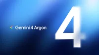

Your browser does not support the audio element.

Listen to article 

[[duration]] minutes

This content is generated by Google AI. Generative AI is experimental

Voice Speed

Voice

Speed 0.75X 1X 1.5X 2X

Read AI-generated summary 

  * Google’s new Gemini 4 Argon model brings advanced reasoning to complex, long-horizon professional tasks.
  * The model features an industry-leading 1 million token limit for deep, multi-step problem solving.
  * It excels at coding, financial research, legal drafting, and autonomous cybersecurity vulnerability patching.
  * Argon is currently rolling out to trusted cyber defenders through the Fairwind Program.
  * Google is prioritizing safety and rigorous testing before a wider release to the public.

Summaries were generated by Google AI. Generative AI is experimental. 

In this article

* * *

Today, we’re announcing our new frontier model, Gemini 4 Argon, which is rolling out to a set of trusted cyber defenders through our [Fairwind Program](<https://deepmind.google/fairwind-program/>). Built to sustain deep reasoning across complex, long-horizon workflows, Argon is fundamentally changing the way we work and build at Google. It delivers frontier performance in complex workflows across real-world software engineering, enterprise knowledge work like legal and finance, and cybersecurity defense.

Safely releasing frontier capabilities at this level requires a phased approach. We are actively engaged in the U.S. government’s voluntary process for pre-release model access while we gradually expand access. We’ll continue to gather feedback from early testers as we iterate on guardrails before making Argon available to developers, enterprises, and consumers as soon as possible.

Argon will launch at an introductory price [1](<https://blog.google/innovation-and-ai/models-and-research/gemini-models/gemini-4-argon/#footnote-1>) of $2 per million input tokens and $10 per million output tokens, with cached input tokens priced at 95% off input token price.

## Changing how we work and build at Google

Gemini 4 Argon is already powering our internal workflows, with thousands of Googlers highlighting the model’s strengths in specialized coding tasks, conducting deeper research, and writing quality. It’s helping teams build faster and push the boundaries of engineering productivity and accelerating breakthroughs:

  * **Quantum algorithmic optimization:** Argon is helping our quantum computing researchers optimize the spacetime resources (qubits × gates) of subroutines that bottleneck important applications. In one example, it beat the published baseline by 40% in a matter of minutes.

  * **Memory efficiency:** A team of Argon agents analyzed fleet-wide profiling telemetry to autonomously identify and apply memory optimizations across Google’s data centers, freeing up over 300 TiB of memory once rolled out, with an estimated 500 TiB to 1 PiB in total savings.

  * **Large Scale Codebase Migrations and Optimizations:** Argon agents are working on migrating C/C++ codebases to Rust across Google—scaling from tens of thousands of lines in core libraries like re2, libgav1 up to 800K+ lines for the Fuchsia OS Zircon kernel. Given the criticality of many of these systems, such large-scale rewrites are undergoing rigorous automated and manual auditing, emulation testing, and review before rolling out to production.  
  
For libgav1, Google's open source software for decoding video, Argon agents took an existing Rust port and replaced 32K lines of SIMD code by running many rounds of profile-guided experiments, studying the compiler's output, producing safe Rust so the compiler would vectorize it automatically. The end result is a memory-safe video decoder that runs 2.7x faster than the Rust port, with identical video output, bringing it closer to the optimized C++.

## Working harder on your most complex problems

To support Gemini 4 Argon’s capabilities across longer, more complex use cases, we are significantly expanding the model’s output token limit to an industry-leading 1M tokens, up from the previous 64K tokens. When the model has the headroom to think deeply and generate hundreds of thousands of tokens in a single trajectory, it adds a new level of depth in reasoning to solve tough problems in one go.

## Enabling coding and enterprise workflows across domains

Gemini 4 Argon’s capabilities across coding, reasoning, and multimodality and its ability to sustain long, multi-step tasks enable it to excel across a range of enterprise workflows.

Google engineers have been using Argon for their daily tasks, from everyday debugging to large-scale codebase migrations and algorithm designs. It sets a new state of the art on DeepSWE v1.1 (77.9%), which measures a model’s performance in real-world long-horizon software engineering tasks.

Beyond coding, Argon is the leading model on the [Vals Index](<https://www.vals.ai/benchmarks/vals_index>), which measures economic impact across finance, coding, legal, and tax work, with every sector weighted by its contribution to U.S. GDP. We see similarly leading performance across other domain specific evaluations, like Vals Finance Agent v2 (multi-step financial research) and Harvey’s Legal Agent Benchmark (legal research and drafting). On AutomationBench, Zapier’s benchmark measuring end-to-end execution across core business functions, Argon ranks #1 with a score of 51.3%.

Argon is also uniquely strong when knowledge work requires visual understanding. It’s able to drive professional chart analysis, identify details from long videos, and take action based on a series of documents. For example, on LVBench, which measures long video understanding, Argon is state of the art with a score of 91.7%.

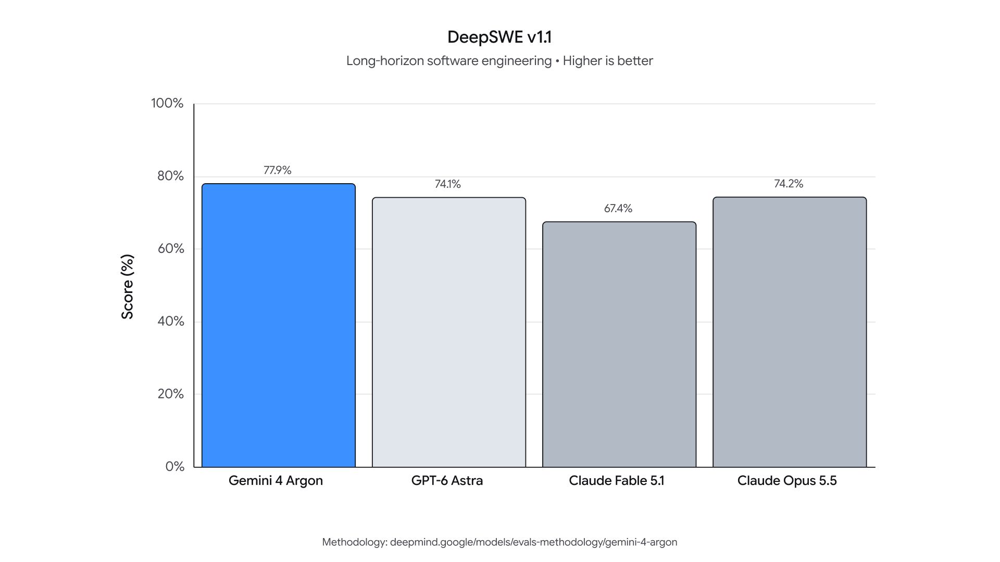

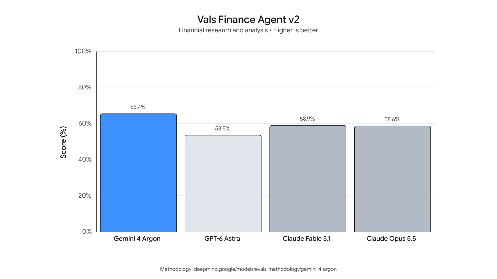

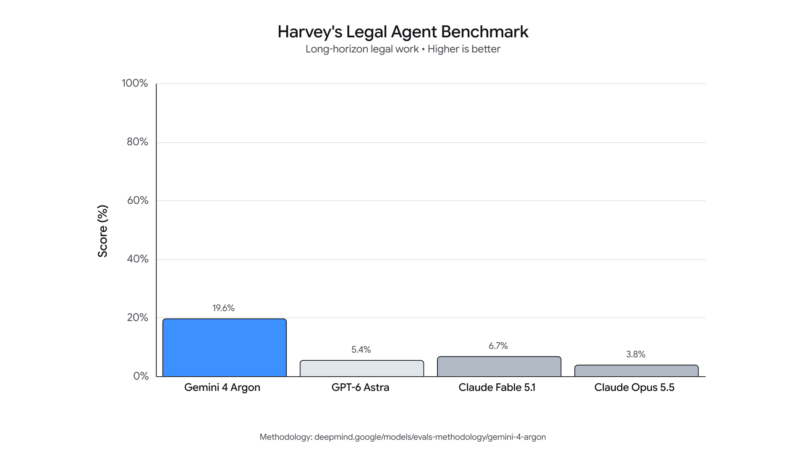

## Leading in defensive cybersecurity

To better equip cyber defenders for the new era of cyberattacks, we trained Gemini 4 Argon to be highly capable at cybersecurity defense. Argon can autonomously find, validate, and patch critical software vulnerabilities. For trusted defenders and our own internal teams at Google, we’ll be releasing Argon without cyber guardrails so they can leverage its full frontier-level cybersecurity defense capabilities.

[Wiz](<https://www.wiz.io/>) is already using Argon for cybersecurity defense through its [Scan for Good](<https://www.wiz.io/scan-for-good>) initiative – a program dedicated to protecting critical public infrastructure for free by finding and remediating high-risk exposures. In an early demonstration of its impact, the model uncovered a critical vulnerability exposing sensitive personal information across healthcare software used by hospitals worldwide, identifying a severe risk that previous frontier models had missed.

On [CWE-bench v1](<https://cwe-bench.com/>), which evaluates the model’s ability to remediate security vulnerabilities, Argon ties for first place with a top score of 68%, building on 3.8 Flash Cyber’s frontier performance on [CWE-bench v0](<https://cwe-bench.com/?v=v0>).

Gemini 4 Argon demonstrates impressive leaps in vulnerability discovery over 3.8 Flash Cyber. For example:

  * On Google’s internal comprehensive vulnerability benchmark, Argon uncovered a wide range of exposures across complex codebases spanning 20 programming languages.
  * On Wiz’s internal black-box penetration testing benchmark, which tests a model’s ability to analyze live web systems without source code, Argon outperforms 3.8 Flash Cyber in discovering the attack surface, identifying vulnerabilities, and producing proof-of-concept evidence to validate them.

## Strengthening frontier safeguards before broad availability

Before rolling out Gemini 4 Argon broadly, we’re continuing to strengthen critical frontier safeguards across four main areas:

**Defending against misuse:** To prevent bad actors from using Argon for cyber or chemical, biological, radiological, and nuclear (CBRN) attacks, the model is designed to refuse harmful requests while preserving legitimate, dual-use scientific research, as per our [Frontier Safety Framework](<https://deepmind.google/blog/strengthening-our-frontier-safety-framework/>). We are strengthening the robustness of our safeguards for this launch, including improving our techniques to monitor the model’s [internal activations](<https://arxiv.org/abs/2601.11516>) to spot misuse. These safeguards underwent robustness testing by internal and external red teams using a combination of manual and automated attack methods.

**Defending against prompt injection attacks:** Argon is also our most resilient model yet against indirect prompt injections, where malicious instructions or context are used to hijack a model’s behavior. These are complex attacks that require constant vigilance and multiple layers of defense. Through automated red teaming and adversarial training, Gemini 4 Argon is leading in prompt injection robustness on the Gray Swan’s Indirect Prompt Injection (IPI) benchmark.

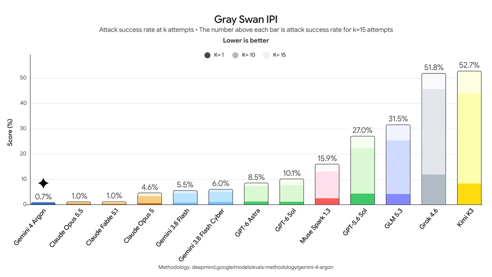

**Monitoring for misalignment:** In order to prevent Argon from stepping out of bounds to try to accomplish a task in a way that goes beyond the user’s intentions, we are deploying misalignment mitigations that monitor Argon’s chain-of-thought and actions and stop execution when necessary.

We used a similar system to monitor our training runs and send alerts to a dedicated incident response team, taking careful precautions against feeding the findings back into training so as to not risk shaping Argon’s reasoning to evade our monitoring. We [strongly encourage the rest of the industry](<https://institute.deepmind.com/essays/the-case-for-reasoning-transparency/>) to preserve reasoning transparency in these pivotal moments of increased capabilities while navigating alignment risks, so that model thoughts remain helpful in identifying and diagnosing misalignment.

**Hardening systems:** As frontier models grow increasingly capable, safely testing them requires secure environments that can keep up with the systems themselves. In line with our [agent control roadmap](<https://deepmind.google/blog/securing-the-future-of-ai-agents/>), we are hardening our sandboxed environments by isolating and sealing them before high-risk training or evaluations begin. We’re committed to sharing these agent security best practices with our partners to improve security across the ecosystem.

## Rolling out soon

We built Gemini 4 Argon with frontier-level capabilities on coding, knowledge work, cybersecurity defense, and creative writing to be a partner for developers, professionals, and enterprises while they tackle the most difficult problems. We’re grateful for the initial cohort of cyber defenders and trusted testers whose real-world evaluations and feedback will help us strengthen our systems before we release to developers, enterprises, and consumers, starting with paid API customers and Google AI Ultra subscribers.

Posted in:

[ 1 ](<https://blog.google/innovation-and-ai/models-and-research/gemini-models/gemini-4-argon/#footnote-source-1> "Jump up")

_After the introductory period expires, the price of $4 per 1M input tokens and $20 per 1M output tokens will apply._

##  About the author 

Koray is one of the world's foremost experts in artificial intelligence. As the SVP of Google DeepMind, he leads the development of Google DeepMind’s state-of-the art generative AI models and their integration into Google’s products at scale. Prior to his current role, he was VP of Research at Google DeepMind, where he founded the deep learning team and his team pioneered major research breakthroughs such as DQN (Deep Q-Network) and WaveNet. 

Read more from Koray Kavukcuoglu 

* * *

##  Related stories 

[ 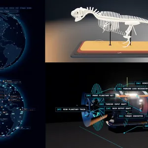 Gemini models  See what 4 builders are making with Gemini 3.8 Flash  By Lindsey Lanquist  ](<https://blog.google/innovation-and-ai/models-and-research/gemini-models/gemini-3-8-flash-developers/>) [ 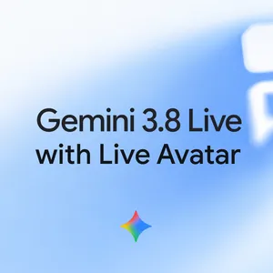 Gemini models  Introducing Gemini 3.8 Live with Live Avatar  By Shuo-yiin Chang & CJ Zheng  ](<https://blog.google/innovation-and-ai/models-and-research/gemini-models/gemini-3-8-live-with-live-avatar/>) [ 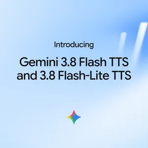 Gemini models  Gemini 3.8 text-to-speech says hello  By Leland Rechis & Alan Cowen  ](<https://blog.google/innovation-and-ai/models-and-research/gemini-models/gemini-3-8-text-to-speech/>) [ 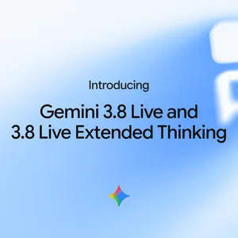 Gemini models  Introducing Gemini 3.8 Live and 3.8 Live Extended Thinking  By Tom Ouyang & Malini Jaganathan  ](<https://blog.google/innovation-and-ai/models-and-research/gemini-models/gemini-3-8-live-gemini-3-8-live-extended-thinking/>) [ 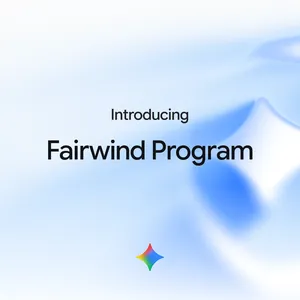 Safety & Security  Proactive cyber defense for governments and enterprises  By Four Flynn  ](<https://blog.google/innovation-and-ai/technology/safety-security/fairwind-program/>) [ 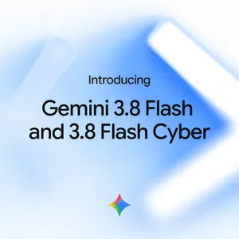 Gemini models  Introducing Gemini 3.8 Flash and 3.8 Flash Cyber  By Tulsee Doshi & Raluca Ada Popa  ](<https://blog.google/innovation-and-ai/models-and-research/gemini-models/3-8-flash-and-3-8-flash-cyber/>)
