[Artificial Analysis](<https://artificialanalysis.ai/>)

K

[All articles](<https://artificialanalysis.ai/articles>)

July 9, 2026

# GPT-5.6 benchmarks across Intelligence, Speed and Cost

**GPT-5.6 Sol comes close second to Claude Fable 5 in the Artificial Analysis Intelligence Index at one third of the cost, and leads the Artificial Analysis Coding Agent Index in OpenAI’s Codex harness**

We supported OpenAI with pre-release evaluation of GPT-5.6 Sol, Terra, and Luna. GPT-5.6 Sol (max) scores 1 point below Claude Fable 5 (max) in the Artificial Analysis Intelligence Index at 59 points, at approximately one third of the cost. GPT-5.6 Terra (max) and Luna (max) score 55 and 51 respectively in the Intelligence Index, at ~50% and ~80% lower Cost per Task than Sol.

GPT-5.6 Sol (max) leads the Artificial Analysis Coding Agent Index at 80 points.

**Key takeaways:**

➤ **One third of the cost of Claude Fable 5:** On max reasoning effort, GPT-5.6 Sol costs $1.04 per task in the Artificial Analysis Intelligence Index - offering a similar level of intelligence to Claude Fable 5 at approximately one third of the cost. Reasoning levels across GPT-5.6 Sol and Luna offer a range of options at the Pareto frontier of Intelligence vs Cost per Task. For example, GPT-5.6 Luna (max) matches or exceeds the intelligence of GLM-5.2 (max) and Gemini 3.5 Flash at a lower cost. GPT-5.6 Terra (max) and Luna (max) cost $0.55 and $0.21 per Intelligence Index task, ~50% and ~80% less than Sol. Across reasoning efforts, each new GPT-5.6 model pushes past GPT-5.5 on the Pareto frontier (excluding non-reasoning). Notably, Luna and Sol are always on the Pareto frontier ahead of Terra. This means that for any Terra effort level, there is a Luna or Sol effort level that is more intelligent at no extra cost, or equally intelligent at lower cost.

➤ **Leading in all Coding Agent evaluations:** The new Artificial Analysis Coding Agent Index pairs models with agentic harnesses and features three frontier coding evaluations - DeepSWE, Terminal-Bench v2, and SWE-Atlas-QnA. GPT-5.6 Sol (max) in Codex scores 80 in the Index, leading in all three evaluations (tying Grok 4.5 in Grok Build for SWE-Atlas-QnA). In addition to scoring higher, its per task cost is ~40% and ~10% cheaper than Claude Fable 5 (max) and Opus 4.8 (max) respectively in Claude Code. GPT-5.6 Terra (max) and Luna (max) score 77 and 75 in the Coding Agent Index respectively, with ~60% and ~80% per-task cost reductions compared to Sol.

➤ **Highest Presentation Elo in AA-Briefcase:** GPT-5.6 Sol (max) ranks second only to Claude Fable 5 (max) in AA-Briefcase, and has the highest Presentation Elo of any model. AA-Briefcase is a new benchmark for testing models on realistic knowledge work tasks in complex projects built by industry experts. GPT-5.6 Sol (max) has the highest recorded Presentation Elo - its outputs across various file types, including PowerPoint and Excel, are the most visually attractive of any model. Fable 5 (max) still leads AA-Briefcase, largely due to its Rubric Score of 56% vs 42% for GPT-5.6 Sol (max). Fable 5 (max) also scores 1764 in Analytical Quality Elo vs GPT-5.6 Sol (max) at 1592.

➤ **First OpenAI models with cache-write pricing:** GPT-5.6 introduces cache-write pricing for the first time at OpenAI. Sol, Terra, and Luna are priced at $5/$30, $2.5/$15, and $1/$6 respectively per million input/output tokens. OpenAI has retained its previous discount of 90% for cache reads, but joins Anthropic in introducing a cost premium for cache writes, at 1.25x the price of input tokens. Cache writes occur when input tokens are committed to memory. Charging for a cache write more accurately reflects the model’s cost to serve, as cached tokens occupy memory whether or not they are reused. Also in line with Anthropic’s models, GPT-5.6 introduces a max reasoning effort level.

➤ **Low token use:** GPT-5.6 Sol (max) uses fewer output tokens than most models of comparable intelligence, and defines a new Pareto frontier of Intelligence vs Output Tokens per Task. GPT-5.6 Sol (max) offers a slight improvement in token efficiency with 15k tokens per Intelligence Index task, vs GPT-5.5 at 16k. Notably, it uses fewer tokens and is more intelligent than Claude Opus 4.8 (max), GLM-5.2 (max), and Gemini 3.5 Flash (high).

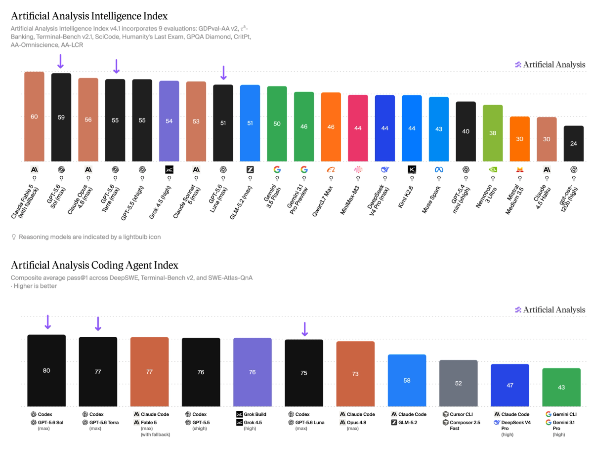

GPT-5.6 Sol (max) offers a similar level of intelligence to Claude Fable 5 at approximately one third of the cost. The model family defines a new Pareto frontier of Intelligence vs Cost per Task.

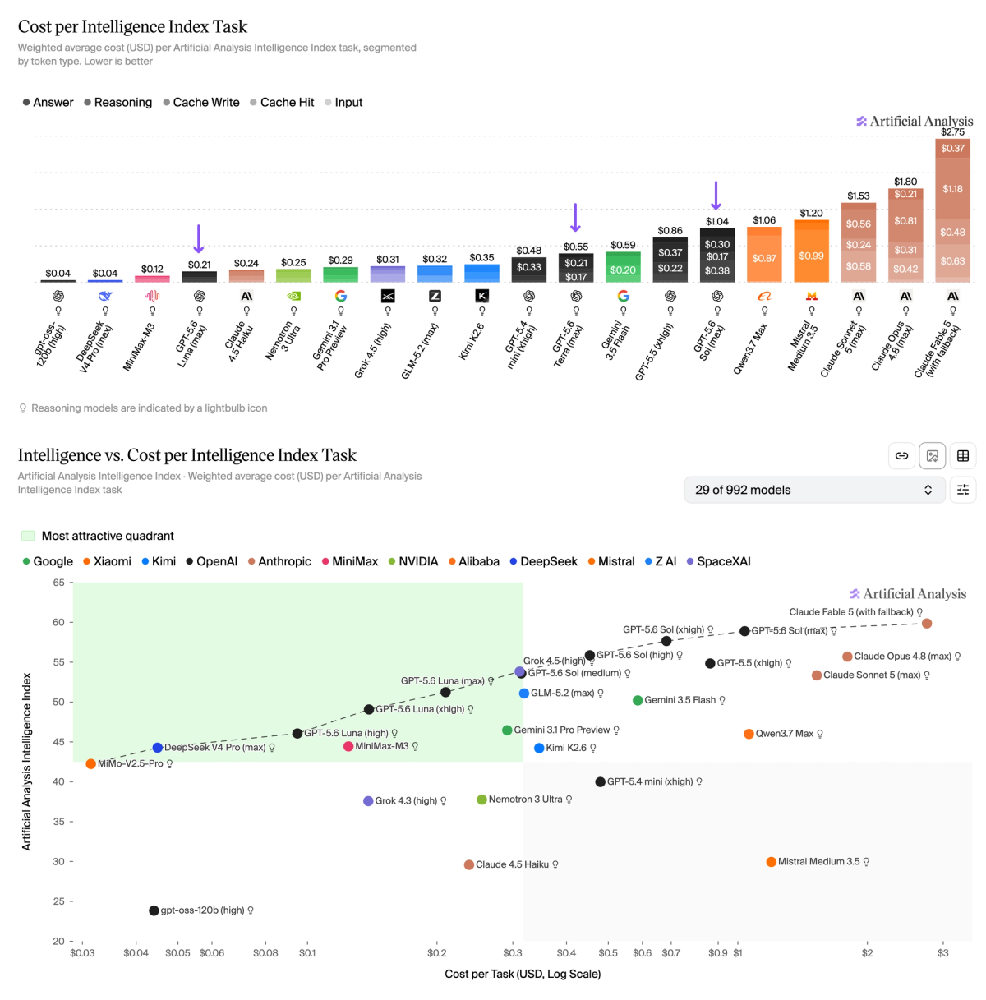

Across reasoning efforts, each GPT-5.6 model pushes past GPT-5.5 on the Pareto frontier (excludes non-reasoning). Notably, Luna and Sol are always on the Pareto frontier ahead of Terra.

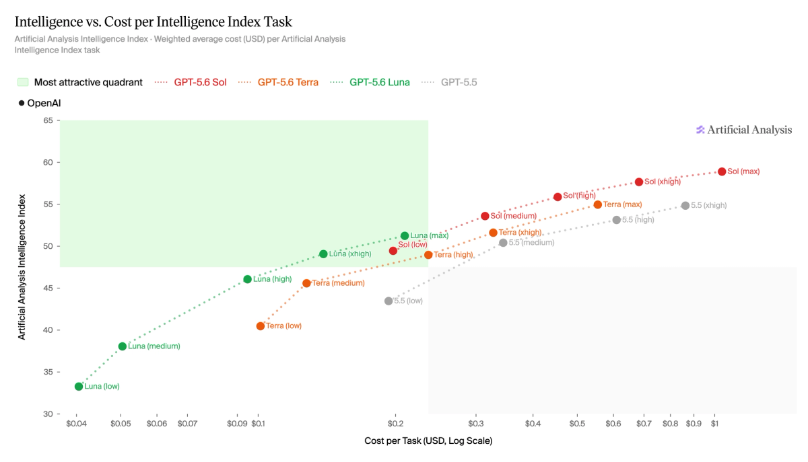

GPT-5.6 Sol (max) in Codex leads every evaluation in the Artificial Analysis Coding Agent Index (tying Grok 4.5 in Grok Build for SWE-Atlas-QnA). It has lower Cost per Task than Claude Fable 5 (max) and Claude Opus 4.8 (max).

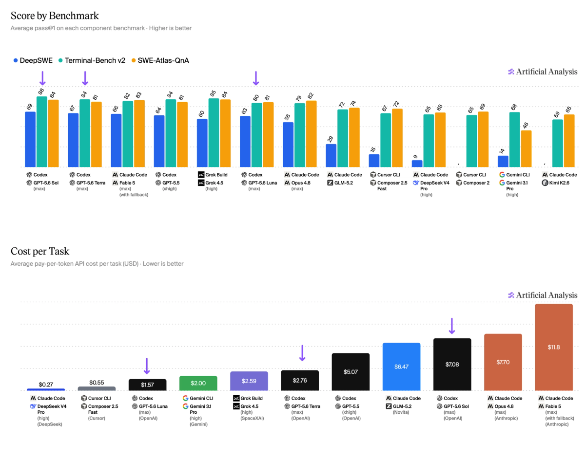

GPT-5.6 Sol (max) ranks second only to Claude Fable 5 (max) in AA-Briefcase, and has the highest Presentation Elo of any model.

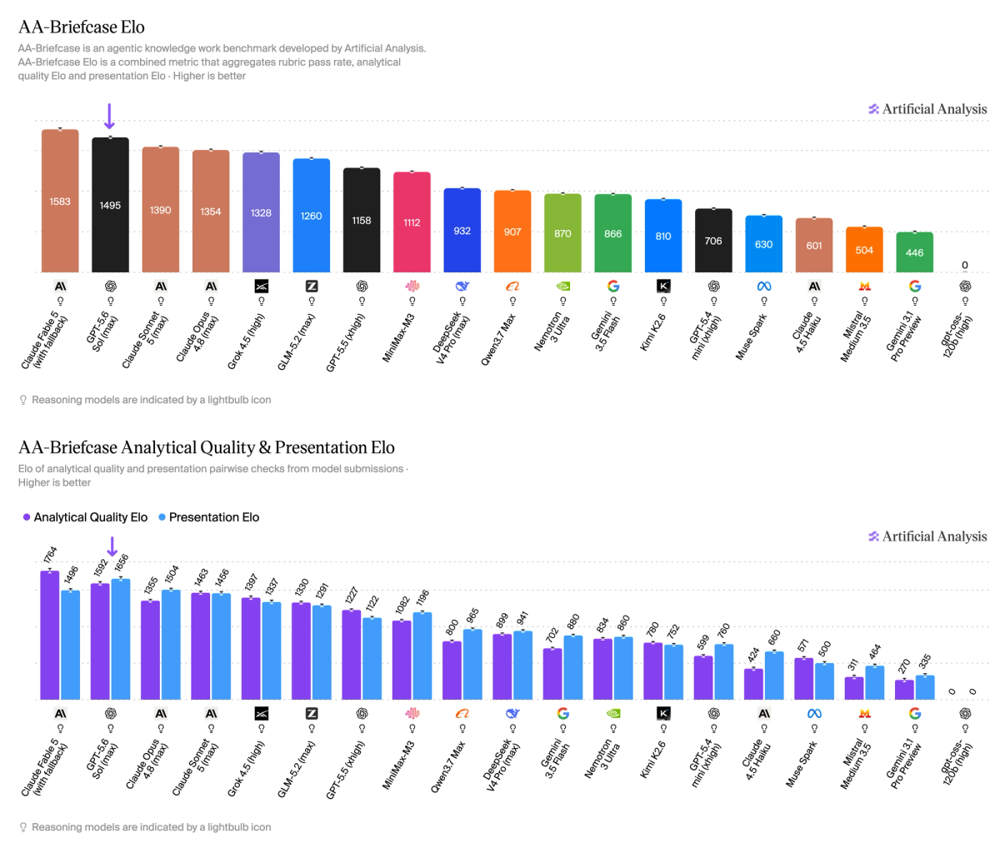

GPT-5.6 Sol defines a new Pareto frontier of Intelligence vs Output Tokens per Task in the Artificial Analysis Intelligence Index. Terra and Luna are not on the Pareto frontier.

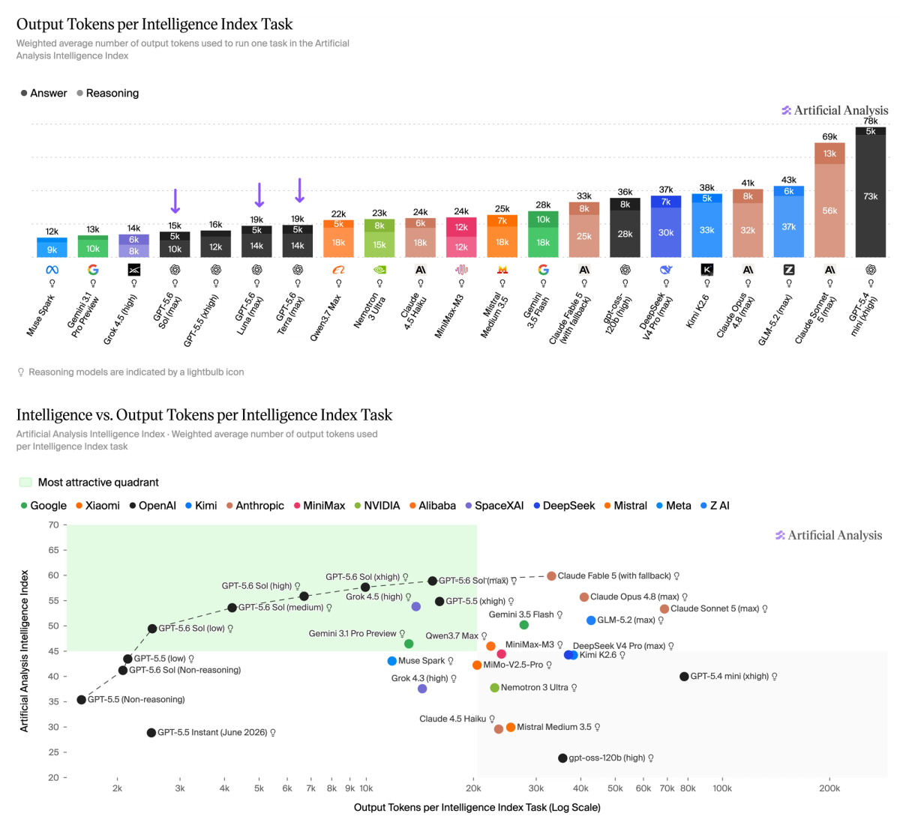

GPT-5.6 Sol (max) scores similarly to Claude Fable 5 (max) in GDPval-AA v2, reflecting a similar ability to complete economically valuable tasks.

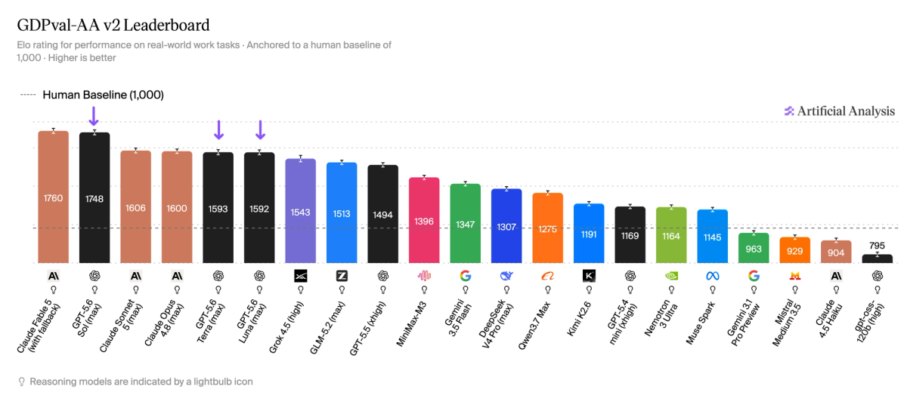

GPT-5.6 Sol (max) offers a minor improvement over GPT-5.5 in the AA-Omniscience Index, with a small uplift in accuracy coupled with an increase in hallucination rate. 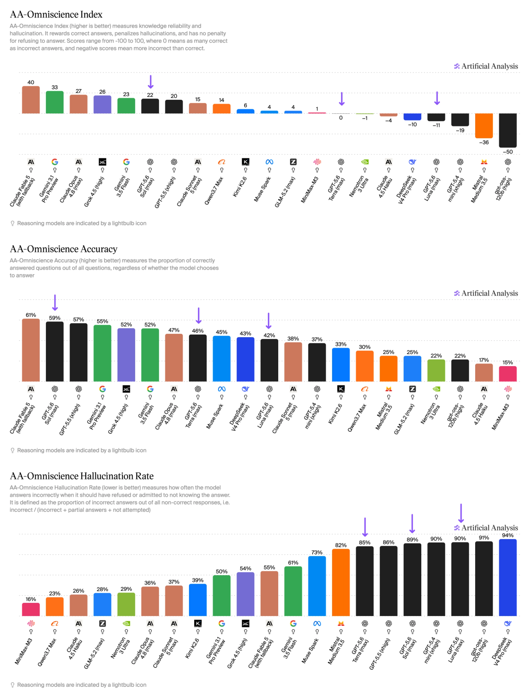

Breakdown of the individual evaluations in the Artificial Analysis Intelligence Index v4.1.

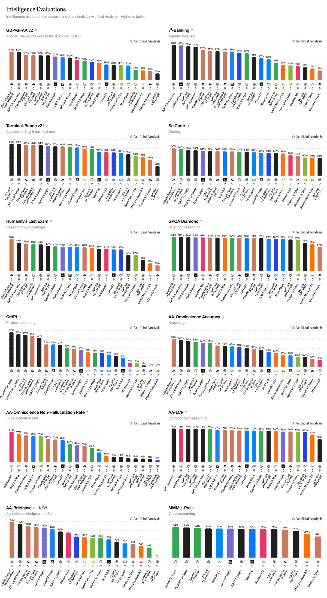

Compare GPT-5.6 Sol, Terra, and Luna with other leading models at: <https://artificialanalysis.ai>

#### Read the latest

[How GPT-5.6 Sol, Terra, Luna compare on intelligence vs costGPT-5.6 Sol and Luna are ahead of Terra at every point on the Intelligence vs Cost per Task chart. GPT-5.6 Luna stands out as a particularly cost efficient modelJuly 13, 2026](<https://artificialanalysis.ai/articles/gpt-5-6-intelligence-vs-cost-across-sol-terra-luna>)[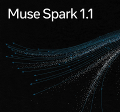Muse Spark 1.1: Meta gains 8 Intelligence Index points in three monthsMeta's Muse Spark 1.1 scores 51 on the Artificial Analysis Intelligence Index and is cost and token efficient compared to its peersJuly 10, 2026](<https://artificialanalysis.ai/articles/muse-spark-1-1-everything-you-need-to-know>)[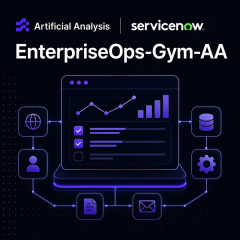Announcing EnterpriseOps-Gym-AAOur independent leaderboard for ServiceNow’s EnterpriseOps-GymJuly 8, 2026](<https://artificialanalysis.ai/articles/announcing-enterpriseops-gym-aa>)
